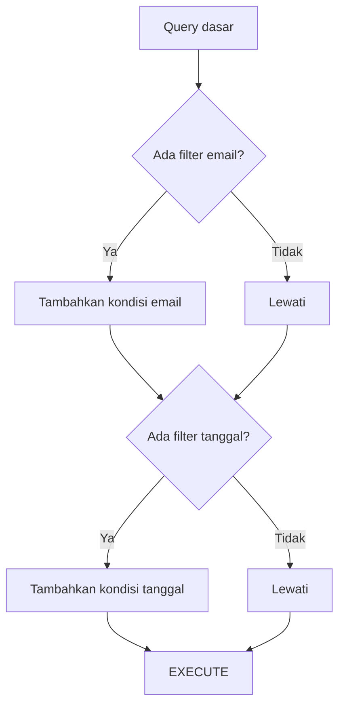

# Modul Pertemuan 14

## Administrasi Basis Data

### Dynamic SQL dalam PostgreSQL

---

## A. Identitas Materi

**Nama Modul:** Dynamic SQL dalam PostgreSQL  
**Pertemuan:** 14  
**Prasyarat:** functions, optimasi query, execution plan, aplikasi dan performa, keamanan query  
**DBMS:** PostgreSQL  
**Fokus Materi:** memahami konsep dynamic SQL, kapan perlu digunakan, risiko keamanannya, serta dampaknya terhadap fleksibilitas dan performa query

---

## B. Tujuan Pembelajaran

Setelah mengikuti pertemuan ini, mahasiswa diharapkan mampu:

1. Menjelaskan apa yang dimaksud dengan dynamic SQL.
2. Menjelaskan perbedaan static SQL dan dynamic SQL.
3. Menjelaskan hubungan dynamic SQL dengan prepared statement dan execution plan.
4. Menggunakan dynamic SQL di dalam function PostgreSQL.
5. Menjelaskan risiko SQL injection dan cara menguranginya.
6. Menjelaskan kapan dynamic SQL berguna untuk OLTP, OLAP, optimizer, dan query fleksibel.
7. Membedakan situasi yang cocok dan tidak cocok untuk dynamic SQL.

---

## C. Keterkaitan dengan Pertemuan Sebelumnya

Pada pertemuan sebelumnya, kita membahas function dalam PostgreSQL, termasuk kapan function membantu aplikasi dan kapan function justru dapat memperlambat query.

Pada pertemuan ini, kita membahas dynamic SQL, yaitu teknik membangun query saat runtime. Materi ini penting karena dynamic SQL sering dipakai di dalam function atau procedure untuk membuat query lebih fleksibel. Namun teknik ini juga membawa risiko keamanan, kompleksitas, dan kesalahan desain jika digunakan tanpa pemahaman yang benar.

---

## D. Peta Materi

Materi pada modul ini dibahas dengan urutan berikut:

1. pengertian dynamic SQL,
2. perbedaan static SQL dan dynamic SQL,
3. hubungan dengan prepared statement dan execution plan,
4. keamanan dan SQL injection,
5. penggunaan dynamic SQL pada function,
6. dynamic SQL untuk OLTP dan OLAP,
7. query builder dinamis,
8. dynamic SQL untuk membantu optimizer dan FDW,
9. kelebihan, kekurangan, dan best practice,
10. praktikum dan latihan.

---

## E. Pengantar

Pada SQL biasa, kita menulis query secara langsung dan bentuk query itu sudah tetap sejak awal. Misalnya:

```sql
SELECT *
FROM booking
WHERE booking_id = 10;
```

Namun dalam beberapa situasi, bentuk query tidak selalu bisa diketahui sejak awal. Bisa jadi kondisi `WHERE`, nama tabel, urutan `ORDER BY`, atau join yang dipakai baru diketahui saat program dijalankan.

Dalam situasi seperti itu, kita membutuhkan **dynamic SQL**.

---

## F. Apa Itu Dynamic SQL?

Dynamic SQL adalah SQL yang dibentuk terlebih dahulu sebagai teks atau string, lalu baru dieksekusi pada saat runtime.

### Contoh sederhana

```sql
DECLARE
   v_sql text;
   cnt int;
BEGIN
   v_sql := 'SELECT count(*) FROM booking';
   EXECUTE v_sql INTO cnt;
END;
```

### Inti konsep

Dynamic SQL bukan berarti SQL yang selalu lebih cepat. Dynamic SQL hanya berarti **query dibangun secara dinamis saat program berjalan**.

### Alur sederhananya


---

## G. Static SQL vs Dynamic SQL

Perbedaan paling mudah dilihat dari cara query dibentuk.

| Static SQL | Dynamic SQL |
| --- | --- |
| bentuk query tetap | bentuk query dapat berubah saat runtime |
| lebih mudah dibaca | lebih fleksibel |
| lebih mudah diuji | lebih kompleks untuk dipelihara |
| cocok untuk kebutuhan umum | cocok untuk kondisi query yang sangat bervariasi |

### Contoh static SQL

```sql
SELECT *
FROM passenger
WHERE passenger_id = 10;
```

### Contoh dynamic SQL

```sql
v_sql := 'SELECT * FROM passenger WHERE passenger_id = ' || quote_literal(v_id);
EXECUTE v_sql;
```

### Kesimpulan awal

Static SQL adalah pilihan default yang lebih sederhana. Dynamic SQL dipakai ketika ada kebutuhan fleksibilitas yang memang nyata.

---

## H. Mengapa Dynamic SQL Penting di PostgreSQL?

Dynamic SQL penting karena PostgreSQL sangat bergantung pada optimizer dan execution plan. Bentuk query yang berbeda dapat menghasilkan plan yang berbeda.

### Hal penting yang perlu dipahami

PostgreSQL dapat menggunakan generic plan atau custom plan tergantung konteks. Pada prepared statement atau function tertentu, query yang sama bisa dipakai berulang dengan parameter berbeda. Dalam beberapa situasi, plan umum yang dipakai tidak selalu ideal untuk semua nilai parameter.

### Di sinilah dynamic SQL bisa membantu

Jika query dibentuk ulang saat runtime, PostgreSQL dapat mengoptimasi query berdasarkan bentuk akhir dan parameter yang benar-benar dipakai saat itu.

### Catatan penting

Kalimat ini perlu dipahami dengan hati-hati:

> Dynamic SQL tidak otomatis lebih cepat. Dynamic SQL hanya bisa membantu ketika query statis atau query generik menghasilkan plan yang kurang sesuai untuk variasi parameter tertentu.

---

## I. Dynamic SQL vs Prepared Statement

Mahasiswa sering bingung membedakan dynamic SQL dengan prepared statement.

### Prepared statement

Prepared statement umumnya dipakai untuk menjalankan query berulang dengan bentuk yang sama, tetapi nilai parameternya berubah.

### Dynamic SQL

Dynamic SQL dipakai ketika bentuk query itu sendiri dapat berubah, misalnya:

* kondisi filter bisa bertambah atau berkurang,
* join tertentu hanya dipakai jika perlu,
* nama tabel atau kolom tertentu ditentukan saat runtime.

### Perbandingan sederhana

| Prepared statement | Dynamic SQL |
| --- | --- |
| bentuk query tetap | bentuk query bisa berubah |
| cocok untuk query berulang | cocok untuk query fleksibel |
| biasanya lebih sederhana | lebih kompleks |
| bisa memakai plan yang dipakai ulang | plan dibentuk dari query akhir yang dihasilkan |

### Pelajaran penting

Prepared statement dan dynamic SQL bukan musuh satu sama lain. Keduanya dipakai untuk masalah yang berbeda.

---

## J. Risiko Keamanan: SQL Injection

Bagian ini sangat penting karena dynamic SQL sangat mudah salah digunakan.

Jika input pengguna langsung digabung ke string SQL, maka query dapat dimanipulasi dan menghasilkan **SQL injection**.

### Contoh yang berbahaya

```sql
v_sql := 'SELECT * FROM users WHERE username = ''' || user_input || '''';
```

Jika `user_input` diisi dengan nilai berbahaya, query bisa berubah makna.

### Cara mengurangi risiko

Gunakan fungsi PostgreSQL yang tepat untuk membentuk query, misalnya:

#### 1. `quote_literal()`

```sql
quote_literal('data')
```

Dipakai untuk nilai literal.

#### 2. `format()`

```sql
format('SELECT * FROM %I', table_name)
```

Dengan `%I` untuk identifier seperti nama tabel atau kolom, dan `%L` untuk literal.

### Aturan penting

* jangan gabungkan input user mentah ke query,
* gunakan `format()`, `quote_literal()`, atau mekanisme aman lain,
* bedakan antara identifier dan literal.

---

## K. Dynamic SQL di Dalam Function

Dynamic SQL sangat sering dipakai di dalam function PostgreSQL.

### Mengapa?

Karena function kadang perlu:

* membentuk query sesuai parameter,
* mengubah filter,
* menentukan bagian query secara dinamis.

### Contoh ide

```sql
EXECUTE 'SELECT ... WHERE col = ' || quote_literal(param);
```

### Manfaat yang mungkin diperoleh

* query lebih fleksibel,
* function bisa menyesuaikan perilakunya,
* dalam kasus tertentu, plan yang dihasilkan bisa lebih sesuai.

### Catatan

Dynamic SQL di dalam function bukan berarti semua function harus dibuat dinamis. Ini hanya salah satu teknik ketika static SQL tidak cukup fleksibel.

---

## L. Dynamic SQL untuk OLTP

Pada OLTP, query sering dijalankan sangat sering dan dengan kombinasi parameter yang berbeda-beda.

### Masalah yang bisa muncul

Jika query ditulis terlalu umum, misalnya semua kemungkinan kondisi dimasukkan sekaligus, hasilnya bisa membuat optimizer kesulitan menghasilkan plan terbaik.

### Contoh pendekatan yang kurang baik

```sql
WHERE (param IS NULL OR col = param)
```

Pendekatan seperti ini memang praktis, tetapi kadang menghasilkan query yang terlalu umum dan membuat plan kurang ideal.

### Peran dynamic SQL

Dynamic SQL memungkinkan function atau procedure hanya menambahkan kondisi yang benar-benar dibutuhkan.

### Keuntungan potensial

* query lebih ringan,
* filter lebih spesifik,
* join yang tidak perlu bisa dihindari,
* plan bisa lebih sesuai dengan kebutuhan saat itu.

---

## M. Dynamic SQL untuk OLAP

Pada OLAP, masalahnya agak berbeda. Data yang diproses besar, dan pemanggilan function per baris bisa sangat mahal.

### Contoh yang kurang baik

```sql
SELECT age_category(age)
FROM passenger;
```

Jika `age_category()` adalah function yang dipanggil untuk setiap baris dalam jumlah sangat besar, performa bisa turun.

### Pendekatan yang sering lebih baik

Kadang logika sebaiknya di-inline langsung ke query, misalnya dengan `CASE`.

```sql
SELECT CASE
         WHEN age < 13 THEN 'anak'
         WHEN age < 60 THEN 'dewasa'
         ELSE 'lansia'
       END
FROM passenger;
```

### Lalu apa peran dynamic SQL di OLAP?

Dynamic SQL kadang dipakai untuk membentuk query analitik yang lebih fleksibel, misalnya memilih kolom tertentu, membentuk agregasi tertentu, atau membuat struktur query berdasarkan kebutuhan laporan. Jadi, fungsinya lebih ke **membentuk query analitik yang tepat**, bukan mengganti semua logika dengan function per baris.

---

## N. Dynamic SQL untuk Query Fleksibel

Salah satu penggunaan paling umum adalah query pencarian yang opsional.

### Contoh kasus

Pengguna bisa mencari data berdasarkan:

* email,
* bandara,
* tanggal,
* flight,
* atau kombinasi beberapa parameter.

Jika semua kondisi dipaksa masuk dalam satu query umum, query menjadi panjang dan bisa kurang efisien.

### Dynamic SQL sebagai solusi

Kita mulai dari query dasar, lalu hanya menambahkan kondisi yang memang dibutuhkan.

### Ilustrasi



---

## O. Contoh Dynamic Query Builder

Konsep dasarnya sederhana:

1. mulai dari query dasar,
2. tambahkan kondisi secara bertahap,
3. tambahkan join jika benar-benar diperlukan,
4. eksekusi query akhir.

### Contoh struktur

```sql
v_sql := 'SELECT * FROM booking WHERE 1=1';

IF p_email IS NOT NULL THEN
   v_sql := v_sql || format(' AND email = %L', p_email);
END IF;

IF p_date IS NOT NULL THEN
   v_sql := v_sql || format(' AND booking_date = %L', p_date);
END IF;

EXECUTE v_sql;
```

### Catatan

Mahasiswa tidak perlu menghafal persis sintaks ini. Yang lebih penting adalah memahami pola berpikirnya.

---

## P. Dynamic SQL untuk Membantu Optimizer

Pada beberapa kasus, optimizer bisa salah memperkirakan distribusi data atau kombinasi kondisi query. Akibatnya, plan yang dipilih bukan plan terbaik.

### Contoh dampak

* memilih hash join padahal nested loop lebih sesuai,
* membaca terlalu banyak data,
* atau memakai jalur akses yang kurang tepat.

### Peran dynamic SQL

Dynamic SQL dapat dipakai untuk menyusun query yang lebih spesifik berdasarkan kondisi data saat itu.

### Contoh ide

* ambil daftar ID kecil terlebih dahulu,
* susun query akhir menggunakan daftar itu,
* atau bentuk query berbeda sesuai skenario input.

### Catatan penting

Ini adalah teknik lanjut. Dynamic SQL bukan pengganti optimizer, tetapi alat bantu ketika query sangat fleksibel atau ketika bentuk query yang lebih spesifik memang diperlukan.

---

## Q. Dynamic SQL dan FDW

FDW adalah singkatan dari **Foreign Data Wrapper**, yaitu fitur yang memungkinkan PostgreSQL mengakses data dari sumber lain.

### Masalah yang sering muncul

* statistik tidak selalu lengkap,
* optimizer lokal bisa memiliki informasi terbatas,
* plan yang dihasilkan kadang kurang ideal.

### Di mana dynamic SQL membantu?

Dynamic SQL dapat dipakai untuk membuat query yang lebih spesifik sebelum dikirim ke sumber data lain atau untuk mempersempit data lebih awal sesuai kebutuhan.

### Inti pemahamannya

Semakin spesifik query yang dikirim, sering kali semakin kecil data yang perlu dipindahkan.

---

## R. Kelebihan dan Kekurangan Dynamic SQL

### Kelebihan

1. fleksibel,
2. dapat menyesuaikan query dengan kebutuhan runtime,
3. berguna untuk query dengan banyak kombinasi kondisi,
4. dalam kasus tertentu dapat membantu menghasilkan plan yang lebih sesuai.

### Kekurangan

1. lebih sulit dibaca,
2. lebih sulit diuji dan di-debug,
3. lebih berisiko terhadap SQL injection,
4. lebih rumit dipelihara,
5. mudah disalahgunakan pada kasus yang sebenarnya cukup dengan static SQL.

---

## S. Best Practice

### Gunakan dynamic SQL jika:

1. bentuk query memang berubah-ubah,
2. banyak kombinasi filter opsional,
3. static SQL terlalu umum dan menghasilkan performa yang tidak konsisten,
4. query harus dibangun sesuai objek runtime tertentu secara aman.

### Hindari dynamic SQL jika:

1. query sebenarnya tetap dan sederhana,
2. tidak ada kebutuhan fleksibilitas nyata,
3. static SQL sudah cukup jelas dan efisien,
4. dynamic SQL hanya menambah kompleksitas tanpa manfaat yang jelas.

### Prinsip utama

> Dynamic SQL adalah alat khusus, bukan pilihan default untuk semua query.

---

## T. Perbandingan Teknik

| Teknik | Kelebihan utama | Tantangan utama |
| --- | --- | --- |
| Static SQL | sederhana dan mudah dipelihara | kurang fleksibel |
| Function dengan query tetap | rapi untuk logika berulang | bisa kurang sesuai untuk variasi query tertentu |
| Dynamic SQL | sangat fleksibel dan adaptif | lebih kompleks dan rawan kesalahan |

---

## U. Studi Kasus Nyata

Bayangkan aplikasi pencarian tiket yang memiliki banyak parameter opsional.

### Masalah

* pengguna bisa mengisi sedikit atau banyak filter,
* query umum menjadi sangat panjang,
* performa tidak stabil.

### Solusi

Gunakan dynamic SQL untuk membangun query berdasarkan filter yang benar-benar diisi.

### Hasil yang diharapkan

* query menjadi lebih spesifik,
* beban proses bisa lebih ringan,
* performa lebih konsisten dibanding pendekatan query serba umum.

---

## V. Ringkasan Materi

Ide utama dari pertemuan ini adalah sebagai berikut.

1. Dynamic SQL adalah SQL yang dibentuk saat runtime lalu dieksekusi.
2. Dynamic SQL berbeda dari static SQL dan juga berbeda dari prepared statement.
3. Dynamic SQL berguna ketika bentuk query memang perlu berubah mengikuti kondisi runtime.
4. Dynamic SQL membawa risiko SQL injection jika tidak dibangun dengan aman.
5. Pada OLTP, dynamic SQL sering berguna untuk query fleksibel dengan banyak parameter opsional.
6. Pada OLAP, dynamic SQL dapat berguna untuk membentuk query analitik yang sesuai, tetapi bukan alasan untuk memanggil function per baris secara sembarangan.
7. Dynamic SQL dapat membantu pada kasus tertentu, tetapi juga menambah kompleksitas sehingga harus digunakan dengan bijak.

---

## W. Praktikum Sederhana

### Studi kasus

Bandingkan query pencarian data dengan dua pendekatan: query umum dengan banyak kondisi opsional dan query dinamis yang hanya menambahkan filter yang dibutuhkan.

### Langkah praktikum

1. Buat satu function atau blok sederhana dengan query statis yang menampung banyak kondisi opsional.
2. Buat versi kedua dengan dynamic SQL.
3. Uji dengan beberapa kombinasi parameter.
4. Bandingkan bentuk query yang dihasilkan.
5. Diskusikan mana yang lebih mudah dipelihara dan mana yang lebih potensial memberi performa lebih baik.

### Hal yang diamati

1. bentuk query akhir,
2. kompleksitas logika,
3. fleksibilitas,
4. potensi performa.

---

## X. Latihan Soal

### Soal Konsep

1. Apa yang dimaksud dengan dynamic SQL?
2. Apa perbedaan utama antara static SQL dan dynamic SQL?
3. Mengapa dynamic SQL lebih berisiko terhadap SQL injection?
4. Apa perbedaan dynamic SQL dan prepared statement?
5. Kapan dynamic SQL cocok digunakan?

### Soal Analisis

1. Mengapa query dengan banyak kondisi opsional kadang kurang ideal jika dipaksakan menjadi satu static SQL umum?
2. Mengapa dynamic SQL tidak boleh dianggap selalu lebih cepat?
3. Mengapa `format()` lebih aman daripada menggabungkan string mentah untuk membentuk query?

### Soal Praktik SQL

1. Buat contoh blok sederhana yang membentuk query dinamis dengan satu kondisi opsional.
2. Tulis contoh penggunaan `quote_literal()`.
3. Tulis contoh penggunaan `format()` dengan `%I` atau `%L`.

---

## Y. Tugas Mandiri

Pilih satu fitur pencarian pada aplikasi, misalnya pencarian mahasiswa, pencarian transaksi, atau pencarian penerbangan.

Kerjakan hal berikut:

1. tuliskan parameter apa saja yang bisa menjadi filter,
2. jelaskan bagaimana query statis umum bisa menjadi terlalu kaku atau terlalu kompleks,
3. usulkan bagaimana dynamic SQL dapat dipakai,
4. jelaskan risiko keamanan yang harus diperhatikan.

---

## Z. Penutup

Dynamic SQL adalah teknik yang sangat berguna ketika aplikasi memerlukan query yang fleksibel dan adaptif. Namun dynamic SQL bukan pilihan default untuk semua kasus. Teknik ini hanya tepat jika benar-benar diperlukan dan harus selalu dibangun dengan perhatian pada keamanan, keterbacaan, dan kemudahan pemeliharaan.

Karena itu, mahasiswa perlu memahami dynamic SQL bukan sebagai “query yang lebih canggih”, tetapi sebagai alat khusus yang dipakai ketika static SQL tidak lagi cukup.