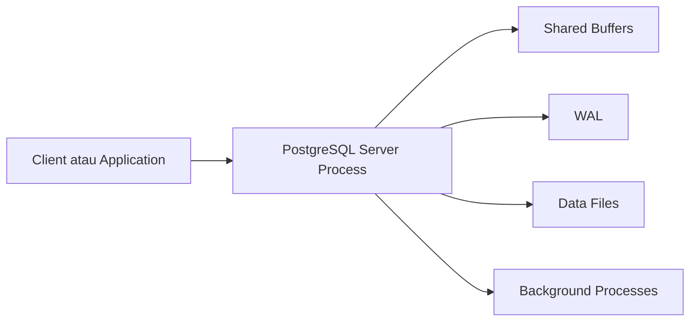

# Modul Pertemuan 1

## Administrasi Basis Data

### Pengantar Administrasi Basis Data dan Arsitektur PostgreSQL

---

## A. Identitas Mata Kuliah

Nama Mata Kuliah: Administrasi Basis Data  
Bobot: 3 SKS  
Prasyarat: Basis Data, SQL dasar, ERD, normalisasi  
DBMS yang digunakan: PostgreSQL

Bahan utama yang dipelajari selama semester ini berfokus pada:

- arsitektur PostgreSQL,
- mekanisme pemrosesan query,
- algoritma akses data dan join,
- analisis `EXPLAIN` dan `EXPLAIN ANALYZE`,
- strategi pembuatan indeks,
- optimasi query pendek dan query panjang,
- optimasi operasi `INSERT`, `UPDATE`, `DELETE`,
- integrasi aplikasi dan dampak ORM,
- benchmarking performa,
- monitoring dan visualisasi performa menggunakan Grafana.

---

## B. Tujuan Pembelajaran Pertemuan 1

Setelah mengikuti pertemuan ini, mahasiswa diharapkan mampu:

1. Menjelaskan ruang lingkup mata kuliah Administrasi Basis Data.
2. Menjelaskan peran DBA dan kaitannya dengan performa sistem.
3. Menjelaskan perbedaan dasar OLTP dan OLAP.
4. Menjelaskan arsitektur dasar PostgreSQL secara umum.
5. Memahami rencana pembelajaran selama 16 minggu, termasuk UTS dan UAS.

---

## C. Pengantar Mata Kuliah

Pada mata kuliah Basis Data, mahasiswa biasanya berfokus pada cara membuat tabel, relasi, dan query yang benar. Pada mata kuliah Administrasi Basis Data, fokusnya diperluas menjadi pertanyaan seperti:

- mengapa query tertentu lambat,
- bagaimana PostgreSQL memproses query,
- kapan indeks membantu dan kapan tidak,
- bagaimana aplikasi memengaruhi performa database,
- bagaimana performa diamati dan diukur.

Dengan kata lain, mata kuliah ini tidak hanya membahas kebenaran query, tetapi juga efisiensinya dalam sistem nyata.

---

## D. Peran DBA

Database Administrator atau DBA bertanggung jawab menjaga agar sistem database tetap stabil, aman, dan efisien.

Tugas DBA antara lain:

- mengelola performa query,
- memantau penggunaan sumber daya,
- menjaga integritas dan ketersediaan data,
- mengelola backup dan recovery,
- mendukung developer agar aplikasi mengakses database dengan benar.

Pada tingkat awal, mahasiswa diharapkan mulai memiliki cara berpikir seperti junior DBA atau performance-minded developer.

---

## E. Konsep Dasar OLTP dan OLAP

### 1. OLTP

OLTP atau Online Transaction Processing digunakan untuk transaksi harian yang membutuhkan respons cepat.

Contohnya:

- login pengguna,
- pembayaran,
- input data akademik,
- update status transaksi.

### 2. OLAP

OLAP atau Online Analytical Processing digunakan untuk analisis dan pelaporan.

Contohnya:

- dashboard manajemen,
- laporan tren penjualan,
- rekap performa bulanan.

### Perbandingan singkat

| Aspek | OLTP | OLAP |
| --- | --- | --- |
| Tujuan | transaksi | analisis |
| Karakter query | pendek | panjang dan kompleks |
| Volume proses | kecil per transaksi | besar per laporan |
| Fokus utama | kecepatan respons | insight dari data |

---

## F. Arsitektur Dasar PostgreSQL

Sebelum masuk ke optimasi query, mahasiswa perlu memahami gambaran besar arsitektur PostgreSQL.

Secara sederhana, PostgreSQL terdiri dari beberapa komponen penting.

### 1. Client Process

Bagian ini adalah aplikasi atau pengguna yang mengirim query ke PostgreSQL.

### 2. Server Process

PostgreSQL menerima koneksi, memproses query, lalu mengembalikan hasil ke client.

### 3. Shared Buffers

Shared buffers adalah area memori yang dipakai PostgreSQL untuk menyimpan halaman data yang sering diakses agar tidak selalu membaca dari disk.

### 4. WAL atau Write-Ahead Log

WAL digunakan agar perubahan data dicatat terlebih dahulu sebelum benar-benar dianggap aman. Komponen ini penting untuk konsistensi dan recovery.

### 5. Background Process

PostgreSQL memiliki proses latar belakang seperti checkpoint, writer, autovacuum, dan proses lain yang membantu menjaga kesehatan sistem.

### Diagram sederhana arsitektur



### Inti pemahaman

Mahasiswa belum perlu menghafal semua detail internal PostgreSQL di minggu pertama. Yang penting adalah memahami bahwa PostgreSQL bukan sekadar tempat menyimpan tabel, tetapi sistem yang memiliki mekanisme memori, logging, proses latar belakang, dan strategi eksekusi query.

---

## G. Mengapa Arsitektur Penting untuk Optimasi?

Optimasi query tidak bisa dipahami dengan baik jika mahasiswa hanya melihat SQL di permukaan.

Contoh:

- query bisa lambat karena data belum ada di shared buffers,
- operasi tulis bisa mahal karena melibatkan WAL,
- tabel bisa membengkak karena MVCC dan autovacuum belum bekerja optimal,
- query bisa berbeda performa karena cara PostgreSQL mengakses data di memori dan disk.

Karena itu, pemahaman arsitektur akan menjadi fondasi untuk pertemuan-pertemuan berikutnya.

---

## H. Rencana Pembelajaran 16 Minggu

| Minggu | Materi |
| --- | --- |
| 1 | Pengantar Administrasi Basis Data dan Arsitektur PostgreSQL |
| 2 | Mekanisme Pemrosesan Query pada PostgreSQL |
| 3 | Algoritma Akses Data dan Index-Only Scan |
| 4 | Algoritma Join pada Database |
| 5 | Analisis EXPLAIN dan EXPLAIN ANALYZE |
| 6 | Strategi Pembuatan Indeks dan Optimasi Query Pendek |
| 7 | Optimasi Query Panjang |
| 8 | UTS |
| 9 | Optimasi Operasi INSERT, UPDATE, DELETE |
| 10 | Desain Database untuk Performa |
| 11 | Integrasi Aplikasi, ORM, dan Performa |
| 12 | Functions dan Dynamic SQL dalam PostgreSQL |
| 13 | Filtering dan Pencarian Lanjutan di PostgreSQL |
| 14 | Benchmarking Performa dan Algoritma Optimasi Query |
| 15 | Monitoring dan Visualisasi Performa PostgreSQL dengan Grafana |
| 16 | UAS |

---

## I. Sistem Penilaian

| Komponen | Bobot |
| --- | --- |
| Tugas | 20% |
| Kuis | 10% |
| UTS | 20% |
| Praktikum | 20% |
| UAS atau proyek akhir | 30% |

---

## J. Gambaran Proyek atau Tugas Akhir

Sebagai arah umum, mahasiswa dapat diminta untuk:

1. menggunakan PostgreSQL pada dataset yang cukup besar,
2. mengidentifikasi query yang lambat,
3. melakukan optimasi melalui perbaikan query, indeks, atau desain data,
4. melakukan benchmarking sebelum dan sesudah optimasi,
5. menampilkan hasil monitoring dalam dashboard Grafana.

---

## K. Contoh Implementasi Sederhana

```sql
SELECT *
FROM mahasiswa
WHERE nim = '2310110001';
```

Pada minggu-minggu berikutnya, query sederhana seperti ini akan dipakai untuk menjelaskan bagaimana query diproses, bagaimana execution plan dibaca, dan kapan indeks membantu.

---

## L. Ringkasan

1. Administrasi Basis Data membahas performa, pengelolaan, dan observasi database secara lebih dalam.
2. PostgreSQL memiliki arsitektur internal yang memengaruhi performa query.
3. DBA perlu memahami hubungan antara query, memori, logging, dan workload aplikasi.
4. Semester ini dibagi menjadi 16 minggu dengan UTS di minggu 8 dan UAS di minggu 16.

---

## M. Praktikum Sederhana

1. Instal PostgreSQL atau gunakan lingkungan PostgreSQL yang sudah tersedia.
2. Jalankan query berikut:

```sql
SELECT version();
```

3. Jelaskan dengan bahasa Anda sendiri apa arti hasil query tersebut.
4. Diskusikan komponen PostgreSQL apa saja yang Anda duga terlibat saat query dijalankan.

---

## N. Latihan

### Soal Konsep

1. Apa perbedaan utama mata kuliah Basis Data dan Administrasi Basis Data?
2. Mengapa pemahaman arsitektur PostgreSQL penting dalam optimasi?
3. Apa perbedaan umum antara OLTP dan OLAP?

### Soal Analisis

4. Jelaskan bagaimana shared buffers dan WAL dapat memengaruhi performa sistem database.
5. Mengapa keluhan “aplikasi lambat” tidak selalu berarti kesalahan ada pada satu query saja?

### Soal Praktis

6. Tuliskan tiga contoh tugas DBA dalam sistem akademik kampus.
7. Buat ringkasan singkat rencana pembelajaran semester ini.

---

## O. Penutup

Pertemuan pertama menjadi fondasi untuk seluruh semester. Jika mahasiswa memahami peran DBA, perbedaan OLTP dan OLAP, serta gambaran arsitektur PostgreSQL, maka materi optimasi pada minggu-minggu berikutnya akan lebih mudah dipahami.
