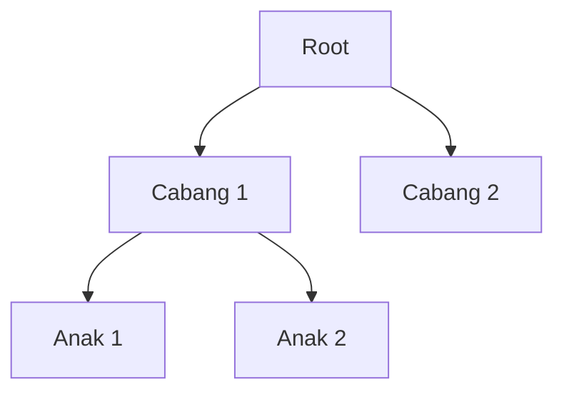

# Modul Pertemuan 10

## Administrasi Basis Data

### Desain Database untuk Performa

---

## A. Identitas Materi

**Nama Modul:** Desain Database untuk Performa  
**Pertemuan:** 10  
**Prasyarat:** SQL dasar, relasi tabel, index, optimasi query baca dan tulis  
**DBMS:** PostgreSQL  
**Fokus Materi:** memahami bahwa performa dan kemudahan pengelolaan database sangat dipengaruhi oleh keputusan desain sejak awal

---

## B. Tujuan Pembelajaran

Setelah mengikuti pertemuan ini, mahasiswa diharapkan mampu:

1. Menjelaskan mengapa desain database berpengaruh langsung terhadap performa dan kemudahan pemeliharaan sistem.
2. Menjelaskan trade-off antara fleksibilitas, efisiensi, dan konsistensi data.
3. Membedakan desain yang lebih cocok untuk kebutuhan transaksi dan kebutuhan analitik.
4. Menjelaskan kelebihan dan kekurangan model relasional, EAV, JSON, dan struktur hierarkis.
5. Menjelaskan tujuan normalisasi dan kapan denormalisasi dapat dipertimbangkan.
6. Membedakan natural key dan surrogate key serta menentukan kapan masing-masing lebih tepat digunakan.
7. Mengidentifikasi kesalahan desain database yang umum terjadi.

---

## C. Keterkaitan dengan Pertemuan Sebelumnya

Pada pertemuan-pertemuan sebelumnya, kita sudah membahas bagaimana query dioptimasi, bagaimana PostgreSQL memilih scan dan join, serta bagaimana operasi `INSERT`, `UPDATE`, dan `DELETE` memengaruhi performa sistem.

Pada pertemuan ini, fokusnya naik satu tingkat lebih awal, yaitu **desain database**. Sebelum query dioptimasi dan sebelum index ditambahkan, bentuk tabel dan relasi sudah lebih dulu menentukan apakah sistem akan mudah dioptimasi atau justru sulit diperbaiki di kemudian hari.

---

## D. Peta Materi

Pada modul ini, kita akan belajar bagaimana mendesain database yang cepat dan mudah dikelola. Bayangkan seperti merancang rumah - jika fondasinya bagus, rumah akan kokoh dan mudah direnovasi nanti. Begitu juga dengan database!

Berikut alur pembelajaran kita:

```
┌─────────────────────────────────────────────────────────────┐
│  DESAIN DATABASE UNTUK PERFORMA                             │
└─────────────────────────────────────────────────────────────┘
           │
           ├─→ 1. Mengapa Desain Penting?
           │    └─ Kenapa harus mikir desain dari awal?
           │       Apa dampaknya kalau desain salah?
           │
           ├─→ 2. Studi Kasus: Nomor Telepon
           │    └─ Cara simpan nomor telepon user
           │       Mana yang lebih baik: 1 tabel atau 2 tabel?
           │
           ├─→ 3. OLTP vs OLAP
           │    └─ Database untuk transaksi harian (kasir, booking)
           │       vs database untuk laporan & analisis (dashboard)
           │
           ├─→ 4. Trade-off Desain
           │    └─ Pilih mana: fleksibel, cepat, atau konsisten?
           │       (Susah dapat ketiganya sekaligus!)
           │
           ├─→ 5. Model Penyimpanan
           │    ├─ Relasional: Tabel biasa (yang kita pelajari selama ini)
           │    ├─ EAV: Tabel super fleksibel tapi rumit
           │    ├─ JSON: Simpan data seperti dokumen
           │    └─ Hierarkis: Untuk data berbentuk pohon/tree
           │
           ├─→ 6. Normalisasi & Denormalisasi
           │    └─ Normalisasi: Pisah tabel biar rapi (menghindari duplikasi)
           │       Denormalisasi: Gabung tabel biar query cepat
           │
           ├─→ 7. Natural Key vs Surrogate Key
           │    └─ Primary key pakai ID asli (NIM, NIK)
           │       atau bikin ID sendiri (auto increment)?
           │
           ├─→ 8. Common Mistakes
           │    └─ Kesalahan yang SERING dilakukan pemula
           │       dan cara menghindarinya
           │
           └─→ 9. Praktikum & Latihan
                └─ Hands-on: Bikin 2 desain database & bandingkan
```

**Estimasi Waktu Belajar:** 3-4 jam (termasuk praktikum)

**Cara Belajar yang Efektif:**
1. Baca konsep sambil bayangkan kasus nyata (misal: toko online, sistem kampus)
2. Coba semua contoh SQL di PostgreSQL Anda
3. Jangan skip bagian "Tips Mahasiswa" - ini penting!
4. Kerjakan praktikum untuk benar-benar paham

**Roadmap Singkat:**

```
Mulai → Kenapa desain penting? → Lihat contoh konkret → 
Pahami jenis database → Belajar trade-off → 
Kenali berbagai model → Normalisasi → Pilih key → 
Hindari kesalahan umum → Praktik langsung → Selesai!
```

---

## E. Pengantar

Ketika mahasiswa belajar database, perhatian sering langsung tertuju pada query: apakah query cepat, apakah index sudah benar, atau apakah execution plan sudah efisien.

Padahal, dalam banyak kasus, akar masalah performa bukan terletak pada query, tetapi pada **desain database**. Jika desain tabel, relasi, dan pemilihan tipe penyimpanan sejak awal sudah tidak tepat, maka query apa pun akan lebih sulit dioptimasi.

### Analogi Sederhana

Bayangkan Anda ingin membangun rumah:
- **Desain database** = fondasi dan struktur rumah
- **Query & index** = pengaturan interior dan furnitur

Jika fondasi rumah salah, mau sesempurna apapun interiornya, rumah tetap akan bermasalah. Begitu juga dengan database!

### Prinsip Utama

> "Bad design cannot be fixed with good queries, but good design makes every query easier."
> 
> (Desain buruk tidak bisa diperbaiki dengan query bagus, tapi desain bagus membuat semua query lebih mudah)

Karena itu, desain database sebaiknya dipahami sebagai **fondasi performa jangka panjang**.

---

## F. Mengapa Desain Database Sangat Penting?

Desain database memengaruhi banyak hal sekaligus, antara lain:

1. kemudahan menulis query,
2. kemudahan menambah index,
3. konsistensi dan integritas data,
4. biaya penyimpanan,
5. performa operasi baca dan tulis,
6. kemudahan pengembangan aplikasi di masa depan.

### Prinsip utama

> Query yang cepat biasanya lahir dari desain data yang benar.

Jika desainnya buruk, maka pengembang sering terpaksa membuat query yang rumit, menambah banyak transformasi, atau menambal masalah dengan index yang sebenarnya tidak menyelesaikan akar persoalan.

### Dampak Konkret Desain Buruk

**Contoh Real:** Sistem e-commerce dengan desain buruk

```sql
-- Desain buruk: semua data order dalam 1 tabel besar
CREATE TABLE orders (
  id INT,
  customer_name TEXT,
  customer_email TEXT,  -- duplikasi!
  customer_phone TEXT,  -- duplikasi!
  product_name TEXT,    -- duplikasi!
  product_price DECIMAL -- bisa berubah!
);
```

**Masalah:**
- Data customer duplikat di setiap order
- Kalau customer ganti email, harus update banyak row
- Kalau harga produk berubah, data historis jadi salah
- Query jadi lambat karena tabel terlalu besar

**TIPS MAHASISWA:**
- Pikirkan desain SEBELUM coding
- Sketsa dulu relasi antar tabel di kertas
- Tanyakan: "Data apa yang bisa berubah? Data apa yang duplikat?"
- Konsultasi desain dengan dosen/senior sebelum implementasi

---

## G. Studi Kasus: Menyimpan Nomor Telepon

Salah satu contoh paling mudah untuk memahami pengaruh desain adalah cara menyimpan nomor telepon pengguna.

### Skenario

Anda sedang membuat aplikasi kontak. Setiap user bisa punya:
- Nomor rumah
- Nomor kantor 
- Nomor HP
- Nomor fax (mungkin)
- Nomor darurat (mungkin)

**Pertanyaan:** Bagaimana cara terbaik menyimpan data ini?

---

### Desain 1: Tabel Terpisah (Relasional)

```sql
CREATE TABLE account (
  account_id INT PRIMARY KEY,
  login TEXT,
  first_name TEXT,
  last_name TEXT
);

CREATE TABLE phone (
  phone_id INT PRIMARY KEY,
  account_id INT REFERENCES account(account_id),
  phone TEXT NOT NULL,
  phone_type TEXT -- 'home', 'work', 'mobile', 'fax', 'emergency'
);

CREATE INDEX idx_phone_number ON phone(phone);
CREATE INDEX idx_phone_account ON phone(account_id);
```

**Diagram ER:**

```
┌────────────────────┐
│     ACCOUNT        │
├────────────────────┤
│ PK: account_id    │
│     login         │
│     first_name    │
│     last_name     │
└────────────────────┘
         │
         │ 1:N
         │
┌────────────────────┐
│      PHONE         │
├────────────────────┤
│ PK: phone_id      │
│ FK: account_id    │
│     phone         │
│     phone_type    │
└────────────────────┘
```

### Kelebihan Desain 1 (Tabel Terpisah)

1. **Fleksibel**: Satu akun bisa punya 0, 1, atau banyak nomor
2. **Mudah tambah tipe baru**: Tinggal insert row baru, tidak perlu ALTER TABLE
3. **Mudah di-index**: Index di kolom `phone` sangat efisien
4. **Normalisasi**: Sesuai prinsip database relasional
5. **Mudah query**: Cari nomor telepon sangat simple

### Contoh Data Desain 1

**Tabel account:**

| account_id | login | first_name | last_name |
|------------|-------|------------|-----------|
| 1 | budi99 | Budi | Santoso |
| 2 | ani_d | Ani | Dewi |

**Tabel phone:**

| phone_id | account_id | phone | phone_type |
|----------|------------|---------------|------------|
| 101 | 1 | 08123456789 | mobile |
| 102 | 1 | 021-5551234 | home |
| 103 | 1 | 021-9998877 | work |
| 104 | 2 | 08567891234 | mobile |

### Contoh Query Desain 1

**Query 1: Cari pemilik nomor telepon**

```sql
SELECT a.account_id, a.first_name, a.last_name
FROM account a
JOIN phone p ON a.account_id = p.account_id
WHERE p.phone = '08123456789';
```

**Query 2: Lihat semua nomor seorang user**

```sql
SELECT phone, phone_type
FROM phone
WHERE account_id = 1
ORDER BY phone_type;
```

**Query 3: Tambah nomor baru**

```sql
INSERT INTO phone (account_id, phone, phone_type)
VALUES (1, '021-7771234', 'office');
```

Jika kolom `phone` diindeks dengan `CREATE INDEX idx_phone ON phone(phone)`, pencarian dapat dilakukan dengan sangat efisien (index scan).

---

### Desain 2: Semua Kolom di Satu Tabel

```sql
CREATE TABLE account (
  account_id INT PRIMARY KEY,
  login TEXT,
  first_name TEXT,
  last_name TEXT,
  home_phone TEXT,
  work_phone TEXT,
  cell_phone TEXT,
  fax_phone TEXT
);
```

**Diagram:**

```
┌──────────────────────────────┐
│         ACCOUNT            │
├──────────────────────────────┤
│ PK: account_id             │
│     login                  │
│     first_name             │
│     last_name              │
│     home_phone             │
│     work_phone             │
│     cell_phone             │
│     fax_phone              │
└──────────────────────────────┘
  (Semua dalam 1 tabel)
```

### Kekurangan Desain 2 (Satu Tabel)

1. **Kurang fleksibel**: Hanya bisa simpan sejumlah tipe yang sudah ditentukan
2. **Banyak NULL**: Jika user tidak punya nomor tertentu, kolom jadi NULL
3. **Sulit tambah tipe**: Butuh `ALTER TABLE` untuk tambah kolom baru
4. **Query lebih rumit**: Harus cek banyak kolom dengan OR
5. **Index kurang efisien**: Perlu banyak index untuk semua kolom phone

### Contoh Data Desain 2

| account_id | first_name | home_phone | work_phone | cell_phone | fax_phone |
|------------|------------|---------------|---------------|---------------|-------------|
| 1 | Budi | 021-5551234 | 021-9998877 | 08123456789 | NULL |
| 2 | Ani | NULL | NULL | 08567891234 | NULL |

Perhatikan banyak NULL value!

### Contoh Query Desain 2

**Query: Cari pemilik nomor (RUMIT!)**

```sql
SELECT account_id, first_name, last_name
FROM account
WHERE home_phone = '08123456789'
   OR work_phone = '08123456789'
   OR cell_phone = '08123456789'
   OR fax_phone = '08123456789';
```

**Masalah:**
- Query panjang dan repetitif
- Sulit dioptimasi oleh PostgreSQL
- Perlu banyak index:
  ```sql
  CREATE INDEX idx_home ON account(home_phone);
  CREATE INDEX idx_work ON account(work_phone);
  CREATE INDEX idx_cell ON account(cell_phone);
  CREATE INDEX idx_fax ON account(fax_phone);
  ```
- Tetap bisa lambat karena OR condition

---

### Perbandingan Langsung

| Aspek | Desain 1 (Terpisah) | Desain 2 (Satu Tabel) |
|-------|---------------------|----------------------|
| **Fleksibilitas** | Sangat baik | Terbatas |
| **Query Search** | Simple & cepat | Rumit & lambat |
| **Tambah tipe baru** | Mudah (INSERT) | Sulit (ALTER TABLE) |
| **NULL values** | Tidak ada | Banyak |
| **Index strategy** | 1 index cukup | Butuh banyak index |
| **Maintenance** | Mudah | Sulit |
| **Cocok untuk** | Sistem produksi | Data sederhana/statis |

### Pelajaran dari Studi Kasus

**KESIMPULAN PENTING:**

1. Desain yang tampak "sederhana" (satu tabel) belum tentu paling baik
2. Relasi yang benar membuat sistem lebih fleksibel dan efisien
3. Normalisasi (pisah tabel) sering lebih baik untuk data dinamis
4. Pikirkan: "Data ini bisa bertambah? Berapa banyak? Sering dicari?"

**TIPS MAHASISWA:**

- Jika ada hubungan "1 ke banyak" (1 user banyak telepon), pisahkan ke tabel berbeda
- Jika data sering dicari, pastikan mudah di-index
- Jangan tambah kolom berulang (phone1, phone2, phone3) - gunakan tabel relasi!
- Test query SEBELUM deploy ke produksi

---

## H. OLTP dan OLAP: Kebutuhan Desain Bisa Berbeda

Tidak semua sistem database mempunyai tujuan yang sama. Mari kita pahami dua kategori utama:

```
  DATABASE SYSTEMS
        │
    ┌───┼───┐
    │       │
  OLTP    OLAP
```

---

### OLTP (Online Transaction Processing)

**Definisi Sederhana:** Sistem untuk transaksi harian yang cepat dan konsisten

**Contoh Aplikasi:**
- Sistem kasir di supermarket
- Aplikasi pemesanan online (Tokopedia, Shopee)
- Sistem perbankan (transfer, tarik tunai)
- Sistem akademik (input nilai, daftar mata kuliah)
- Aplikasi booking hotel/tiket

**Karakteristik:**

| Aspek | Detail |
|-------|--------|
| **Operasi utama** | INSERT, UPDATE, DELETE (tulis banyak) |
| **Volume data per query** | Sedikit (1-100 rows) |
| **Frekuensi** | Sangat sering (ribuan per detik) |
| **Users** | Banyak user concurrent |
| **Response time** | Harus SANGAT cepat (< 1 detik) |
| **Fokus** | Konsistensi & integritas data |

**Contoh Query OLTP:**

```sql
-- INSERT: Customer beli produk
INSERT INTO orders (customer_id, product_id, quantity, total)
VALUES (12345, 789, 2, 50000);

-- UPDATE: Update stok produk
UPDATE products 
SET stock = stock - 2 
WHERE product_id = 789;

-- SELECT: Cek detail 1 order
SELECT * FROM orders WHERE order_id = 98765;
```

**Desain Database untuk OLTP:**

```
✔ Normalisasi (pisah tabel dengan baik)
✔ Index pada primary key & foreign key
✔ Constraint untuk jaga integritas
✔ Transaction (ACID compliance)
✔ Hindari duplikasi data
```

---

### OLAP (Online Analytical Processing)

**Definisi Sederhana:** Sistem untuk analisis dan pelaporan data dalam jumlah besar

**Contoh Aplikasi:**
- Dashboard CEO/Manager
- Laporan penjualan bulanan
- Analisis tren customer
- Data warehouse perusahaan
- Business Intelligence (BI) tools

**Karakteristik:**

| Aspek | Detail |
|-------|--------|
| **Operasi utama** | SELECT dengan agregasi (baca banyak) |
| **Volume data per query** | Sangat banyak (jutaan rows) |
| **Frekuensi** | Jarang (beberapa kali per hari/minggu) |
| **Users** | Sedikit (analyst, manager) |
| **Response time** | Boleh lebih lama (menit) |
| **Fokus** | Kecepatan membaca data besar |

**Contoh Query OLAP:**

```sql
-- Analisis: Total penjualan per bulan
SELECT 
  DATE_TRUNC('month', order_date) AS bulan,
  SUM(total) AS total_penjualan,
  COUNT(*) AS jumlah_order,
  AVG(total) AS rata_rata
FROM orders
WHERE order_date >= '2024-01-01'
GROUP BY DATE_TRUNC('month', order_date)
ORDER BY bulan;

-- Analisis: Top 10 produk terlaris
SELECT 
  p.product_name,
  SUM(oi.quantity) AS total_terjual,
  SUM(oi.quantity * oi.price) AS revenue
FROM order_items oi
JOIN products p ON oi.product_id = p.product_id
GROUP BY p.product_name
ORDER BY revenue DESC
LIMIT 10;
```

**Desain Database untuk OLAP:**

```
✔ Denormalisasi (gabung tabel untuk query cepat)
✔ Summary tables / materialized views
✔ Column-oriented storage (optional)
✔ Partitioning untuk data besar
✔ Boleh ada duplikasi untuk kecepatan
```

---

### Perbandingan OLTP vs OLAP

| Aspek | OLTP | OLAP |
|-------|------|------|
| **Tujuan** | Transaksi harian | Analisis & laporan |
| **Data size per query** | Kecil (KB) | Besar (GB) |
| **Query type** | Simple, cepat | Complex, agregasi |
| **Write operation** | Sangat sering | Jarang |
| **Read operation** | Spesifik | Scan banyak data |
| **Normalisasi** | Ya, tinggi | Bisa denormalisasi |
| **Update** | Real-time | Batch (periodic) |
| **Users** | Ribuan | Puluhan |
| **Response time** | < 1 detik | Bisa menit |
| **Contoh** | Kasir, booking | Dashboard, report |

### Ilustrasi Perbedaan

**OLTP - Seperti Kasir Supermarket:**

```
Customer A: Scan produk → Bayar → Selesai (3 detik)
Customer B: Scan produk → Bayar → Selesai (3 detik)  
Customer C: Scan produk → Bayar → Selesai (3 detik)

Ribuan transaksi per hari, masing-masing harus CEPAT!
```

**OLAP - Seperti Laporan Manager:**

```
Manager: "Berapa total penjualan Q1 2024?"
System: *Analisis 10 juta transaksi* → Hasil (30 detik)

Beberapa query per hari, boleh agak lama tapi akurat!
```

---

### Hybrid: Sistem Real-World

Dalam praktik, banyak sistem punya KEDUA kebutuhan:

```
┌──────────────────────────────┐
│   OLTP DATABASE              │
│   (Transaksi harian)         │
│   - Ternormalisasi           │
│   - Write-heavy              │
└──────────────────────────────┘
           │
           │ ETL Process
           │ (Extract-Transform-Load)
           │ Nightly/Hourly
           ↓
┌──────────────────────────────┐
│   OLAP DATABASE/             │
│   DATA WAREHOUSE             │
│   - Denormalisasi            │
│   - Read-heavy               │
└──────────────────────────────┘
```

**Strategi Umum:**
1. Database utama (OLTP) untuk transaksi
2. Copy data ke database terpisah (OLAP) untuk analisis
3. Desain berbeda sesuai kebutuhan masing-masing

### Ringkasan untuk Mahasiswa

| Kebutuhan | Karakter desain yang cocok |
|-----------|----------------------------|
| **OLTP** | Terstruktur, ternormalisasi, index untuk writes |
| **OLAP** | Bisa denormalisasi, summary tables, index untuk reads |
| **Hybrid** | Pisah database atau gunakan materialized views |

**TIPS MAHASISWA:**

1. **Untuk tugas/project biasa**: Fokus ke OLTP dulu (normalisasi yang baik)
2. **Untuk dashboard/laporan**: Buat materialized view atau tabel summary
3. **Jangan campur**: Jangan paksa OLAP query di database OLTP production
4. **Think ahead**: Tanyakan "Sistem ini lebih banyak tulis atau baca?"

---

## I. Fleksibilitas vs Efisiensi vs Konsistensi

Dalam perancangan database, ada **trade-off** (pertukaran) yang sangat penting:

### The Iron Triangle of Database Design

```
          FLEKSIBILITAS
               ▲
              /|\
             / | \
            /  |  \
           /   |   \
          /    |    \
         /     |     \
        /      |      \
       /       |       \
      /        |        \
     /   Pilih salah    \
    /   2 atau cari      \
   /      balance!        \
  /_________________________\
 EFISIENSI          KONSISTENSI
```

**Maksudnya:**
- Sulit dapat ketiganya sempurna sekaligus
- Harus pilih prioritas mana yang paling penting
- Ada trade-off (pengorbanan) di setiap pilihan

---

### Contoh Trade-off 1: JSON untuk Fleksibilitas

**Skenario:** Toko online dengan berbagai kategori produk

**Pilihan A: Tabel Terpisah (Konsisten + Efisien)**

```sql
CREATE TABLE products (
  id INT PRIMARY KEY,
  name TEXT,
  price DECIMAL,
  category TEXT
);

CREATE TABLE product_laptop (
  product_id INT PRIMARY KEY,
  ram_gb INT,
  storage_gb INT,
  processor TEXT
);

CREATE TABLE product_baju (
  product_id INT PRIMARY KEY,
  size VARCHAR(10),
  color TEXT,
  material TEXT
);
```

**Keuntungan:**
- Tipe data jelas dan terjaga
- Query cepat dan mudah di-index
- Validasi ketat (RAM harus integer, dll)

**Kerugian:**
- Harus buat tabel baru untuk kategori baru
- Kurang fleksibel

**Pilihan B: JSON untuk Semua Atribut (Fleksibel)**

```sql
CREATE TABLE products (
  id INT PRIMARY KEY,
  name TEXT,
  price DECIMAL,
  attributes JSONB  -- Semua atribut di sini!
);

-- Contoh data:
INSERT INTO products VALUES (
  1, 'Laptop ASUS', 5000000,
  '{"ram_gb": 8, "storage_gb": 512, "processor": "Intel i5"}'
);

INSERT INTO products VALUES (
  2, 'Kaos Polos', 50000,
  '{"size": "L", "color": "Hitam", "material": "Katun"}'
);
```

**Keuntungan:**
- Sangat fleksibel, tambah atribut tanpa ALTER TABLE
- Satu tabel untuk semua produk

**Kerugian:**
- Query lebih rumit: `WHERE attributes->>'ram_gb' = '8'`
- Tidak ada validasi tipe data (RAM bisa jadi text!)
- Index kurang efisien
- Susah join dengan tabel lain

---

### Contoh Trade-off 2: Denormalisasi untuk Kecepatan

**Skenario:** E-commerce butuh laporan penjualan cepat

**Pilihan A: Normalisasi Penuh (Konsisten)**

```sql
CREATE TABLE orders (
  order_id INT PRIMARY KEY,
  customer_id INT,
  order_date DATE
);

CREATE TABLE order_items (
  order_id INT,
  product_id INT,
  quantity INT,
  price DECIMAL
);

CREATE TABLE products (
  product_id INT PRIMARY KEY,
  product_name TEXT,
  category TEXT
);
```

**Query untuk laporan:**

```sql
-- Butuh banyak JOIN, bisa lambat!
SELECT 
  p.category,
  SUM(oi.quantity * oi.price) AS revenue
FROM orders o
JOIN order_items oi ON o.order_id = oi.order_id
JOIN products p ON oi.product_id = p.product_id
WHERE o.order_date >= '2024-01-01'
GROUP BY p.category;
```

**Pilihan B: Denormalisasi (Efisien untuk Baca)**

```sql
CREATE TABLE order_items (
  order_id INT,
  product_id INT,
  product_name TEXT,      -- Duplikasi!
  product_category TEXT,  -- Duplikasi!
  quantity INT,
  price DECIMAL,
  order_date DATE         -- Duplikasi!
);
```

**Query jadi simple:**

```sql
-- Tidak perlu JOIN!
SELECT 
  product_category,
  SUM(quantity * price) AS revenue
FROM order_items
WHERE order_date >= '2024-01-01'
GROUP BY product_category;
```

**Keuntungan:**
- Query SANGAT cepat (no JOIN)
- Cocok untuk reporting/OLAP

**Kerugian:**
- Data duplikat (boros storage)
- Kalau nama produk berubah, harus update banyak row
- Risiko inkonsistensi data

---

### Prinsip Memilih Trade-off

**Prioritaskan KONSISTENSI jika:**
- Sistem transaksional (OLTP)
- Data sering berubah
- Integritas data sangat penting (keuangan, medis)
- Banyak user concurrent write

**Prioritaskan EFISIENSI jika:**
- Sistem analitik (OLAP)
- Query kompleks dan sering diulang
- Read-heavy, write jarang
- Performa query lebih penting dari storage

**Prioritaskan FLEKSIBILITAS jika:**
- Struktur data sering berubah
- Banyak atribut optional/dynamic
- Integrasi dengan data eksternal
- Prototype/MVP (Minimum Viable Product)

### Strategi Hybrid (Best Practice)

Jangan pilih ekstrem! Gunakan kombinasi:

```sql
-- Core data: Relasional (konsisten)
CREATE TABLE products (
  id INT PRIMARY KEY,
  name TEXT NOT NULL,
  price DECIMAL NOT NULL,
  category TEXT NOT NULL,
  
  -- Extra attributes: JSON (fleksibel)
  extra_specs JSONB
);

-- Summary table: Denormalisasi (efisien untuk read)
CREATE MATERIALIZED VIEW sales_summary AS
SELECT 
  product_category,
  DATE_TRUNC('month', order_date) AS month,
  SUM(revenue) AS total_revenue
FROM order_details
GROUP BY product_category, month;
```

### Prinsip Penting

> "Fleksibilitas yang baik adalah fleksibilitas yang tetap terkontrol."

**TIPS MAHASISWA:**

1. **Default**: Mulai dengan normalisasi (konsisten)
2. **JSON**: Gunakan hanya untuk atribut tambahan, bukan core data
3. **Denormalisasi**: Hanya jika sudah punya bukti query lambat
4. **Test**: Ukur performa sebelum dan sesudah perubahan
5. **Ask**: "Data ini penting? Sering berubah? Sering di-query?"

---

## J. Perbandingan Model Penyimpanan Data

### 1. Model Relasional

Model relasional menggunakan tabel, baris, kolom, primary key, foreign key, dan constraint.

#### Kelebihan

* sangat baik untuk data yang terstruktur,
* kuat dalam menjaga integritas,
* mudah dioptimasi dengan index,
* cocok untuk query yang kompleks.

#### Kekurangan

* untuk beberapa jenis data yang sangat dinamis, desain awal bisa terasa lebih kaku.

### 2. Model EAV

EAV adalah singkatan dari **Entity-Attribute-Value**.

Contoh bentuk data:

| entity | attribute | value |
| --- | --- | --- |
| user1 | passport_num | 12345 |
| user1 | country | ID |

#### Kelebihan

* sangat fleksibel untuk atribut yang sering berubah-ubah.

#### Kekurangan

* tipe data sulit dikontrol,
* query menjadi lebih rumit,
* sering membutuhkan banyak self join atau pivot,
* performa dapat memburuk saat data membesar.

### Contoh masalah pada EAV

Jika nilai tanggal disimpan sebagai teks, query seperti berikut bisa menjadi mahal:

```sql
SELECT *
FROM custom_field
WHERE to_date(custom_field_value, 'DD-MM-YYYY') > CURRENT_DATE;
```

Pada situasi seperti ini, database harus melakukan konversi nilai terlebih dahulu sebelum membandingkan.

### 3. JSON atau Key-Value di Dalam Tabel

PostgreSQL mendukung JSON dan JSONB. Fitur ini sangat berguna untuk data tambahan yang sifatnya semi-terstruktur.

Contoh:

```sql
CREATE TABLE user_profile (
  id INT PRIMARY KEY,
  data JSONB
);
```

#### Kelebihan

* lebih fleksibel,
* cocok untuk atribut tambahan yang tidak selalu ada,
* praktis untuk integrasi dengan data eksternal.

#### Kekurangan

* query bisa lebih rumit dibanding kolom biasa,
* validasi lebih terbatas,
* performa pencarian bisa kalah dibanding desain relasional jika dipakai berlebihan.

### 4. Model Hierarkis

Model ini cocok untuk data berbentuk pohon, misalnya struktur folder atau bagan organisasi.

Ilustrasi sederhananya:



#### Kelebihan

* cocok untuk data dengan struktur pohon yang jelas.

#### Kekurangan

* kurang fleksibel jika relasi data tidak murni berbentuk pohon,
* dapat menjadi rumit jika satu data perlu berhubungan dengan banyak data lain.

---

## K. PostgreSQL dan Kombinasi Model

Salah satu kekuatan PostgreSQL adalah kemampuannya mendukung lebih dari satu pendekatan. PostgreSQL bukan hanya mendukung model relasional, tetapi juga mendukung JSON, array, dan beberapa tipe data kompleks lainnya.

Namun kemampuan ini tidak berarti semua data harus dipindahkan ke bentuk yang paling fleksibel.

### Praktik yang lebih aman

* data utama dan data inti sistem tetap disimpan secara relasional,
* JSON digunakan untuk atribut tambahan atau data semi-terstruktur,
* constraint dan relasi tetap dimanfaatkan untuk menjaga kualitas data.

---

## L. Normalisasi dan Denormalisasi

### Apa itu normalisasi?

Secara sederhana, normalisasi adalah proses menyusun tabel agar:

* duplikasi data berkurang,
* ketergantungan data lebih jelas,
* perubahan data menjadi lebih aman dan konsisten.

### Tujuan normalisasi

1. mengurangi redundansi,
2. mencegah inkonsistensi,
3. memudahkan pemeliharaan data.

### Contoh sederhana

#### Belum ternormalisasi

| id | nama | kota |
| --- | --- | --- |
| 1 | Budi | Jakarta |
| 2 | Andi | Jakarta |

Nilai kota berulang di banyak baris.

#### Lebih ternormalisasi

Tabel `user`:

| id | nama | kota_id |
| --- | --- | --- |
| 1 | Budi | 10 |
| 2 | Andi | 10 |

Tabel `kota`:

| kota_id | nama_kota |
| --- | --- |
| 10 | Jakarta |

### Apakah normalisasi selalu paling cepat?

Tidak selalu. Normalisasi membuat data lebih rapi, tetapi query tertentu mungkin memerlukan join tambahan.

Karena itu, kita perlu membedakan antara:

* desain yang baik untuk integritas data,
* dan penyesuaian khusus untuk kebutuhan analitik atau pelaporan.

### Kapan denormalisasi dipertimbangkan?

Denormalisasi biasanya dipertimbangkan jika:

* kebutuhan baca tertentu sangat dominan,
* pola query sangat jelas dan berulang,
* manfaat penyederhanaan query lebih besar daripada risiko duplikasi data.

---

## M. Natural Key dan Surrogate Key

Salah satu keputusan desain yang penting adalah memilih kunci utama.

### Natural key

Natural key adalah kunci yang berasal dari data nyata di dunia bisnis.

Contoh:

* NIK,
* email,
* kode bandara,
* nomor induk mahasiswa.

### Surrogate key

Surrogate key adalah kunci buatan sistem yang biasanya tidak memiliki makna bisnis langsung.

Contoh:

```sql
id SERIAL PRIMARY KEY
```

### Perbandingan sederhana

| Aspek | Natural Key | Surrogate Key |
| --- | --- | --- |
| Makna bisnis | ada | tidak ada |
| Stabilitas | bisa berubah pada kasus tertentu | biasanya stabil |
| Panjang | bisa lebih panjang | biasanya lebih pendek |
| Kemudahan relasi | kadang lebih rumit | sering lebih mudah |

### Prinsip pemilihan

* gunakan natural key jika nilainya benar-benar stabil, unik, dan memang cocok menjadi identitas utama,
* gunakan surrogate key jika identitas bisnis bisa berubah, terlalu panjang, atau tidak praktis untuk relasi internal.

---

## N. Studi Kasus Pemilihan Key

### Kasus 1: kode bandara

```sql
airport_code CHAR(3) PRIMARY KEY
```

Kode bandara seperti `CGK` atau `JFK` memiliki arti bisnis yang jelas, pendek, dan stabil. Pada kasus seperti ini, natural key dapat menjadi pilihan yang masuk akal.

### Kasus 2: data booking

```sql
booking_id SERIAL PRIMARY KEY
```

Pada sistem booking, sering kali lebih aman memakai surrogate key karena:

* relasi internal menjadi lebih sederhana,
* sistem tidak terlalu bergantung pada satu kode bisnis,
* perubahan aturan bisnis lebih mudah ditangani.

### Kasus 3: tabel relasi

Untuk tabel relasi seperti `booking_leg`, kadang kunci komposit lebih sesuai, misalnya:

```sql
PRIMARY KEY (booking_id, flight_id)
```

Namun pada kasus lain, surrogate key tetap dipakai jika ada kebutuhan operasional tertentu. Yang penting, keputusan tersebut diambil berdasarkan alasan yang jelas, bukan kebiasaan semata.

---

## O. Kesalahan Desain yang Umum

Beberapa kesalahan yang sering terjadi dalam perancangan database adalah:

1. memakai surrogate key untuk semua tabel tanpa alasan,
2. menyimpan hampir semua atribut ke JSON walaupun datanya inti dan sering diquery,
3. memakai EAV secara berlebihan untuk data yang sebenarnya bisa dimodelkan relasional,
4. mengabaikan normalisasi sehingga data duplikat dan sulit dijaga konsistensinya,
5. membuat desain terlalu fleksibel tetapi mengorbankan performa dan validasi.

### Prinsip evaluasi

Saat menilai desain database, pertanyaan yang perlu diajukan adalah:

* apakah data ini stabil atau sering berubah bentuk,
* apakah data ini sering dicari dan difilter,
* apakah integritas data harus dijaga ketat,
* apakah sistem lebih dominan transaksi atau analitik,
* apakah kompleksitas desain ini benar-benar memberi manfaat.

---

## P. Strategi Umum Mendesain Database yang Lebih Baik

Beberapa pedoman praktis yang dapat digunakan adalah:

1. mulai dari model relasional yang jelas,
2. normalisasi data inti terlebih dahulu,
3. gunakan denormalisasi hanya bila ada alasan kebutuhan yang jelas,
4. gunakan JSON untuk atribut tambahan, bukan untuk semua data inti,
5. pilih natural key atau surrogate key berdasarkan stabilitas dan kebutuhan bisnis,
6. rancang tabel dengan mempertimbangkan pola query yang benar-benar akan dijalankan.

---

## Q. Ringkasan Materi

Ide utama dari pertemuan ini adalah sebagai berikut.

1. Desain database adalah fondasi performa dan kualitas sistem.
2. Fleksibilitas harus diseimbangkan dengan efisiensi dan konsistensi data.
3. Model relasional tetap menjadi dasar utama untuk banyak sistem transaksi.
4. EAV, JSON, dan model lain dapat berguna, tetapi tidak boleh digunakan tanpa pertimbangan.
5. Normalisasi membantu menjaga data tetap rapi dan konsisten.
6. Denormalisasi dapat dipakai pada kondisi tertentu, terutama untuk kebutuhan analitik atau query baca khusus.
7. Pemilihan natural key dan surrogate key harus didasarkan pada kebutuhan nyata, bukan kebiasaan semata.

---

## R. Praktikum Sederhana

Gunakan PostgreSQL dan buat dua model tabel untuk menyimpan data kontak pengguna.

### Langkah praktikum

1. Buat satu desain dengan tabel relasional terpisah.
2. Buat satu desain dengan beberapa kolom nomor telepon di satu tabel.
3. Isi masing-masing desain dengan data contoh.
4. Jalankan query pencarian nomor telepon.
5. Bandingkan kemudahan query, fleksibilitas desain, dan kemungkinan strategi indexing.

### Hal yang diamati

1. perbedaan struktur query,
2. perbedaan fleksibilitas saat ada tipe nomor baru,
3. kemudahan menambah index,
4. potensi duplikasi atau inkonsistensi data.

---

## S. Latihan Soal

### Soal Konsep

1. Mengapa desain database memengaruhi performa sistem?
2. Apa perbedaan utama antara desain yang fleksibel dan desain yang efisien?
3. Mengapa model relasional masih menjadi pilihan utama untuk banyak sistem transaksi?
4. Jelaskan perbedaan natural key dan surrogate key.
5. Apa tujuan normalisasi dalam perancangan database?

### Soal Analisis

1. Mengapa penggunaan JSON untuk semua data inti dapat menimbulkan masalah performa?
2. Mengapa model EAV sering membuat query lebih rumit dibanding model relasional?
3. Kapan denormalisasi dapat dipertimbangkan, dan apa risikonya?

### Soal Praktik SQL

1. Buat contoh desain dua tabel untuk menyimpan akun dan nomor telepon.
2. Buat contoh desain satu tabel yang menyimpan beberapa jenis nomor telepon sekaligus.
3. Tulis contoh primary key yang memakai natural key dan contoh yang memakai surrogate key.

---

## T. Penutup

Desain database yang baik tidak selalu berarti paling fleksibel, paling singkat, atau paling modern. Desain yang baik adalah desain yang sesuai dengan kebutuhan sistem, menjaga kualitas data, dan tetap dapat dioptimasi ketika data bertambah besar.

Karena itu, mahasiswa perlu membangun cara berpikir bahwa performa database tidak dimulai dari query, tetapi dari keputusan desain data yang dibuat sejak awal. Jika fondasinya benar, proses optimasi pada tahap berikutnya akan jauh lebih mudah.