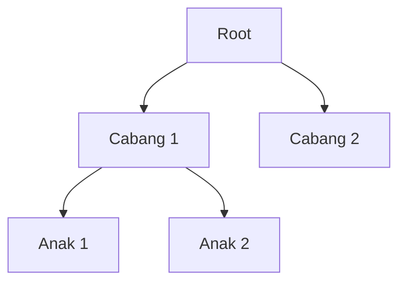

# Modul Pertemuan 10

## Administrasi Basis Data

### Desain Database untuk Performa

---

## A. Identitas Materi

**Nama Modul:** Desain Database untuk Performa  
**Pertemuan:** 10  
**Prasyarat:** SQL dasar, relasi tabel, index, optimasi query baca dan tulis  
**DBMS:** PostgreSQL  
**Fokus Materi:** memahami bahwa performa dan kemudahan pengelolaan database sangat dipengaruhi oleh keputusan desain sejak awal

---

## B. Tujuan Pembelajaran

Setelah mengikuti pertemuan ini, mahasiswa diharapkan mampu:

1. Menjelaskan mengapa desain database berpengaruh langsung terhadap performa dan kemudahan pemeliharaan sistem.
2. Menjelaskan trade-off antara fleksibilitas, efisiensi, dan konsistensi data.
3. Membedakan desain yang lebih cocok untuk kebutuhan transaksi dan kebutuhan analitik.
4. Menjelaskan kelebihan dan kekurangan model relasional, EAV, JSON, dan struktur hierarkis.
5. Menjelaskan tujuan normalisasi dan kapan denormalisasi dapat dipertimbangkan.
6. Membedakan natural key dan surrogate key serta menentukan kapan masing-masing lebih tepat digunakan.
7. Mengidentifikasi kesalahan desain database yang umum terjadi.

---

## C. Keterkaitan dengan Pertemuan Sebelumnya

Pada pertemuan-pertemuan sebelumnya, kita sudah membahas bagaimana query dioptimasi, bagaimana PostgreSQL memilih scan dan join, serta bagaimana operasi `INSERT`, `UPDATE`, dan `DELETE` memengaruhi performa sistem.

Pada pertemuan ini, fokusnya naik satu tingkat lebih awal, yaitu **desain database**. Sebelum query dioptimasi dan sebelum index ditambahkan, bentuk tabel dan relasi sudah lebih dulu menentukan apakah sistem akan mudah dioptimasi atau justru sulit diperbaiki di kemudian hari.

---

## D. Peta Materi

Materi pada modul ini dibahas dengan urutan berikut:

1. mengapa desain database penting,
2. studi kasus sederhana desain tabel,
3. perbedaan kebutuhan OLTP dan OLAP,
4. fleksibilitas vs efisiensi dan konsistensi,
5. perbandingan beberapa model penyimpanan data,
6. normalisasi dan denormalisasi,
7. natural key dan surrogate key,
8. kesalahan desain yang umum,
9. praktikum dan latihan.

---

## E. Pengantar

Ketika mahasiswa belajar database, perhatian sering langsung tertuju pada query: apakah query cepat, apakah index sudah benar, atau apakah execution plan sudah efisien.

Padahal, dalam banyak kasus, akar masalah performa bukan terletak pada query, tetapi pada **desain database**. Jika desain tabel, relasi, dan pemilihan tipe penyimpanan sejak awal sudah tidak tepat, maka query apa pun akan lebih sulit dioptimasi.

Karena itu, desain database sebaiknya dipahami sebagai **fondasi performa jangka panjang**.

---

## F. Mengapa Desain Database Sangat Penting?

Desain database memengaruhi banyak hal sekaligus, antara lain:

1. kemudahan menulis query,
2. kemudahan menambah index,
3. konsistensi dan integritas data,
4. biaya penyimpanan,
5. performa operasi baca dan tulis,
6. kemudahan pengembangan aplikasi di masa depan.

### Prinsip utama

> Query yang cepat biasanya lahir dari desain data yang benar.

Jika desainnya buruk, maka pengembang sering terpaksa membuat query yang rumit, menambah banyak transformasi, atau menambal masalah dengan index yang sebenarnya tidak menyelesaikan akar persoalan.

---

## G. Studi Kasus: Menyimpan Nomor Telepon

Salah satu contoh paling mudah untuk memahami pengaruh desain adalah cara menyimpan nomor telepon pengguna.

### Desain 1: dipisah ke tabel relasi

```sql
CREATE TABLE account (
  account_id INT PRIMARY KEY,
  login TEXT,
  first_name TEXT,
  last_name TEXT
);

CREATE TABLE phone (
  phone_id INT PRIMARY KEY,
  account_id INT,
  phone TEXT,
  phone_type TEXT
);
```

### Kelebihan desain ini

* fleksibel karena satu akun bisa punya banyak nomor,
* tidak perlu menambah kolom baru untuk tipe nomor baru,
* lebih mudah di-index,
* lebih dekat dengan prinsip normalisasi.

### Contoh query

```sql
SELECT account_id
FROM phone
WHERE phone = '08123456789';
```

Jika kolom `phone` diindeks, pencarian dapat dilakukan dengan efisien.

### Desain 2: semua nomor disimpan di satu tabel

```sql
CREATE TABLE account (
  account_id INT PRIMARY KEY,
  home_phone TEXT,
  work_phone TEXT,
  cell_phone TEXT
);
```

### Kekurangan desain ini

* kurang fleksibel,
* jika ada tipe baru harus tambah kolom,
* query pencarian menjadi lebih rumit,
* kebutuhan index juga bisa bertambah.

### Contoh query

```sql
SELECT account_id
FROM account
WHERE home_phone = '08123456789'
   OR work_phone = '08123456789'
   OR cell_phone = '08123456789';
```

### Pelajaran dari studi kasus

Desain yang tampak sederhana belum tentu paling baik. Kita harus menyesuaikan bentuk penyimpanan dengan pola data dan pola query yang benar-benar akan dipakai.

---

## H. OLTP dan OLAP: Kebutuhan Desain Bisa Berbeda

Tidak semua sistem database mempunyai tujuan yang sama.

### OLTP

OLTP adalah sistem yang fokus pada transaksi harian, misalnya:

* sistem kasir,
* aplikasi pemesanan,
* sistem akademik,
* sistem perbankan.

Pada OLTP, kebutuhan utamanya adalah:

* data konsisten,
* transaksi cepat,
* perubahan data sering terjadi.

Karena itu, desain yang lebih ternormalisasi sering lebih cocok.

### OLAP

OLAP adalah sistem yang fokus pada analisis dan pelaporan, misalnya:

* dashboard manajemen,
* laporan penjualan,
* analisis tren,
* data warehouse.

Pada OLAP, kebutuhan utamanya adalah:

* membaca data dalam jumlah besar,
* agregasi,
* query analitis.

Dalam konteks ini, denormalisasi kadang dapat dipertimbangkan agar query lebih sederhana dan lebih cepat untuk kebutuhan baca tertentu.

### Ringkasan

| Kebutuhan | Karakter desain yang sering cocok |
| --- | --- |
| OLTP | lebih terstruktur, lebih ternormalisasi |
| OLAP | bisa lebih denormalisasi sesuai kebutuhan analitik |

---

## I. Fleksibilitas vs Efisiensi vs Konsistensi

Dalam perancangan database, ada trade-off yang sangat penting:

* sistem yang terlalu fleksibel belum tentu efisien,
* sistem yang sangat cepat belum tentu mudah dikembangkan,
* sistem yang fleksibel tetapi longgar bisa mengorbankan konsistensi data.

### Contoh pilihan yang terlihat fleksibel

* menyimpan banyak atribut ke dalam JSON,
* memakai model EAV untuk hampir semua data,
* membuat skema terlalu umum agar semua jenis data bisa masuk.

### Risiko jika terlalu fleksibel

1. query menjadi lebih rumit,
2. index lebih sulit dimanfaatkan,
3. validasi data menjadi lebih lemah,
4. konsistensi data lebih sulit dijaga,
5. performa jangka panjang dapat menurun.

### Prinsip penting

> Fleksibilitas yang baik adalah fleksibilitas yang tetap terkontrol.

---

## J. Perbandingan Model Penyimpanan Data

### 1. Model Relasional

Model relasional menggunakan tabel, baris, kolom, primary key, foreign key, dan constraint.

#### Kelebihan

* sangat baik untuk data yang terstruktur,
* kuat dalam menjaga integritas,
* mudah dioptimasi dengan index,
* cocok untuk query yang kompleks.

#### Kekurangan

* untuk beberapa jenis data yang sangat dinamis, desain awal bisa terasa lebih kaku.

### 2. Model EAV

EAV adalah singkatan dari **Entity-Attribute-Value**.

Contoh bentuk data:

| entity | attribute | value |
| --- | --- | --- |
| user1 | passport_num | 12345 |
| user1 | country | ID |

#### Kelebihan

* sangat fleksibel untuk atribut yang sering berubah-ubah.

#### Kekurangan

* tipe data sulit dikontrol,
* query menjadi lebih rumit,
* sering membutuhkan banyak self join atau pivot,
* performa dapat memburuk saat data membesar.

### Contoh masalah pada EAV

Jika nilai tanggal disimpan sebagai teks, query seperti berikut bisa menjadi mahal:

```sql
SELECT *
FROM custom_field
WHERE to_date(custom_field_value, 'DD-MM-YYYY') > CURRENT_DATE;
```

Pada situasi seperti ini, database harus melakukan konversi nilai terlebih dahulu sebelum membandingkan.

### 3. JSON atau Key-Value di Dalam Tabel

PostgreSQL mendukung JSON dan JSONB. Fitur ini sangat berguna untuk data tambahan yang sifatnya semi-terstruktur.

Contoh:

```sql
CREATE TABLE user_profile (
  id INT PRIMARY KEY,
  data JSONB
);
```

#### Kelebihan

* lebih fleksibel,
* cocok untuk atribut tambahan yang tidak selalu ada,
* praktis untuk integrasi dengan data eksternal.

#### Kekurangan

* query bisa lebih rumit dibanding kolom biasa,
* validasi lebih terbatas,
* performa pencarian bisa kalah dibanding desain relasional jika dipakai berlebihan.

### 4. Model Hierarkis

Model ini cocok untuk data berbentuk pohon, misalnya struktur folder atau bagan organisasi.

Ilustrasi sederhananya:



#### Kelebihan

* cocok untuk data dengan struktur pohon yang jelas.

#### Kekurangan

* kurang fleksibel jika relasi data tidak murni berbentuk pohon,
* dapat menjadi rumit jika satu data perlu berhubungan dengan banyak data lain.

---

## K. PostgreSQL dan Kombinasi Model

Salah satu kekuatan PostgreSQL adalah kemampuannya mendukung lebih dari satu pendekatan. PostgreSQL bukan hanya mendukung model relasional, tetapi juga mendukung JSON, array, dan beberapa tipe data kompleks lainnya.

Namun kemampuan ini tidak berarti semua data harus dipindahkan ke bentuk yang paling fleksibel.

### Praktik yang lebih aman

* data utama dan data inti sistem tetap disimpan secara relasional,
* JSON digunakan untuk atribut tambahan atau data semi-terstruktur,
* constraint dan relasi tetap dimanfaatkan untuk menjaga kualitas data.

---

## L. Normalisasi dan Denormalisasi

### Apa itu normalisasi?

Secara sederhana, normalisasi adalah proses menyusun tabel agar:

* duplikasi data berkurang,
* ketergantungan data lebih jelas,
* perubahan data menjadi lebih aman dan konsisten.

### Tujuan normalisasi

1. mengurangi redundansi,
2. mencegah inkonsistensi,
3. memudahkan pemeliharaan data.

### Contoh sederhana

#### Belum ternormalisasi

| id | nama | kota |
| --- | --- | --- |
| 1 | Budi | Jakarta |
| 2 | Andi | Jakarta |

Nilai kota berulang di banyak baris.

#### Lebih ternormalisasi

Tabel `user`:

| id | nama | kota_id |
| --- | --- | --- |
| 1 | Budi | 10 |
| 2 | Andi | 10 |

Tabel `kota`:

| kota_id | nama_kota |
| --- | --- |
| 10 | Jakarta |

### Apakah normalisasi selalu paling cepat?

Tidak selalu. Normalisasi membuat data lebih rapi, tetapi query tertentu mungkin memerlukan join tambahan.

Karena itu, kita perlu membedakan antara:

* desain yang baik untuk integritas data,
* dan penyesuaian khusus untuk kebutuhan analitik atau pelaporan.

### Kapan denormalisasi dipertimbangkan?

Denormalisasi biasanya dipertimbangkan jika:

* kebutuhan baca tertentu sangat dominan,
* pola query sangat jelas dan berulang,
* manfaat penyederhanaan query lebih besar daripada risiko duplikasi data.

---

## M. Natural Key dan Surrogate Key

Salah satu keputusan desain yang penting adalah memilih kunci utama.

### Natural key

Natural key adalah kunci yang berasal dari data nyata di dunia bisnis.

Contoh:

* NIK,
* email,
* kode bandara,
* nomor induk mahasiswa.

### Surrogate key

Surrogate key adalah kunci buatan sistem yang biasanya tidak memiliki makna bisnis langsung.

Contoh:

```sql
id SERIAL PRIMARY KEY
```

### Perbandingan sederhana

| Aspek | Natural Key | Surrogate Key |
| --- | --- | --- |
| Makna bisnis | ada | tidak ada |
| Stabilitas | bisa berubah pada kasus tertentu | biasanya stabil |
| Panjang | bisa lebih panjang | biasanya lebih pendek |
| Kemudahan relasi | kadang lebih rumit | sering lebih mudah |

### Prinsip pemilihan

* gunakan natural key jika nilainya benar-benar stabil, unik, dan memang cocok menjadi identitas utama,
* gunakan surrogate key jika identitas bisnis bisa berubah, terlalu panjang, atau tidak praktis untuk relasi internal.

---

## N. Studi Kasus Pemilihan Key

### Kasus 1: kode bandara

```sql
airport_code CHAR(3) PRIMARY KEY
```

Kode bandara seperti `CGK` atau `JFK` memiliki arti bisnis yang jelas, pendek, dan stabil. Pada kasus seperti ini, natural key dapat menjadi pilihan yang masuk akal.

### Kasus 2: data booking

```sql
booking_id SERIAL PRIMARY KEY
```

Pada sistem booking, sering kali lebih aman memakai surrogate key karena:

* relasi internal menjadi lebih sederhana,
* sistem tidak terlalu bergantung pada satu kode bisnis,
* perubahan aturan bisnis lebih mudah ditangani.

### Kasus 3: tabel relasi

Untuk tabel relasi seperti `booking_leg`, kadang kunci komposit lebih sesuai, misalnya:

```sql
PRIMARY KEY (booking_id, flight_id)
```

Namun pada kasus lain, surrogate key tetap dipakai jika ada kebutuhan operasional tertentu. Yang penting, keputusan tersebut diambil berdasarkan alasan yang jelas, bukan kebiasaan semata.

---

## O. Kesalahan Desain yang Umum

Beberapa kesalahan yang sering terjadi dalam perancangan database adalah:

1. memakai surrogate key untuk semua tabel tanpa alasan,
2. menyimpan hampir semua atribut ke JSON walaupun datanya inti dan sering diquery,
3. memakai EAV secara berlebihan untuk data yang sebenarnya bisa dimodelkan relasional,
4. mengabaikan normalisasi sehingga data duplikat dan sulit dijaga konsistensinya,
5. membuat desain terlalu fleksibel tetapi mengorbankan performa dan validasi.

### Prinsip evaluasi

Saat menilai desain database, pertanyaan yang perlu diajukan adalah:

* apakah data ini stabil atau sering berubah bentuk,
* apakah data ini sering dicari dan difilter,
* apakah integritas data harus dijaga ketat,
* apakah sistem lebih dominan transaksi atau analitik,
* apakah kompleksitas desain ini benar-benar memberi manfaat.

---

## P. Strategi Umum Mendesain Database yang Lebih Baik

Beberapa pedoman praktis yang dapat digunakan adalah:

1. mulai dari model relasional yang jelas,
2. normalisasi data inti terlebih dahulu,
3. gunakan denormalisasi hanya bila ada alasan kebutuhan yang jelas,
4. gunakan JSON untuk atribut tambahan, bukan untuk semua data inti,
5. pilih natural key atau surrogate key berdasarkan stabilitas dan kebutuhan bisnis,
6. rancang tabel dengan mempertimbangkan pola query yang benar-benar akan dijalankan.

---

## Q. Ringkasan Materi

Ide utama dari pertemuan ini adalah sebagai berikut.

1. Desain database adalah fondasi performa dan kualitas sistem.
2. Fleksibilitas harus diseimbangkan dengan efisiensi dan konsistensi data.
3. Model relasional tetap menjadi dasar utama untuk banyak sistem transaksi.
4. EAV, JSON, dan model lain dapat berguna, tetapi tidak boleh digunakan tanpa pertimbangan.
5. Normalisasi membantu menjaga data tetap rapi dan konsisten.
6. Denormalisasi dapat dipakai pada kondisi tertentu, terutama untuk kebutuhan analitik atau query baca khusus.
7. Pemilihan natural key dan surrogate key harus didasarkan pada kebutuhan nyata, bukan kebiasaan semata.

---

## R. Praktikum Sederhana

Gunakan PostgreSQL dan buat dua model tabel untuk menyimpan data kontak pengguna.

### Langkah praktikum

1. Buat satu desain dengan tabel relasional terpisah.
2. Buat satu desain dengan beberapa kolom nomor telepon di satu tabel.
3. Isi masing-masing desain dengan data contoh.
4. Jalankan query pencarian nomor telepon.
5. Bandingkan kemudahan query, fleksibilitas desain, dan kemungkinan strategi indexing.

### Hal yang diamati

1. perbedaan struktur query,
2. perbedaan fleksibilitas saat ada tipe nomor baru,
3. kemudahan menambah index,
4. potensi duplikasi atau inkonsistensi data.

---

## S. Latihan Soal

### Soal Konsep

1. Mengapa desain database memengaruhi performa sistem?
2. Apa perbedaan utama antara desain yang fleksibel dan desain yang efisien?
3. Mengapa model relasional masih menjadi pilihan utama untuk banyak sistem transaksi?
4. Jelaskan perbedaan natural key dan surrogate key.
5. Apa tujuan normalisasi dalam perancangan database?

### Soal Analisis

1. Mengapa penggunaan JSON untuk semua data inti dapat menimbulkan masalah performa?
2. Mengapa model EAV sering membuat query lebih rumit dibanding model relasional?
3. Kapan denormalisasi dapat dipertimbangkan, dan apa risikonya?

### Soal Praktik SQL

1. Buat contoh desain dua tabel untuk menyimpan akun dan nomor telepon.
2. Buat contoh desain satu tabel yang menyimpan beberapa jenis nomor telepon sekaligus.
3. Tulis contoh primary key yang memakai natural key dan contoh yang memakai surrogate key.

---

## T. Tugas Mandiri

Pilih satu sistem informasi yang Anda kenal, misalnya sistem akademik, toko online, aplikasi perpustakaan, atau aplikasi absensi.

Kerjakan hal berikut:

1. identifikasi tiga entitas utama pada sistem tersebut,
2. jelaskan apakah masing-masing lebih cocok memakai natural key atau surrogate key,
3. sebutkan satu bagian data yang sebaiknya relasional dan satu bagian data yang mungkin boleh disimpan sebagai JSON,
4. jelaskan alasan desain Anda dari sudut pandang performa dan konsistensi data.

---

## U. Penutup

Desain database yang baik tidak selalu berarti paling fleksibel, paling singkat, atau paling modern. Desain yang baik adalah desain yang sesuai dengan kebutuhan sistem, menjaga kualitas data, dan tetap dapat dioptimasi ketika data bertambah besar.

Karena itu, mahasiswa perlu membangun cara berpikir bahwa performa database tidak dimulai dari query, tetapi dari keputusan desain data yang dibuat sejak awal. Jika fondasinya benar, proses optimasi pada tahap berikutnya akan jauh lebih mudah.