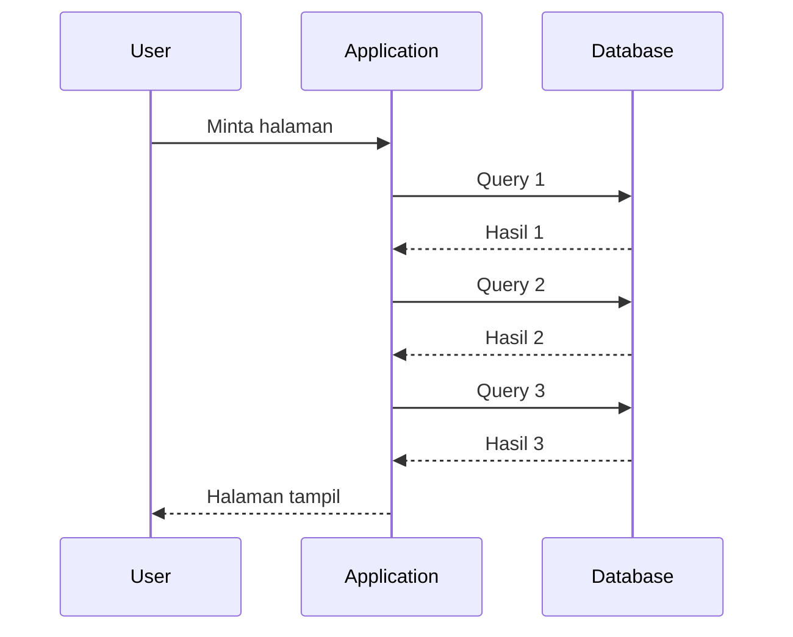
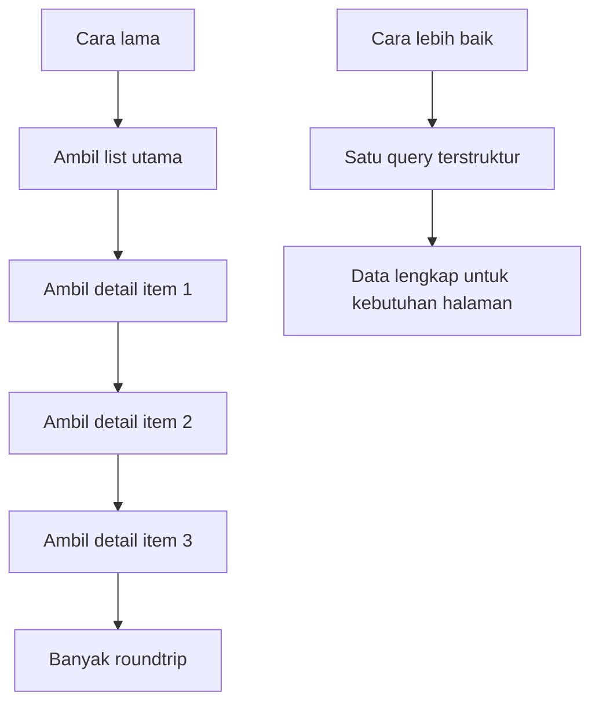

# Modul Pertemuan 11

## Administrasi Basis Data

### Integrasi Aplikasi, ORM, dan Performa

---

## A. Identitas Materi

**Nama Modul:** Integrasi Aplikasi, ORM, dan Performa  
**Pertemuan:** 11  
**Prasyarat:** optimasi query, algoritma join, execution plan, desain database, optimasi DML  
**DBMS:** PostgreSQL  
**Fokus Materi:** memahami bahwa performa aplikasi tidak hanya ditentukan oleh query yang cepat, tetapi juga oleh cara aplikasi berinteraksi dengan database

---

## B. Tujuan Pembelajaran

Setelah mengikuti pertemuan ini, mahasiswa diharapkan mampu:

1. Menjelaskan hubungan antara performa aplikasi dan performa database.
2. Menjelaskan mengapa aplikasi bisa lambat walaupun query individual terlihat cepat.
3. Menjelaskan konsep response time, roundtrip, impedance mismatch, dan layered architecture.
4. Mengidentifikasi anti-pattern seperti terlalu banyak query kecil, shopping list problem, dan N+1 query.
5. Menjelaskan peran ORM beserta manfaat dan risikonya terhadap performa.
6. Menjelaskan pendekatan yang lebih efisien dalam pengambilan data berbasis set.
7. Menganalisis interaksi aplikasi dan PostgreSQL secara lebih tepat dari sudut pandang performa.

---

## C. Keterkaitan dengan Pertemuan Sebelumnya

Pada pertemuan sebelumnya, kita membahas desain database, pentingnya struktur tabel, normalisasi, dan keputusan desain yang memengaruhi performa jangka panjang.

Pada pertemuan ini, fokusnya bergeser ke lapisan aplikasi. Walaupun desain database dan query sudah baik, aplikasi tetap bisa lambat jika cara aplikasi mengambil data dari database tidak efisien. Karena itu, mahasiswa perlu memahami bahwa optimasi tidak berhenti pada SQL, tetapi juga pada pola komunikasi antara aplikasi dan database.

---

## D. Peta Materi

Materi pada modul ini dibahas dengan urutan berikut:

1. mengapa response time penting,
2. mengapa query cepat belum tentu aplikasi cepat,
3. world wide wait dan roundtrip berlebihan,
4. impedance mismatch antara aplikasi dan database,
5. layered architecture dan dampaknya,
6. anti-pattern pada aplikasi,
7. ORM dan masalah N+1 query,
8. solusi pengambilan data berbasis set,
9. pendekatan yang dapat dilakukan di PostgreSQL,
10. praktikum dan latihan.

---

## E. Pengantar

Pada banyak kasus, pengembang sudah merasa berhasil ketika query `SELECT` dapat berjalan cepat. Namun dari sudut pandang pengguna, yang dinilai bukanlah waktu eksekusi satu query, melainkan **waktu respon aplikasi secara keseluruhan**.

Akibatnya, muncul situasi seperti ini:

* satu query hanya membutuhkan 0,1 detik,
* tetapi halaman aplikasi baru selesai dalam beberapa detik,
* dan pengguna tetap merasa sistem lambat.

Di sinilah materi minggu ini menjadi penting. Kita tidak lagi hanya bertanya, “apakah query ini cepat?”, tetapi juga, “apakah aplikasi menggunakan database dengan cara yang benar?”

---

## F. Mengapa Response Time Sangat Penting?

Dalam dunia nyata, performa aplikasi memiliki dampak langsung terhadap pengalaman pengguna dan bahkan nilai bisnis.

### Fakta praktis

* jika aplikasi merespons cepat, pengguna merasa sistem nyaman digunakan,
* jika aplikasi lambat, pengguna mudah meninggalkan proses,
* pada sistem bisnis, keterlambatan kecil pun dapat berdampak pada konversi, produktivitas, dan kepuasan pengguna.

### Inti pemahaman

> Performa aplikasi bukan hanya masalah teknis, tetapi juga masalah kualitas layanan.

Karena itu, pengukuran performa harus dilihat dari **end-to-end response time**, bukan hanya dari kecepatan satu query di database.

---

## G. Query Cepat Belum Tentu Aplikasi Cepat

Ini adalah ide utama dalam modul ini.

Sebuah aplikasi bisa tetap lambat walaupun setiap query individual terlihat cepat. Penyebabnya sering bukan karena satu query yang sangat berat, melainkan karena **terlalu banyak query kecil** yang dijalankan berulang-ulang.

### Contoh situasi

* Query A: 0,05 detik
* Query B: 0,08 detik
* Query C: 0,07 detik

Jika aplikasi menjalankan ratusan query kecil semacam ini untuk satu halaman, total waktu respon tetap akan besar.

### Ilustrasi sederhana


Masalahnya bukan hanya waktu query, tetapi juga waktu bolak-balik antara aplikasi dan database.

---

## H. World Wide Wait dan Masalah Roundtrip

Istilah yang sering dipakai untuk menggambarkan masalah ini adalah **world wide wait**, yaitu kondisi ketika sistem sebenarnya lebih banyak menunggu daripada bekerja secara efisien.

### Gejala umum

* query individual tampak cepat,
* tetapi halaman aplikasi atau proses bisnis tetap lambat,
* CPU aplikasi tampak tidak terlalu sibuk,
* waktu habis untuk menunggu hasil query satu per satu.

### Penyebab utama

* terlalu banyak roundtrip,
* data diambil sedikit demi sedikit,
* logika aplikasi memaksa database bekerja per baris, bukan per himpunan data.

### Ilustrasi roundtrip



Jika pola ini terjadi puluhan atau ratusan kali, waktu respon akan membengkak.

---

## I. Impedance Mismatch antara Aplikasi dan Database

Salah satu sumber masalah mendasar adalah perbedaan cara berpikir antara aplikasi dan database.

### Aplikasi sering berpikir seperti ini

* bekerja dengan object,
* memproses data satu per satu,
* menggunakan loop dan navigasi antar object.

### Database berpikir seperti ini

* bekerja dengan tabel dan set data,
* memproses banyak baris sekaligus,
* menggunakan operasi berbasis SQL seperti join, grouping, dan agregasi.

### Perbandingan sederhana

| Cara pikir aplikasi | Cara pikir database |
| --- | --- |
| object | set data |
| satu per satu | banyak sekaligus |
| loop | join dan operasi set |
| navigasi antar object | query terstruktur |

### Dampak utama

Jika aplikasi memaksa database mengikuti pola object satu per satu, maka kekuatan SQL tidak dimanfaatkan secara optimal.

---

## J. Layered Architecture dan Pengaruhnya terhadap Performa

Banyak aplikasi modern menggunakan layered architecture, misalnya:

1. UI,
2. business logic,
3. persistence layer,
4. database.

Arsitektur seperti ini sangat berguna untuk:

* modularitas,
* pembagian tanggung jawab,
* dan kemudahan perawatan kode.

Namun, jika setiap layer terlalu terpisah tanpa mempertimbangkan performa, maka proses pengambilan data bisa menjadi berputar-putar dan tidak efisien.

### Risiko umum

* terlalu banyak method kecil yang saling memanggil,
* data diminta per potong kecil di banyak layer,
* tidak ada satu titik yang merancang query secara utuh.

### Catatan penting

Arsitektur berlapis tidak salah. Masalahnya muncul ketika desain lapisan membuat aplikasi kehilangan pandangan bahwa database lebih efisien jika diberi pekerjaan berbasis set.

---

## K. Masalah Umum dalam Implementasi Aplikasi

Beberapa pola yang sering membuat aplikasi lambat adalah sebagai berikut.

### 1. Business logic terlalu besar dan tersebar

Akibatnya:

* logika sulit dibaca,
* query tersebar di banyak tempat,
* duplikasi akses data mudah terjadi.

### 2. Data diambil satu per satu

Contoh pola:

```text
for each flight:
    get boarding pass
```

Secara konsep, ini sama seperti nested loop di aplikasi.

### 3. Database tidak dimanfaatkan sesuai kekuatannya

Padahal pada banyak kasus, data yang dibutuhkan bisa diambil sekaligus dengan join:

```sql
SELECT *
FROM flight
JOIN boarding_pass USING (flight_id);
```

---

## L. Shopping List Problem

Salah satu analogi paling mudah dipahami mahasiswa adalah **shopping list problem**.

### Analogi sehari-hari

Cara buruk:

* pergi ke toko untuk membeli satu barang,
* pulang,
* lalu kembali lagi untuk membeli barang berikutnya.

Cara yang lebih baik:

* buat daftar belanja,
* ambil semua barang sekaligus,
* lalu pulang satu kali.

### Dalam aplikasi

Cara buruk:

* 100 baris data memicu 100 query.

Cara lebih baik:

* 100 baris data diambil melalui satu query yang dirancang dengan benar.

### Prinsip utamanya

> Lebih baik sedikit query yang tepat daripada sangat banyak query kecil.

---

## M. Dampak Anti-Pattern pada Aplikasi

Jika aplikasi menggunakan terlalu banyak query kecil, dampaknya bisa sangat besar:

1. response time meningkat,
2. roundtrip jaringan bertambah,
3. server aplikasi lebih banyak menunggu,
4. throughput sistem turun,
5. beban database meningkat walaupun tiap query tampak ringan.

### Solusi yang sering salah sasaran

Beberapa orang mencoba memperbaiki masalah ini dengan:

* upgrade server,
* upgrade jaringan,
* memindahkan sistem ke arsitektur terdistribusi.

Padahal, jika akar masalahnya adalah jumlah request yang terlalu banyak, solusi tersebut sering tidak menyentuh masalah utama.

---

## N. Contoh Kasus Nyata

Bayangkan sebuah form besar dengan banyak komponen. Di balik satu halaman, aplikasi memanggil fungsi kecil berulang-ulang, dan setiap fungsi memanggil query sendiri.

Akibatnya bisa terjadi pola seperti ini:

* satu layar sederhana memicu ribuan query,
* waktu respon meningkat dari hitungan milidetik menjadi menit,
* developer merasa query tidak berat, padahal masalahnya ada pada jumlah eksekusi.

### Pelajaran penting

Masalah performa aplikasi sering tidak berasal dari satu query yang buruk, tetapi dari akumulasi banyak query yang seharusnya bisa digabungkan.

---

## O. Kesalahan Umum Developer

Beberapa kesalahan yang sering ditemukan adalah:

1. membuat terlalu banyak method kecil yang masing-masing melakukan query,
2. menggunakan loop di aplikasi untuk mengambil detail data satu per satu,
3. menghindari join padahal join lebih tepat,
4. memanggil query yang sama berkali-kali,
5. menganggap query yang cepat pasti tidak bermasalah walaupun dipanggil sangat sering.

---

## P. ORM dan Mengapa Ia Populer

ORM adalah singkatan dari **Object Relational Mapper**, yaitu alat yang membantu aplikasi memetakan tabel database menjadi object di dalam kode program.

### Contoh ORM yang umum

* Hibernate,
* Sequelize,
* TypeORM,
* Eloquent,
* Entity Framework.

### Mengapa ORM populer?

* mempermudah pengembangan,
* mengurangi penulisan SQL manual,
* membantu developer yang lebih terbiasa dengan object dibanding SQL.

### Catatan penting

ORM bukan sesuatu yang salah. Masalah muncul jika developer memakai ORM tanpa memahami query yang sebenarnya dijalankan di belakang layar.

---

## Q. Cara Kerja ORM dan Risiko Performanya

ORM cenderung mendorong aplikasi bekerja dalam bentuk object. Ini nyaman untuk pengembangan, tetapi dapat membuat akses data menjadi terlalu terpecah.

### Risiko yang sering muncul

* data diambil per object,
* relasi dimuat sedikit demi sedikit,
* developer tidak melihat berapa banyak query yang sebenarnya berjalan.

### Dampak

* terlalu banyak roundtrip,
* query berulang,
* pemakaian database tidak lagi set-based.

---

## R. N+1 Query Problem

Salah satu anti-pattern paling terkenal pada aplikasi berbasis ORM adalah **N+1 query problem**.

### Bentuk umum

1. satu query dipakai untuk mengambil daftar utama,
2. lalu untuk setiap item pada daftar itu, aplikasi menjalankan query tambahan.

### Contoh pseudocode

```text
users = getAllUsers()

for each user:
    getOrders(user.id)
```

Jika ada 100 user, maka pola ini bisa menghasilkan:

* 1 query untuk daftar user,
* 100 query untuk order masing-masing user.

### Total

* 1 + N query.

### Hubungan dengan shopping list problem

Masalah ini sebenarnya adalah versi teknis dari shopping list problem yang sudah dibahas sebelumnya.

---

## S. Dampak ORM yang Tidak Dikendalikan

Jika ORM dipakai tanpa pengendalian, beberapa dampaknya adalah:

1. SQL tersembunyi dari pengembang,
2. query mahal berjalan tanpa disadari,
3. properti object tertentu bisa memicu query tambahan,
4. satu halaman aplikasi dapat mengeksekusi query berulang kali tanpa terlihat jelas di kode.

### Inti masalah

Developer merasa sedang memanggil method atau property biasa, padahal di belakang layar database sedang menerima banyak permintaan.

---

## T. Solusi: Ambil Data Sekaligus dalam Bentuk Set

Untuk banyak kasus, solusi yang lebih efisien adalah mengambil data yang diperlukan sekaligus dalam bentuk yang lebih lengkap.

### Target solusi

1. ambil data secara set-based,
2. kurangi jumlah roundtrip,
3. gabungkan data yang memang akan dipakai bersama,
4. biarkan database mengerjakan operasi join, filter, dan agregasi.

### Ilustrasi perbandingan



---

## U. Pendekatan yang Bisa Dilakukan di PostgreSQL

PostgreSQL menyediakan banyak kemampuan yang dapat membantu aplikasi mengurangi jumlah query.

### 1. Join yang dirancang dengan baik

Untuk kebutuhan tampilan atau laporan tertentu, join sering menjadi solusi paling langsung.

### 2. Function yang mengembalikan set data

PostgreSQL dapat digunakan untuk membuat function yang mengembalikan hasil terstruktur sesuai kebutuhan aplikasi.

Contoh:

```sql
SELECT * FROM get_user_booking();
```

### 3. JSON atau JSONB untuk hasil yang siap dikirim ke aplikasi

Jika aplikasi membutuhkan struktur data bertingkat, PostgreSQL juga bisa membantu membangun hasil dalam bentuk JSON.

Contoh:

```sql
SELECT json_build_object(
  'user_id', u.user_id,
  'name', u.name
)
FROM users u;
```

### 4. Pendekatan object-relational PostgreSQL

PostgreSQL mendukung beberapa fitur lanjutan yang memungkinkan hasil query lebih dekat dengan kebutuhan aplikasi.

### Catatan penting

Tujuan utamanya bukan memakai fitur sebanyak mungkin, tetapi **mengurangi roundtrip dan menyusun hasil data sesuai kebutuhan aplikasi secara efisien**.

---

## V. Perbandingan Pendekatan Lama dan Pendekatan yang Lebih Baik

| Aspek | Pendekatan Kurang Efisien | Pendekatan Lebih Baik |
| --- | --- | --- |
| Jumlah query | banyak query kecil | sedikit query yang terstruktur |
| Roundtrip | tinggi | rendah |
| Pemrosesan | banyak di aplikasi | lebih banyak dimanfaatkan di database |
| Kode | tampak sederhana per bagian, tetapi tersebar | lebih terencana sesuai kebutuhan data |
| Performa | mudah turun saat data membesar | lebih stabil dan lebih mudah diukur |

---

## W. Prinsip Praktis yang Perlu Diingat

Beberapa prinsip utama yang perlu diingat mahasiswa adalah:

1. minimalkan jumlah query,
2. maksimalkan data yang berguna per query,
3. gunakan SQL dan join ketika memang tepat,
4. pikirkan data sebagai set, bukan hanya object satu per satu,
5. pahami query yang dihasilkan ORM,
6. ukur response time aplikasi secara menyeluruh, bukan hanya waktu eksekusi satu query.

---

## X. Ringkasan Materi

Ide utama dari pertemuan ini adalah sebagai berikut.

1. Aplikasi cepat tidak cukup dibangun dengan satu query yang cepat.
2. Masalah performa sering muncul karena terlalu banyak query kecil dan terlalu banyak roundtrip.
3. Aplikasi dan database memiliki cara berpikir yang berbeda, sehingga impedance mismatch perlu dipahami.
4. Layered architecture dan ORM membantu pengembangan, tetapi bisa menimbulkan masalah performa jika digunakan tanpa kontrol.
5. N+1 query problem adalah salah satu bentuk anti-pattern yang sangat umum.
6. Pendekatan set-based biasanya lebih efisien dibanding mengambil data satu per satu.
7. PostgreSQL dapat membantu menyiapkan hasil data yang lebih lengkap agar aplikasi tidak perlu bolak-balik terlalu sering.

---

## Y. Praktikum Sederhana

Gunakan satu contoh skenario aplikasi, misalnya tampilan daftar user dan daftar order milik setiap user.

### Langkah praktikum

1. Buat satu versi akses data yang mengambil daftar user terlebih dahulu, lalu mengambil order tiap user satu per satu.
2. Buat versi kedua yang mengambil semua data yang diperlukan dengan join atau query gabungan.
3. Catat jumlah query yang dijalankan pada masing-masing pendekatan.
4. Bandingkan waktu respon keduanya.
5. Diskusikan pendekatan mana yang lebih efisien dan mengapa.

### Hal yang diamati

1. jumlah query,
2. jumlah roundtrip,
3. waktu respon,
4. kompleksitas logika di aplikasi.

---

## Z. Latihan Soal

### Soal Konsep

1. Mengapa query yang cepat belum tentu membuat aplikasi menjadi cepat?
2. Apa yang dimaksud dengan world wide wait dalam konteks performa aplikasi?
3. Jelaskan apa yang dimaksud dengan impedance mismatch antara aplikasi dan database.
4. Apa itu ORM, dan mengapa ORM bisa mempermudah pengembangan aplikasi?
5. Apa yang dimaksud dengan N+1 query problem?

### Soal Analisis

1. Mengapa terlalu banyak query kecil dapat menurunkan performa walaupun masing-masing query tampak ringan?
2. Mengapa upgrade hardware tidak selalu menyelesaikan masalah performa aplikasi?
3. Mengapa pendekatan set-based biasanya lebih baik daripada loop berbasis object satu per satu?

### Soal Praktik SQL dan Perancangan

1. Tulis contoh query join untuk mengambil data `orders`, `users`, dan `products` dalam satu query.
2. Buat contoh pseudocode yang menunjukkan pola N+1 query.
3. Berikan contoh bagaimana PostgreSQL dapat mengembalikan data dalam bentuk JSON agar aplikasi tidak perlu melakukan banyak query tambahan.

---

## AA. Tugas Mandiri

Pilih satu fitur aplikasi yang Anda kenal, misalnya halaman daftar mahasiswa, halaman riwayat transaksi, atau halaman detail pemesanan.

Kerjakan hal berikut:

1. jelaskan data apa saja yang perlu ditampilkan,
2. jelaskan bagaimana fitur tersebut bisa menjadi lambat jika data diambil satu per satu,
3. usulkan pendekatan query yang lebih set-based,
4. jelaskan apakah ORM pada fitur itu berpotensi menimbulkan N+1 query.

---

## AB. Penutup

Performa aplikasi bukan hanya soal seberapa cepat database menjalankan satu query, tetapi juga soal bagaimana aplikasi merancang komunikasi dengan database.

Jika aplikasi terlalu sering bolak-balik meminta data kecil, maka performa akan turun walaupun database sebenarnya cukup cepat. Karena itu, mahasiswa perlu membangun kebiasaan berpikir set-based, memahami dampak ORM, dan merancang pengambilan data secara lebih utuh.

Dengan cara berpikir ini, mahasiswa akan lebih siap membangun aplikasi yang tidak hanya benar secara fungsi, tetapi juga efisien saat digunakan.