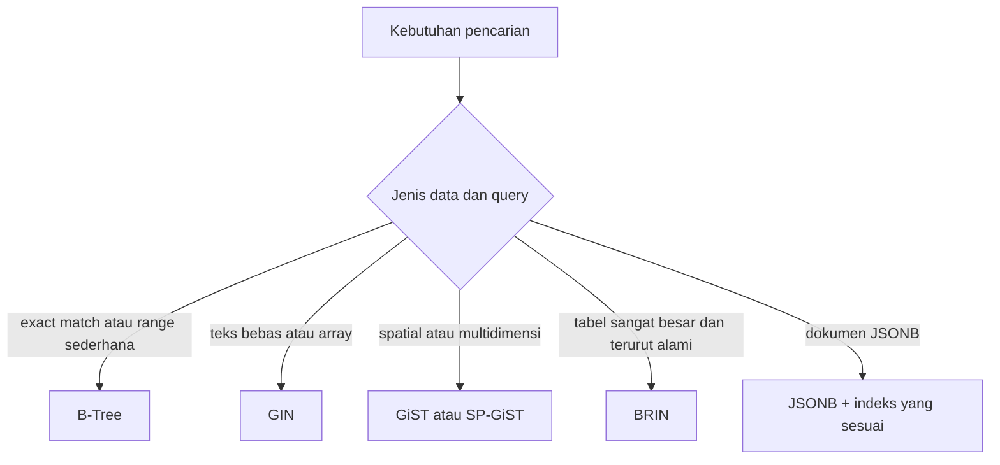
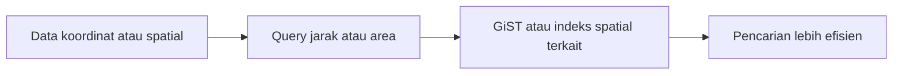

# Modul Pertemuan 13

## Administrasi Basis Data

### More Complex Filtering and Search (Filtering dan Pencarian Lanjutan di PostgreSQL)

---

## A. Identitas Materi

**Nama Modul:** More Complex Filtering and Search (Filtering dan Pencarian Lanjutan di PostgreSQL)  
**Pertemuan:** 13  
**Prasyarat:** indeks B-Tree, optimasi query, dynamic SQL, JSON/JSONB, dasar desain query  
**DBMS:** PostgreSQL  
**Fokus Materi:** memahami keterbatasan indeks biasa, mengenal pencarian teks, pencarian multidimensi, indeks lanjutan PostgreSQL, serta memilih strategi filtering dan search yang sesuai dengan bentuk data dan pola query

---

## B. Tujuan Pembelajaran

Setelah mengikuti pertemuan ini, mahasiswa diharapkan mampu:

1. Menjelaskan mengapa B-Tree tidak selalu cocok untuk semua jenis pencarian.
2. Menjelaskan konsep dasar Full Text Search pada PostgreSQL.
3. Menjelaskan fungsi `tsvector`, `tsquery`, dan operator pencarian teks.
4. Menjelaskan perbedaan GIN, GiST, SP-GiST, dan BRIN secara umum.
5. Menjelaskan kebutuhan indexing untuk data teks, spatial, multidimensi, dan JSONB.
6. Menjelaskan kapan JSONB berguna dan apa keterbatasannya.
7. Memilih strategi pencarian yang lebih tepat berdasarkan jenis data dan kebutuhan aplikasi.

---

## C. Keterkaitan dengan Pertemuan Sebelumnya

Pada pertemuan sebelumnya, kita membahas bagaimana aplikasi sering membutuhkan bentuk data yang lebih kompleks daripada sekadar hasil query sederhana. Kita juga melihat bagaimana struktur data, contract, dan cara pengambilan data dapat memengaruhi performa.

Pada pertemuan ini, fokusnya bergeser ke teknik filtering dan searching yang lebih lanjut. Ketika data yang dicari bukan hanya angka atau string pendek, melainkan dokumen teks, data spasial, data bertingkat, atau JSONB, maka kita memerlukan strategi pencarian dan jenis indeks yang berbeda dari B-Tree biasa.

---

## D. Peta Materi

Materi pada modul ini dibahas dengan urutan berikut:

1. mengapa pencarian lanjutan diperlukan,
2. Full Text Search,
3. indeks untuk pencarian teks,
4. pencarian multidimensi dan spatial,
5. BRIN untuk tabel besar,
6. indexing pada JSON dan JSONB,
7. risiko menjadikan JSON sebagai storage utama,
8. perbandingan strategi search,
9. best practice, studi kasus, praktikum, dan latihan.

---

## E. Pengantar

Pada materi dasar indeks, kita mengenal B-Tree sebagai jenis indeks default di PostgreSQL. B-Tree sangat baik untuk kondisi seperti:

- pencarian exact match,
- perbandingan `<`, `<=`, `>`, `>=`,
- sorting,
- range query sederhana.

Namun tidak semua kebutuhan pencarian cocok dengan pola tersebut.

Contoh kebutuhan yang lebih kompleks:

- mencari artikel berdasarkan kata-kata yang mirip makna atau bentuk katanya,
- mencari lokasi terdekat dari satu titik koordinat,
- mencari data di dalam dokumen JSONB,
- mempercepat pencarian pada tabel log yang sangat besar.

Jika semua masalah ini dipaksa memakai B-Tree, hasilnya bisa tidak efisien atau bahkan tidak relevan. Karena itu, PostgreSQL menyediakan beberapa teknik pencarian dan indeks lanjutan.

---

## F. Mengapa B-Tree Tidak Selalu Cukup?

### 1. B-Tree sangat baik untuk data terurut

B-Tree bekerja baik ketika PostgreSQL dapat memanfaatkan urutan nilai.

Contoh yang cocok:

```sql
SELECT *
FROM booking
WHERE booking_id = 1001;
```

atau:

```sql
SELECT *
FROM booking
WHERE booking_date BETWEEN DATE '2026-03-01' AND DATE '2026-03-31';
```

### 2. Masalah mulai muncul pada data yang tidak sederhana

Contoh kasus yang tidak cocok jika hanya mengandalkan B-Tree:

- teks panjang atau dokumen,
- pencarian kata yang mirip,
- array atau himpunan nilai,
- data koordinat,
- dokumen JSONB yang berisi struktur bertingkat.

### 3. Inti persoalan

Jenis query berbeda membutuhkan cara representasi indeks yang berbeda. Itulah alasan kita perlu mengenal Full Text Search, GIN, GiST, BRIN, dan teknik lainnya.

### Diagram keputusan sederhana



---

## G. Full Text Search

### 1. Apa itu Full Text Search?

Full Text Search atau FTS adalah teknik pencarian pada teks bebas. FTS dipakai ketika data yang dicari bukan sekadar nilai string persis sama, tetapi isi dokumen atau kalimat.

Contoh data yang cocok:

- artikel,
- komentar pengguna,
- abstrak penelitian,
- deskripsi produk,
- catatan atau log teks.

### 2. Perbedaan dengan pencarian SQL biasa

| SQL biasa | Full Text Search |
| --- | --- |
| fokus pada kecocokan literal | fokus pada kecocokan istilah dalam dokumen |
| sering memakai `=` atau `LIKE` | memakai representasi term dan query teks |
| cocok untuk string sederhana | cocok untuk teks yang lebih panjang |
| tidak memahami bentuk dasar kata | dapat melakukan normalisasi kata |

### 3. Konsep dasar FTS

FTS di PostgreSQL umumnya melibatkan dua objek utama:

- `tsvector` untuk representasi dokumen,
- `tsquery` untuk representasi kata kunci pencarian.

#### Dokumen menjadi `tsvector`

Teks dipecah menjadi kata-kata penting, lalu dinormalisasi.

```sql
SELECT to_tsvector('english', 'Database systems are running efficiently');
```

#### Query menjadi `tsquery`

Kata kunci pencarian juga diubah ke format yang bisa dibandingkan.

```sql
SELECT to_tsquery('english', 'database & efficient');
```

### 4. Operator penting

Operator dasar FTS adalah `@@`.

```sql
document_tsvector @@ search_tsquery
```

Artinya: apakah dokumen cocok dengan query teks?

### 5. Contoh sederhana

```sql
SELECT *
FROM article
WHERE to_tsvector('english', content) @@ to_tsquery('english', 'database');
```

### 6. Proses linguistik

FTS bukan sekadar memecah string, tetapi juga bisa melakukan:

- stemming, yaitu mengubah kata ke bentuk dasar,
- penghapusan stop words tertentu,
- normalisasi sesuai konfigurasi bahasa.

Contoh umum:

- `running` dapat dipetakan ke `run`,
- `words` dapat dipetakan ke `word`.

### 7. Konfigurasi bahasa

PostgreSQL mendukung beberapa konfigurasi, misalnya:

- `english`,
- `simple`,
- konfigurasi khusus jika diperlukan.

Pemilihan konfigurasi penting karena memengaruhi hasil stemming dan kata-kata yang dianggap penting.

---

## H. Trigram Search

Selain FTS, PostgreSQL juga mendukung pencarian berbasis kemiripan string melalui trigram.

### 1. Apa itu trigram?

Trigram memecah string menjadi potongan tiga karakter yang saling tumpang tindih.

Contoh sederhana:

- `cats` dapat dipandang sebagai potongan-potongan seperti `cat` dan `ats`.

### 2. Kapan trigram berguna?

Trigram berguna untuk:

- pencarian mirip ejaan,
- typo-tolerant search,
- `LIKE` atau `ILIKE` tertentu,
- pencocokan nama yang tidak selalu persis.

### 3. Catatan

Trigram tidak sama dengan Full Text Search. FTS fokus pada istilah dan struktur kata, sedangkan trigram fokus pada kemiripan karakter.

---

## I. Indeks untuk Full Text Search

### 1. GIN (Generalized Inverted Index)

GIN sangat sering dipakai untuk Full Text Search, array, dan JSONB.

### Konsep dasar GIN

Secara sederhana, GIN menyimpan hubungan antara elemen dan baris yang mengandung elemen tersebut. Untuk FTS, elemen itu bisa berupa term atau lexeme.

### Contoh indeks GIN untuk FTS

```sql
CREATE INDEX idx_article_fts
ON article
USING GIN (to_tsvector('english', content));
```

### Kelebihan GIN

- sangat baik untuk pencarian term,
- cocok untuk dokumen teks,
- sangat berguna untuk array dan JSONB.

### Kekurangan GIN

- ukuran indeks bisa besar,
- biaya update dapat lebih tinggi dibanding beberapa jenis indeks lain.

### 2. GiST untuk teks

GiST juga dapat dipakai pada beberapa skenario teks, meskipun untuk FTS murni GIN sering menjadi pilihan utama.

### Karakter umum GiST

- lebih fleksibel,
- mendukung berbagai tipe data,
- pada beberapa skenario perlu pemeriksaan ulang hasil.

### Perbandingan singkat GIN dan GiST untuk teks

| Aspek | GIN | GiST |
| --- | --- | --- |
| fokus utama | pencarian elemen/term | kerangka indeks yang lebih umum |
| umum untuk FTS | sangat umum | bisa digunakan tergantung kasus |
| ukuran indeks | bisa lebih besar | sering lebih fleksibel |
| akurasi hasil langsung | umumnya baik | bisa memerlukan recheck |

### Catatan penting

Kalimat seperti “GIN selalu lebih baik dari GiST” tidak tepat. Pemilihan tetap bergantung pada tipe data, pola query, dan beban update.

---

## J. Multidimensional dan Spatial Search

### 1. Apa itu data spatial atau multidimensi?

Data spatial biasanya berkaitan dengan posisi atau bentuk geometris, misalnya titik lokasi, area, atau jarak.

Data multidimensi lebih luas dari itu, misalnya:

- koordinat `(x, y)`,
- koordinat tiga dimensi `(x, y, z)`,
- gabungan ruang dan waktu,
- struktur yang tidak cukup diwakili satu nilai linear.

### 2. Jenis query yang umum

#### Range query

Mencari data dalam area atau rentang tertentu.

#### Nearest neighbor query

Mencari titik yang paling dekat dengan titik referensi.

### 3. Mengapa B-Tree kurang cocok?

B-Tree terutama memanfaatkan urutan satu dimensi. Untuk data spasial, hubungan antarobjek tidak cukup dijelaskan dengan satu urutan linear.

### 4. Solusi umum: GiST

GiST sangat berguna untuk data multidimensi dan spatial.

Contoh konsep:

```sql
CREATE INDEX idx_location
ON places
USING GIST (coordinates);
```

### Diagram sederhana



### Catatan tambahan

Dalam ekosistem PostgreSQL, pencarian spatial yang lebih kaya biasanya dibahas bersama PostGIS. Namun secara konsep, mahasiswa perlu memahami dulu mengapa data spasial membutuhkan jenis indeks yang berbeda.

---

## K. Jenis-Jenis Indeks Lanjutan di PostgreSQL

Berikut adalah gambaran umum beberapa jenis indeks.

| Jenis indeks | Kegunaan umum |
| --- | --- |
| B-Tree | equality, range, sorting |
| Hash | equality tertentu |
| GIN | full text search, array, JSONB |
| GiST | spatial, multidimensi, beberapa pencarian fleksibel |
| SP-GiST | struktur data tertentu seperti partisi ruang tertentu |
| BRIN | tabel sangat besar dengan urutan alami |

Tabel ini bersifat ringkas. Pada praktiknya, pemilihan indeks harus didasarkan pada query yang benar-benar dijalankan.

---

## L. BRIN untuk Tabel Besar

### 1. Apa itu BRIN?

BRIN adalah singkatan dari Block Range Index.

BRIN tidak menyimpan indeks detail untuk setiap baris seperti B-Tree. BRIN menyimpan ringkasan untuk blok-blok data.

### 2. Cara kerja sederhana

Jika data dalam tabel memiliki korelasi yang baik dengan urutan penyimpanan fisik, BRIN dapat membantu PostgreSQL menemukan blok mana yang layak dibaca dan blok mana yang bisa dilewati.

### Contoh

```sql
CREATE INDEX idx_logs_brin
ON logs
USING BRIN (event_time);
```

### 3. Kelebihan BRIN

- ukuran indeks sangat kecil,
- cocok untuk tabel yang sangat besar,
- berguna pada data time-series atau append-only.

### 4. Kekurangan BRIN

- presisinya tidak setinggi B-Tree,
- PostgreSQL tetap mungkin membaca lebih banyak blok,
- kurang cocok jika data tidak punya korelasi urutan yang baik.

### 5. Cocok untuk

- log aplikasi,
- data sensor atau time-series,
- tabel audit,
- data transaksi besar yang tumbuh berurutan.

---

## M. Indexing pada JSON dan JSONB

### 1. JSON vs JSONB

Secara umum:

| JSON | JSONB |
| --- | --- |
| menyimpan teks JSON asli | menyimpan bentuk biner yang sudah diproses |
| lebih dekat ke input asli | lebih baik untuk query dan indexing |
| biasanya kurang cocok untuk pencarian intensif | lebih sering dipakai untuk query operasional |

### 2. Mengapa JSONB lebih sering diindeks?

Karena PostgreSQL dapat memproses JSONB dengan lebih efisien untuk operator dan indexing tertentu.

### 3. Contoh GIN pada JSONB

```sql
CREATE INDEX idx_booking_jsonb
ON booking_jsonb
USING GIN (cplx_booking);
```

### 4. Contoh query JSONB

Contoh query bergantung pada operator yang dipakai. Pada praktik PostgreSQL, pencarian JSONB sering menggunakan operator seperti `@>`, `?`, atau fungsi/ekspresi tertentu.

Contoh sederhana:

```sql
SELECT *
FROM booking_jsonb
WHERE cplx_booking @> '{"departure_airport":"ORD"}';
```

### 5. Keterbatasan

Index JSONB tidak otomatis membuat semua jenis query menjadi cepat. Beberapa pola masih sulit dioptimalkan, misalnya:

- ekspresi `LIKE` tertentu,
- transformasi seperti `lower()` tanpa ekspresi indeks yang sesuai,
- pencarian berbasis tanggal jika struktur dan operatornya tidak mendukung indeks secara langsung.

### 6. Pelajaran penting

JSONB fleksibel, tetapi fleksibel tidak berarti selalu paling cepat. Desain operator dan bentuk query tetap menentukan.

---

## N. Masalah Jika JSON Dijadikan Storage Utama

Mahasiswa sering tergoda menyimpan semua data sebagai JSON karena terlihat praktis. Namun pendekatan ini memiliki trade-off yang serius.

### Beberapa kelemahan

1. duplikasi data lebih mudah terjadi,
2. update bisa lebih sulit jika struktur dokumen besar,
3. integritas relasional menjadi lebih lemah,
4. satu struktur JSON sering cocok hanya untuk use case tertentu,
5. query lintas banyak relasi bisa lebih alami jika data tetap relasional.

### Kesimpulan yang lebih aman

JSON dan JSONB sangat berguna untuk:

- transport data,
- metadata fleksibel,
- kebutuhan semi-structured,
- integrasi dengan aplikasi modern.

Namun untuk data inti yang sangat relasional, pendekatan tabel normal tetap sering lebih kuat dan lebih mudah dipelihara.

---

## O. Perbandingan Strategi Search

Tabel berikut merangkum pilihan umum.

| Metode | Cocok untuk | Kelebihan | Keterbatasan |
| --- | --- | --- | --- |
| B-Tree | equality, range, sorting | cepat dan umum | tidak cocok untuk teks bebas atau spatial |
| GIN | FTS, array, JSONB | sangat baik untuk keanggotaan elemen | ukuran indeks dapat besar |
| GiST | spatial, multidimensi | fleksibel | kadang perlu recheck |
| BRIN | tabel sangat besar dan terurut alami | ringan dan hemat ruang | kurang presisi |
| JSONB + indeks | data semi-structured | fleksibel | tidak semua query mudah dioptimalkan |

---

## P. Best Practice

### Gunakan B-Tree jika:

- query dominan berupa equality atau range sederhana,
- kolom bersifat terstruktur dan umum dipakai untuk filter atau sort.

### Gunakan GIN jika:

- melakukan Full Text Search,
- mencari elemen pada array,
- mengakses dokumen JSONB dengan operator yang sesuai.

### Gunakan GiST jika:

- data bersifat spatial atau multidimensi,
- query berkaitan dengan kedekatan, jangkauan, atau hubungan ruang.

### Gunakan BRIN jika:

- tabel sangat besar,
- data memiliki urutan alami,
- Anda ingin indeks yang kecil dan murah secara penyimpanan.

### Hindari hal berikut:

- membuat banyak indeks tanpa melihat query nyata,
- menganggap semua kolom JSONB otomatis cepat,
- memakai JSON untuk seluruh desain data tanpa alasan yang kuat,
- menilai indeks hanya dari teori tanpa melihat `EXPLAIN`.

---

## Q. Studi Kasus Sederhana

### Kasus

Sebuah sistem perjalanan ingin menyediakan fitur pencarian booking berdasarkan:

- bandara keberangkatan,
- bandara tujuan,
- kata kunci catatan perjalanan,
- data metadata tambahan yang disimpan pada JSONB.

### Pendekatan 1: semua disatukan dalam JSONB

Keuntungannya:

- fleksibel,
- cepat dikembangkan.

Kekurangannya:

- tidak semua filter mudah dioptimalkan,
- query bisa menjadi lebih rumit,
- performa bisa kalah dari desain relasional untuk kebutuhan tertentu.

### Pendekatan 2: data inti relasional, metadata tetap JSONB

Keuntungannya:

- kolom utama bisa memakai indeks yang tepat,
- metadata tetap fleksibel,
- performa dan fleksibilitas lebih seimbang.

### Pelajaran

Pada banyak sistem nyata, pendekatan campuran sering lebih masuk akal daripada memilih satu model secara ekstrem.

---

## R. Ringkasan

Hal-hal penting dari materi ini adalah:

1. B-Tree sangat berguna, tetapi tidak cocok untuk semua jenis pencarian.
2. Full Text Search dipakai untuk pencarian teks bebas dan memanfaatkan `tsvector`, `tsquery`, serta operator `@@`.
3. GIN umum dipakai untuk FTS, array, dan JSONB.
4. GiST berguna untuk data spatial dan multidimensi.
5. BRIN cocok untuk tabel yang sangat besar dengan urutan alami.
6. JSONB memberi fleksibilitas, tetapi tidak otomatis unggul untuk semua query.
7. Pemilihan strategi search harus mengikuti bentuk data dan pola query, bukan mengikuti satu aturan yang sama untuk semua kasus.

Kalimat yang perlu diingat:

> Indeks yang baik bukan indeks yang paling banyak, tetapi indeks yang paling sesuai dengan data dan query.

---

## S. Praktikum

### Tujuan praktikum

Membandingkan beberapa strategi pencarian berdasarkan bentuk data yang berbeda.

### Tugas

1. Buat tabel `article` dengan kolom teks panjang.
2. Uji pencarian kata pada kolom teks tanpa indeks.
3. Tambahkan indeks GIN untuk `to_tsvector(...)` lalu bandingkan performanya.
4. Buat tabel `logs` dengan data waktu yang terus bertambah, lalu coba indeks BRIN pada kolom waktu.
5. Buat tabel JSONB sederhana dan uji pencarian dengan operator JSONB yang relevan.

### Hal yang dianalisis

- waktu eksekusi query,
- kemungkinan perubahan execution plan,
- ukuran indeks,
- kecocokan indeks terhadap pola query.

### Contoh latihan SQL

```sql
CREATE INDEX idx_article_content_fts
ON article
USING GIN (to_tsvector('english', content));

EXPLAIN ANALYZE
SELECT *
FROM article
WHERE to_tsvector('english', content) @@ to_tsquery('english', 'database');
```

---

## T. Latihan

### Soal Konsep

1. Mengapa B-Tree tidak selalu cocok untuk pencarian teks bebas?
2. Apa perbedaan peran `tsvector` dan `tsquery` pada Full Text Search?
3. Jelaskan perbedaan umum antara GIN dan GiST.
4. Mengapa BRIN cocok untuk tabel log yang sangat besar?
5. Apa keuntungan utama JSONB dibanding JSON untuk kebutuhan query?

### Soal Analisis

6. Sebuah aplikasi berita memiliki jutaan artikel dan fitur pencarian kata kunci. Jelaskan mengapa `LIKE '%kata%'` saja sering tidak cukup dan bagaimana PostgreSQL dapat membantu.
7. Sebuah tabel audit bertambah jutaan baris per hari dan selalu diisi berdasarkan waktu kejadian. Jenis indeks apa yang layak dipertimbangkan terlebih dahulu? Jelaskan alasannya.
8. Sebuah sistem menyimpan data inti pelanggan dalam JSONB penuh. Apa risiko desain seperti ini jika sistem semakin besar?

### Soal Praktis

9. Tuliskan contoh `CREATE INDEX` untuk Full Text Search pada kolom `description` di tabel `product`.
10. Tuliskan contoh query JSONB sederhana untuk mencari data dengan nilai `departure_airport = 'ORD'`.

---

## U. Tugas Mandiri

Pilih salah satu skenario berikut:

- pencarian artikel berita,
- pencarian lokasi cabang terdekat,
- pencarian log berdasarkan waktu,
- pencarian data semi-structured berbasis JSONB.

Lalu kerjakan hal berikut:

1. identifikasi jenis data yang dicari,
2. identifikasi pola query utama,
3. tentukan jenis indeks yang paling relevan,
4. jelaskan alasan pemilihannya,
5. sebutkan risiko jika jenis indeks yang dipilih tidak sesuai.

---

## V. Penutup

Materi ini menunjukkan bahwa pencarian yang efisien tidak cukup hanya mengandalkan satu jenis indeks. PostgreSQL menyediakan berbagai pilihan karena bentuk data dan kebutuhan query memang sangat beragam.

Mahasiswa perlu membiasakan diri melihat hubungan antara tiga hal:

1. bentuk data,
2. pola query,
3. jenis indeks.

Jika ketiganya selaras, performa pencarian dapat meningkat secara signifikan. Jika tidak selaras, indeks justru bisa menjadi beban tambahan tanpa manfaat yang nyata.