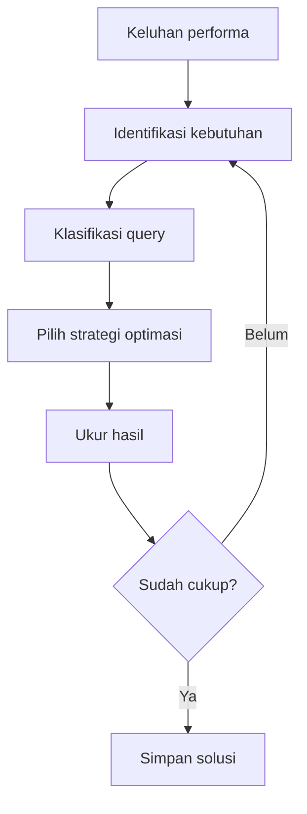

# Modul Pertemuan 14

## Administrasi Basis Data

### Benchmarking Performa dan Algoritma Optimasi Query

---

## A. Identitas Materi

**Nama Modul:** Benchmarking Performa dan Algoritma Optimasi Query  
**Pertemuan:** 14  
**Prasyarat:** seluruh materi optimasi query, EXPLAIN, aplikasi dan performa, indexing, query pendek dan panjang  
**DBMS:** PostgreSQL  
**Fokus Materi:** memahami cara mengukur performa secara terkontrol dan menyusun langkah optimasi query secara sistematis

---

## B. Tujuan Pembelajaran

Setelah mengikuti pertemuan ini, mahasiswa diharapkan mampu:

1. Menjelaskan apa itu benchmarking dalam konteks database.
2. Menjelaskan mengapa benchmarking perlu dilakukan sebelum menyimpulkan bahwa optimasi berhasil.
3. Menjelaskan metrik dasar seperti latency, throughput, TPS, dan waktu respons.
4. Menjelaskan langkah sistematis dalam optimasi query.
5. Membedakan strategi penanganan query pendek dan query panjang.
6. Menjelaskan hubungan antara benchmarking, execution plan, dan kebutuhan bisnis.
7. Menyusun alur analisis performa yang lebih disiplin.

---

## C. Keterkaitan dengan Pertemuan Sebelumnya

Setelah mempelajari function, dynamic SQL, filtering lanjutan, dan berbagai strategi optimasi sebelumnya, mahasiswa sekarang perlu memahami satu hal penting: optimasi yang baik harus dibuktikan dengan pengukuran.

Karena itu, pertemuan ini menggabungkan dua hal: benchmarking untuk mengukur performa, dan algoritma optimasi query untuk menentukan langkah perbaikannya.

---

## D. Peta Materi

1. pengertian benchmarking,
2. metrik performa utama,
3. prinsip benchmarking yang benar,
4. algoritma optimasi query,
5. short query dan long query,
6. langkah evaluasi bertahap,
7. kesalahan umum,
8. praktikum dan latihan.

---

## E. Pengantar

Banyak mahasiswa merasa sudah melakukan optimasi hanya karena query terlihat lebih rapi atau karena indeks sudah ditambah. Padahal optimasi yang baik harus menjawab pertanyaan berikut:

- apakah query benar-benar lebih cepat,
- apakah beban CPU dan I/O berkurang,
- apakah hasilnya stabil,
- apakah perubahan itu memang relevan bagi kebutuhan bisnis.

Untuk menjawab pertanyaan tersebut, kita membutuhkan benchmarking.

---

## F. Apa Itu Benchmarking?

Benchmarking adalah proses mengukur performa sistem secara terkontrol agar kita dapat membandingkan kondisi sebelum dan sesudah perubahan.

Dalam konteks PostgreSQL, benchmarking dapat dipakai untuk:

- membandingkan query lama dan query baru,
- membandingkan kondisi sebelum dan sesudah penambahan indeks,
- membandingkan desain query yang berbeda,
- menilai dampak konfigurasi atau workload.

---

## G. Metrik Performa Utama

### 1. Latency

Latency adalah lama waktu yang dibutuhkan satu permintaan untuk selesai.

### 2. Throughput

Throughput adalah jumlah pekerjaan yang dapat diselesaikan dalam periode waktu tertentu.

### 3. TPS

TPS atau Transactions Per Second menunjukkan berapa transaksi yang bisa diproses per detik.

### 4. Response Time

Response time adalah waktu yang dirasakan pengguna atau aplikasi sejak permintaan dikirim sampai hasil diterima.

### 5. Resource Usage

Selain waktu, kita juga perlu melihat penggunaan CPU, memori, disk I/O, dan koneksi.

---

## H. Prinsip Benchmarking yang Benar

Agar benchmark tidak menyesatkan, beberapa prinsip harus dijaga.

1. bandingkan pada kondisi yang sebanding,
2. gunakan data dan workload yang relevan,
3. lakukan lebih dari satu kali percobaan,
4. bedakan kondisi cold cache dan warm cache jika perlu,
5. catat parameter pengujian dengan jelas.

### Hal yang perlu dihindari

- mengukur hanya sekali lalu langsung menyimpulkan,
- mengganti terlalu banyak variabel sekaligus,
- membandingkan query pada dataset yang berbeda,
- mengabaikan kebutuhan bisnis.

---

## I. Alat Benchmarking Sederhana

Beberapa alat atau pendekatan yang dapat dipakai antara lain:

- `EXPLAIN ANALYZE`,
- pengukuran waktu eksekusi query,
- `pgbench` untuk workload sintetis,
- pencatatan metrik sistem dan database.

### Contoh sederhana dengan `EXPLAIN ANALYZE`

```sql
EXPLAIN ANALYZE
SELECT *
FROM booking
WHERE booking_id = 1001;
```

---

## J. Algoritma Optimasi Query

Optimasi query sebaiknya tidak dilakukan secara acak. Secara umum, langkah berpikir yang lebih aman adalah:

1. pahami kebutuhan bisnis,
2. identifikasi jenis query,
3. cari bottleneck utama,
4. pilih strategi optimasi yang paling relevan,
5. ukur hasilnya,
6. evaluasi dan ulangi bila perlu.



---

## K. Query Pendek dan Query Panjang dalam Benchmarking

### Query Pendek

Untuk query pendek, fokus benchmark biasanya pada:

- selektivitas filter,
- penggunaan indeks,
- waktu respons cepat,
- kestabilan hasil pada banyak eksekusi.

### Query Panjang

Untuk query panjang, fokus benchmark biasanya pada:

- jumlah data yang dibaca,
- efisiensi join dan agregasi,
- kemungkinan incremental update,
- konsumsi sumber daya total.

---

## L. Langkah Optimasi yang Lebih Sistematis

### 1. Pahami kebutuhan

Jangan optimasi query yang salah sasaran.

### 2. Tentukan jenis query

Apakah query ini operasional harian atau laporan besar?

### 3. Cek execution plan

Cari node paling mahal dan jumlah baris yang diproses.

### 4. Uji satu perubahan pada satu waktu

Misalnya hanya menambah indeks, atau hanya mengubah filter, lalu ukur dampaknya.

### 5. Libatkan sisi aplikasi

Kadang query terlihat cepat, tetapi aplikasi tetap lambat karena roundtrip berlebihan.

---

## M. Kesalahan Umum

1. optimasi tanpa data pengukuran,
2. terlalu cepat menambah indeks,
3. menyimpulkan hanya dari satu kali percobaan,
4. mengabaikan execution plan,
5. hanya fokus pada database tanpa melihat aplikasi,
6. menganggap query lebih rapi pasti lebih cepat.

---

## N. Ringkasan

1. Benchmarking dipakai untuk mengukur performa secara terkontrol.
2. Optimasi harus dibuktikan dengan data, bukan hanya dugaan.
3. Metrik seperti latency, throughput, TPS, dan response time penting dipahami.
4. Algoritma optimasi membantu mahasiswa bekerja lebih sistematis.
5. Query pendek dan query panjang memerlukan fokus evaluasi yang berbeda.

---

## O. Praktikum

1. Pilih satu query pendek dan satu query panjang.
2. Jalankan `EXPLAIN ANALYZE` pada keduanya.
3. Catat waktu eksekusi, jumlah baris, dan node yang paling mahal.
4. Lakukan satu perubahan, misalnya menambah indeks atau memperbaiki filter.
5. Ulangi pengukuran dan bandingkan hasilnya.

### Contoh awal

```sql
EXPLAIN ANALYZE
SELECT b.booking_id, COUNT(*)
FROM booking b
JOIN booking_leg bl ON bl.booking_id = b.booking_id
GROUP BY b.booking_id;
```

---

## P. Latihan

### Soal Konsep

1. Apa yang dimaksud dengan benchmarking pada database?
2. Mengapa benchmarking perlu dilakukan sebelum dan sesudah optimasi?
3. Apa perbedaan latency dan throughput?
4. Mengapa optimasi query harus dimulai dari kebutuhan bisnis?

### Soal Analisis

5. Jelaskan mengapa satu kali pengukuran tidak cukup untuk menyimpulkan hasil benchmark.
6. Sebuah query terlihat lebih cepat setelah ditambah indeks, tetapi beban write meningkat. Apa yang harus dievaluasi?
7. Mengapa query pendek dan query panjang tidak boleh dibandingkan dengan pendekatan evaluasi yang sama persis?

### Soal Praktis

8. Tuliskan langkah benchmark sederhana untuk membandingkan query sebelum dan sesudah penambahan indeks.
9. Buat contoh metrik yang perlu dicatat saat menguji query laporan besar.
10. Buat alur optimasi singkat dalam bentuk poin-poin.

---

## Q. Penutup

Pertemuan ini menekankan bahwa optimasi yang baik harus terukur. Mahasiswa perlu membiasakan diri untuk tidak hanya memperbaiki query, tetapi juga membuktikan hasil perbaikannya dengan benchmarking yang benar dan langkah optimasi yang sistematis.
