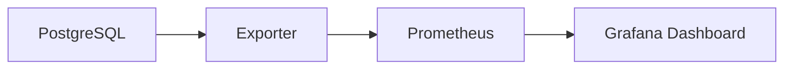

# Modul Pertemuan 15

## Administrasi Basis Data

### Monitoring dan Visualisasi Performa PostgreSQL dengan Grafana

---

## A. Identitas Materi

**Nama Modul:** Monitoring dan Visualisasi Performa PostgreSQL dengan Grafana  
**Pertemuan:** 15  
**Prasyarat:** benchmarking performa, arsitektur PostgreSQL, query optimization, metrik performa database  
**DBMS:** PostgreSQL  
**Fokus Materi:** memahami konsep monitoring database, memilih metrik penting PostgreSQL, dan menyajikan metrik tersebut dalam dashboard Grafana

---

## B. Tujuan Pembelajaran

Setelah mengikuti pertemuan ini, mahasiswa diharapkan mampu:

1. Menjelaskan perbedaan benchmarking dan monitoring.
2. Menjelaskan mengapa monitoring penting dalam sistem database nyata.
3. Menjelaskan alur dasar integrasi PostgreSQL, exporter, Prometheus, dan Grafana.
4. Menentukan metrik PostgreSQL yang penting untuk diamati.
5. Menjelaskan fungsi dashboard dalam observasi performa.
6. Membuat rancangan dashboard Grafana sederhana untuk PostgreSQL.
7. Menginterpretasikan beberapa gejala performa dari panel monitoring.

---

## C. Keterkaitan dengan Pertemuan Sebelumnya

Pada pertemuan sebelumnya, kita membahas benchmarking untuk mengukur performa secara terkontrol. Benchmarking membantu membandingkan kondisi sebelum dan sesudah optimasi.

Pada pertemuan ini, fokusnya berbeda: bukan lagi pengujian sesaat, tetapi pemantauan berkelanjutan. Monitoring membantu kita melihat kesehatan sistem database dari waktu ke waktu, termasuk ketika sistem benar-benar sedang dipakai oleh pengguna.

---

## D. Peta Materi

1. pengertian monitoring,
2. perbedaan benchmarking dan monitoring,
3. arsitektur monitoring PostgreSQL,
4. metrik penting PostgreSQL,
5. dashboard Grafana,
6. contoh interpretasi panel,
7. praktikum dan latihan.

---

## E. Pengantar

Dalam sistem nyata, database tidak cukup hanya dioptimasi satu kali. Setelah query diperbaiki dan indeks ditambahkan, performa tetap harus dipantau.

Mengapa?

- data terus bertambah,
- pola akses aplikasi berubah,
- beban pengguna naik turun,
- bottleneck dapat muncul kembali.

Karena itu, sistem produksi membutuhkan monitoring yang berjalan terus-menerus.

---

## F. Benchmarking vs Monitoring

| Aspek | Benchmarking | Monitoring |
| --- | --- | --- |
| Tujuan | mengukur performa dalam pengujian terkontrol | memantau sistem saat berjalan |
| Waktu | sebelum atau sesudah perubahan | berkelanjutan |
| Fokus | perbandingan hasil uji | kesehatan dan gejala sistem |
| Contoh | membandingkan query sebelum dan sesudah indeks | memantau CPU, koneksi, cache hit, dan query lambat |

### Inti perbedaan

Benchmarking menjawab pertanyaan “apakah perubahan ini lebih baik?” sedangkan monitoring menjawab pertanyaan “bagaimana kondisi sistem saat ini?”

---

## G. Arsitektur Monitoring PostgreSQL dengan Grafana

Dalam implementasi umum, monitoring PostgreSQL dengan Grafana melibatkan beberapa komponen.

### 1. PostgreSQL

Sumber data utama yang menghasilkan metrik.

### 2. Exporter

Exporter mengambil metrik dari PostgreSQL lalu menyajikannya dalam format yang bisa dibaca sistem monitoring.

### 3. Prometheus

Prometheus mengumpulkan dan menyimpan metrik secara periodik.

### 4. Grafana

Grafana menampilkan metrik dalam bentuk dashboard visual.

### Diagram sederhana



---

## H. Metrik Penting PostgreSQL

Mahasiswa tidak perlu memantau semua metrik sekaligus. Fokuslah pada metrik yang paling membantu memahami kondisi sistem.

### 1. Jumlah koneksi

Membantu melihat apakah koneksi terlalu banyak atau mendekati batas.

### 2. Transaksi per detik

Menunjukkan tingkat aktivitas sistem.

### 3. Query lambat

Membantu mengidentifikasi gejala bottleneck pada query.

### 4. Cache hit ratio

Menunjukkan seberapa sering PostgreSQL mendapatkan data dari cache dibanding membaca dari disk.

### 5. I/O disk

Berguna untuk mendeteksi beban baca atau tulis yang berat.

### 6. Deadlock dan lock wait

Membantu mengidentifikasi masalah konkurensi.

### 7. Ukuran database dan pertumbuhan tabel

Berguna untuk melihat tren penggunaan storage.

---

## I. Sumber Metrik PostgreSQL

Beberapa metrik dapat diperoleh dari:

- `pg_stat_database`,
- `pg_stat_activity`,
- `pg_stat_user_tables`,
- `pg_stat_statements`,
- metrik sistem operasi yang dikumpulkan exporter.

### Contoh konsep query statistik

```sql
SELECT datname, numbackends, xact_commit, xact_rollback
FROM pg_stat_database;
```

---

## J. Dashboard Grafana

Dashboard adalah kumpulan panel yang menampilkan metrik dalam bentuk grafik, angka, atau tabel.

### Fungsi dashboard

- memberi gambaran cepat kondisi sistem,
- membantu mendeteksi anomali,
- memudahkan diskusi antara DBA, developer, dan tim operasional,
- membantu membandingkan pola beban pada waktu yang berbeda.

### Contoh panel yang layak ada

1. jumlah koneksi aktif,
2. TPS,
3. cache hit ratio,
4. query paling lambat,
5. penggunaan CPU dan memori server,
6. aktivitas read dan write disk.

---

## K. Contoh Interpretasi Dashboard

### Kasus 1: koneksi melonjak tinggi

Kemungkinan penyebab:

- traffic aplikasi naik,
- connection pooling tidak optimal,
- ada query yang menggantung.

### Kasus 2: cache hit ratio turun

Kemungkinan penyebab:

- working set data terlalu besar,
- shared buffers tidak cukup,
- workload berubah menjadi lebih banyak membaca data baru.

### Kasus 3: query lambat meningkat

Kemungkinan penyebab:

- statistik data sudah berubah,
- pertumbuhan tabel membuat plan lama tidak lagi ideal,
- ada fitur aplikasi baru yang menghasilkan workload berbeda.

---

## L. Prinsip Mendesain Dashboard yang Baik

1. tampilkan metrik yang benar-benar penting,
2. jangan memenuhi dashboard dengan terlalu banyak panel,
3. kelompokkan panel berdasarkan tema,
4. gunakan label yang jelas,
5. pilih rentang waktu yang relevan,
6. sediakan panel ringkasan dan panel detail.

---

## M. Praktik Implementasi Sederhana

Secara umum, alur implementasinya adalah:

1. siapkan PostgreSQL,
2. siapkan exporter PostgreSQL,
3. hubungkan exporter ke Prometheus,
4. hubungkan Grafana ke Prometheus,
5. buat atau impor dashboard,
6. amati perubahan metrik saat query dijalankan.

### Catatan

Pada kelas, dosen dapat menyesuaikan tingkat kedalaman instalasi. Jika lingkungan lab terbatas, mahasiswa tetap dapat mempelajari konsep dan rancangan dashboard meskipun instalasi tidak dilakukan penuh.

---

## N. Ringkasan

1. Monitoring dipakai untuk memantau sistem secara berkelanjutan.
2. Grafana membantu memvisualisasikan metrik PostgreSQL dalam dashboard.
3. Monitoring dan benchmarking saling melengkapi, bukan saling menggantikan.
4. Metrik penting meliputi koneksi, TPS, query lambat, cache hit ratio, I/O, dan lock.
5. Dashboard yang baik harus jelas, relevan, dan mudah dibaca.

---

## O. Praktikum

1. Identifikasi minimal lima metrik PostgreSQL yang penting untuk dipantau.
2. Rancang dashboard sederhana dengan panel-panel utama.
3. Jelaskan alasan mengapa setiap panel penting.
4. Jika lingkungan mendukung, hubungkan Grafana ke sumber metrik dan amati perubahan saat query dijalankan.

### Contoh tugas praktikum

Buat rancangan dashboard dengan panel berikut:

- koneksi aktif,
- TPS,
- query lambat,
- cache hit ratio,
- penggunaan disk.

---

## P. Latihan

### Soal Konsep

1. Apa perbedaan benchmarking dan monitoring?
2. Mengapa monitoring penting setelah optimasi dilakukan?
3. Apa fungsi Grafana dalam ekosistem monitoring?
4. Mengapa cache hit ratio penting untuk diamati?

### Soal Analisis

5. Sebuah dashboard menunjukkan koneksi aktif terus naik dan query lambat meningkat. Jelaskan kemungkinan penyebabnya.
6. Mengapa dashboard yang terlalu penuh panel justru bisa menyulitkan analisis?
7. Apa risiko jika sistem hanya mengandalkan benchmarking tanpa monitoring berkelanjutan?

### Soal Praktis

8. Tuliskan lima panel yang menurut Anda paling penting dalam dashboard PostgreSQL.
9. Buat sketsa alur monitoring PostgreSQL sampai Grafana.
10. Jelaskan satu contoh kondisi yang bisa dideteksi lebih cepat melalui dashboard monitoring.

---

## Q. Penutup

Monitoring dan visualisasi performa adalah penutup yang penting dalam mata kuliah ini karena menunjukkan bahwa optimasi database tidak berhenti pada penulisan query. Sistem yang baik harus dapat diukur, dipantau, dan dijelaskan kondisinya secara visual kepada tim yang mengelolanya.
