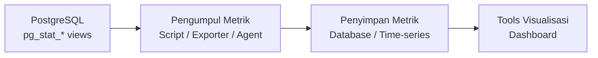

# Modul Pertemuan 15

## Administrasi Basis Data

### Monitoring dan Visualisasi Performa PostgreSQL

---

## A. Identitas Materi

**Nama Modul:** Monitoring dan Visualisasi Performa PostgreSQL  
**Pertemuan:** 15  
**Prasyarat:** benchmarking performa, arsitektur PostgreSQL, query optimization, metrik performa database  
**DBMS:** PostgreSQL  
**Fokus Materi:** memahami konsep monitoring database, menentukan metrik penting PostgreSQL, dan menyajikan metrik tersebut menggunakan tools visualisasi pilihan mahasiswa

---

## B. Tujuan Pembelajaran

Setelah mengikuti pertemuan ini, mahasiswa diharapkan mampu:

1. Menjelaskan perbedaan benchmarking dan monitoring.
2. Menjelaskan mengapa monitoring penting dalam sistem database nyata.
3. Menjelaskan alur dasar integrasi PostgreSQL dengan sistem monitoring dan visualisasi.
4. Menentukan metrik PostgreSQL yang penting untuk diamati.
5. Menjelaskan fungsi dashboard dalam observasi performa.
6. Memilih tools visualisasi yang sesuai dengan kebutuhan dan kemampuan.
7. Membuat rancangan dashboard sederhana untuk PostgreSQL menggunakan tools pilihan sendiri.
8. Menginterpretasikan gejala performa dari panel monitoring.

---

## C. Keterkaitan dengan Pertemuan Sebelumnya

Pada pertemuan sebelumnya, kita membahas benchmarking untuk mengukur performa secara terkontrol. Benchmarking membantu membandingkan kondisi sebelum dan sesudah optimasi dengan data yang terukur.

Pada pertemuan ini, fokusnya berbeda: bukan lagi pengujian sesaat, tetapi pemantauan berkelanjutan. Monitoring membantu kita melihat kesehatan sistem database dari waktu ke waktu, termasuk ketika sistem benar-benar sedang dipakai oleh pengguna nyata di lingkungan produksi.

Keduanya saling melengkapi: benchmarking digunakan untuk membuktikan bahwa perubahan berhasil, sedangkan monitoring digunakan untuk memastikan sistem tetap sehat setelah perubahan tersebut diterapkan.

---

## D. Peta Materi

1. pengertian monitoring,
2. perbedaan benchmarking dan monitoring,
3. arsitektur monitoring PostgreSQL,
4. view statistik bawaan PostgreSQL,
5. metrik penting yang perlu dipantau,
6. pilihan tools visualisasi,
7. prinsip desain dashboard,
8. contoh interpretasi kondisi,
9. praktikum dan latihan.

---

## E. Pengantar

Dalam sistem nyata, database tidak cukup hanya dioptimasi satu kali. Setelah query diperbaiki dan indeks ditambahkan, performa tetap harus dipantau secara berkelanjutan.

Mengapa?

- data terus bertambah dan pola distribusinya berubah,
- pola akses aplikasi berevolusi seiring fitur baru dirilis,
- beban pengguna naik turun mengikuti waktu dan musim,
- bottleneck yang sudah diatasi dapat muncul kembali dalam bentuk baru.

Karena itu, sistem produksi membutuhkan monitoring yang berjalan terus-menerus. Monitoring bukan pelengkap optimasi, melainkan bagian tak terpisahkan dari pengelolaan database yang serius.

---

## F. Benchmarking vs Monitoring

| Aspek | Benchmarking | Monitoring |
| --- | --- | --- |
| Tujuan | mengukur performa dalam kondisi terkontrol | memantau kondisi sistem saat berjalan |
| Waktu pelaksanaan | sebelum atau sesudah perubahan tertentu | berkelanjutan, terus-menerus |
| Fokus | perbandingan hasil pengujian | kesehatan dan gejala sistem |
| Siapa yang memulai | DBA atau developer secara sengaja | sistem secara otomatis |
| Contoh | membandingkan query sebelum dan sesudah indeks | memantau jumlah koneksi, cache hit, dan query lambat |

### Inti perbedaan

Benchmarking menjawab pertanyaan **"apakah perubahan ini lebih baik?"** sedangkan monitoring menjawab pertanyaan **"bagaimana kondisi sistem saat ini?"**

Keduanya dibutuhkan. Benchmarking tanpa monitoring tidak akan tahu apakah hasil optimasi bertahan di produksi. Monitoring tanpa benchmarking tidak akan tahu apakah perubahan yang dilakukan memang berdampak positif.

---

## G. Arsitektur Monitoring PostgreSQL

Secara umum, sistem monitoring PostgreSQL terdiri dari beberapa lapisan. Setiap lapisan dapat diisi oleh berbagai tools.

### Lapisan 1: Sumber Data

PostgreSQL menyimpan data statistik internal secara otomatis. Data ini dapat diakses melalui view bawaan tanpa instalasi tambahan.

Contoh view statistik:

- `pg_stat_database` — statistik per database,
- `pg_stat_activity` — daftar koneksi dan query yang sedang berjalan,
- `pg_stat_user_tables` — statistik akses per tabel,
- `pg_stat_statements` — statistik eksekusi query (memerlukan ekstensi).

### Lapisan 2: Pengumpul Metrik

Komponen yang mengambil data dari sumber lalu menyimpannya untuk dianalisis kemudian. Pilihan umum:

- **script kustom** yang langsung query ke view statistik,
- **prometheus + postgres_exporter** untuk sistem berbasis time-series,
- **agen bawaan tools** seperti Netdata Agent atau Datadog Agent.

### Lapisan 3: Visualisasi dan Dashboard

Komponen yang menampilkan data dalam bentuk grafik, angka, atau tabel. Lapisan ini dapat diisi oleh berbagai tools sesuai kebutuhan dan kemampuan.

### Diagram alur sederhana



---

## H. View Statistik Bawaan PostgreSQL

PostgreSQL menyediakan view statistik yang dapat langsung di-query tanpa instalasi tambahan. Berikut beberapa yang paling penting.

### H.1 pg_stat_database

Menampilkan statistik per database, termasuk jumlah koneksi, transaksi, dan cache.

```sql
SELECT
    datname,
    numbackends     AS koneksi_aktif,
    xact_commit     AS commit,
    xact_rollback   AS rollback,
    blks_hit,
    blks_read,
    ROUND(
        blks_hit::NUMERIC / NULLIF(blks_hit + blks_read, 0) * 100, 2
    ) AS cache_hit_ratio_persen
FROM pg_stat_database
WHERE datname NOT IN ('postgres', 'template0', 'template1');
```

### H.2 pg_stat_activity

Menampilkan semua sesi dan query yang sedang aktif.

```sql
SELECT
    pid,
    usename     AS pengguna,
    datname     AS database,
    state,
    EXTRACT(EPOCH FROM (NOW() - query_start)) AS durasi_detik,
    LEFT(query, 100) AS query
FROM pg_stat_activity
WHERE state != 'idle'
ORDER BY durasi_detik DESC;
```

### H.3 pg_stat_user_tables

Menampilkan statistik akses per tabel, berguna untuk mendeteksi tabel yang paling banyak dibaca atau memiliki banyak baris mati.

```sql
SELECT
    relname         AS tabel,
    seq_scan        AS full_scan,
    idx_scan        AS index_scan,
    n_live_tup      AS baris_aktif,
    n_dead_tup      AS baris_mati
FROM pg_stat_user_tables
ORDER BY seq_scan DESC;
```

### H.4 pg_stat_statements

Menampilkan statistik eksekusi per query. Memerlukan ekstensi yang diaktifkan terlebih dahulu.

```sql
-- Aktifkan ekstensi dulu
CREATE EXTENSION IF NOT EXISTS pg_stat_statements;

-- Query top 5 paling lambat
SELECT
    LEFT(query, 80)                             AS query,
    calls                                       AS eksekusi,
    ROUND(mean_exec_time::NUMERIC, 2)           AS rata2_ms,
    ROUND(total_exec_time::NUMERIC, 2)          AS total_ms
FROM pg_stat_statements
ORDER BY mean_exec_time DESC
LIMIT 5;
```

---

## I. Metrik Penting PostgreSQL

Tidak semua metrik perlu dipantau setiap saat. Fokuslah pada metrik yang paling mencerminkan kondisi sistem.

### 1. Jumlah koneksi aktif

Membantu melihat apakah koneksi mendekati batas maksimum (`max_connections`). Koneksi yang terlalu banyak dapat menyebabkan penolakan koneksi baru.

### 2. Transaksi per detik (TPS)

Menunjukkan tingkat aktivitas sistem secara keseluruhan. Lonjakan TPS yang tiba-tiba dapat mengindikasikan beban tidak normal.

### 3. Cache hit ratio

Menunjukkan persentase data yang diambil dari memori dibanding dari disk. Nilai yang baik adalah di atas 95 persen. Nilai rendah mengindikasikan shared_buffers perlu diperbesar atau data working set terlalu besar.

### 4. Query lambat

Query dengan waktu eksekusi rata-rata tinggi adalah kandidat utama untuk dioptimasi. Dipantau melalui `pg_stat_statements`.

### 5. Jumlah dead tuples

Baris yang sudah dihapus atau diperbarui tetapi belum dibersihkan oleh VACUUM. Jumlah dead tuples yang tinggi dapat memperlambat query dan menyebabkan table bloat.

### 6. I/O disk

Tingginya aktivitas baca dari disk mengindikasikan cache tidak cukup atau terjadi full table scan yang berulang.

### 7. Lock dan deadlock

Query yang menunggu lock dalam waktu lama mengindikasikan masalah konkurensi. Deadlock yang sering terjadi memerlukan analisis pola akses transaksi.

### 8. Ukuran database dan pertumbuhan tabel

Berguna untuk perencanaan kapasitas storage dan mendeteksi tabel yang tumbuh tidak normal.

---

## J. Pilihan Tools Visualisasi

Tidak ada satu tools yang paling tepat untuk semua situasi. Mahasiswa dipersilakan memilih tools yang paling sesuai dengan kebutuhan, kemampuan teknis, dan lingkungan yang tersedia.

### Kategori 1: Monitoring dan Observability

Cocok untuk memantau metrik performa sistem dan database secara real-time dengan grafik time-series.

| Tools | Lisensi | Kelebihan utama |
| --- | --- | --- |
| Grafana | Open-source | fleksibel, ekosistem Prometheus, banyak plugin |
| Kibana | Open-source | kuat untuk analisis log, bagian dari Elastic Stack |
| Netdata | Open-source | ringan, otomatis mendeteksi PostgreSQL, update per detik |
| Zabbix | Open-source | fitur alert lengkap, cocok untuk skala enterprise |
| Datadog | Komersial | praktis, SaaS, deteksi anomali berbasis AI |

### Kategori 2: Business Intelligence

Cocok untuk memvisualisasikan isi data di dalam PostgreSQL, misalnya untuk laporan, tren, atau ringkasan transaksi bisnis.

| Tools | Lisensi | Kelebihan utama |
| --- | --- | --- |
| Metabase | Open-source | antarmuka mudah, tidak wajib paham SQL |
| Apache Superset | Open-source | mendukung volume data besar, banyak jenis chart |
| Google Looker Studio | Gratis (Cloud) | mudah dibagikan via link, koneksi langsung ke PostgreSQL |
| Tableau | Komersial | standar industri, visualisasi sangat interaktif |
| Microsoft Power BI | Komersial | integrasi kuat dengan ekosistem Microsoft |

### Kategori 3: Visualisasi Kustom via Kode

Cocok bagi mahasiswa yang ingin membangun dashboard sendiri menggunakan kode program.

| Tools | Bahasa | Kelebihan utama |
| --- | --- | --- |
| Streamlit | Python | cepat membuat dashboard interaktif, koneksi langsung ke PostgreSQL via psycopg2 |
| Chart.js / D3.js | JavaScript | fleksibel penuh, dapat diintegrasikan ke aplikasi web |
| Recharts | JavaScript (React) | cocok untuk proyek berbasis React |

### Panduan memilih tools

Pertimbangkan hal berikut sebelum memilih:

- **Tujuan:** apakah untuk memantau kesehatan sistem atau menganalisis isi data bisnis?
- **Kemampuan teknis:** apakah lebih nyaman dengan Python, JavaScript, atau antarmuka klik?
- **Lingkungan:** apakah tersedia server, Docker, atau hanya laptop pribadi?
- **Biaya:** apakah tools tersebut gratis atau berbayar?

---

## K. Prinsip Desain Dashboard yang Baik

Prinsip ini berlaku untuk tools apa pun yang dipilih.

### Fungsi dashboard

- memberi gambaran cepat kondisi sistem tanpa harus menjalankan query manual,
- membantu mendeteksi anomali sebelum dampaknya dirasakan pengguna,
- memudahkan diskusi antara DBA, developer, dan tim operasional,
- membantu membandingkan pola beban pada waktu yang berbeda.

### Prinsip yang perlu diikuti

1. tampilkan hanya metrik yang benar-benar penting,
2. jangan memenuhi dashboard dengan terlalu banyak panel,
3. kelompokkan panel berdasarkan tema: koneksi, performa query, storage,
4. gunakan label yang jelas dan satuan yang konsisten,
5. pilih rentang waktu yang relevan dengan kebutuhan pemantauan,
6. sediakan panel ringkasan di bagian atas dan panel detail di bawah.

### Contoh panel yang layak ada dalam satu dashboard PostgreSQL

1. jumlah koneksi aktif,
2. TPS (transaksi per detik),
3. cache hit ratio,
4. daftar query paling lambat,
5. ukuran tabel dan pertumbuhan,
6. jumlah dead tuples per tabel.

---

## L. Contoh Interpretasi Kondisi Dashboard

### Kasus 1: jumlah koneksi melonjak tinggi

Gejala: panel koneksi aktif mendekati batas `max_connections`.

Kemungkinan penyebab:

- traffic aplikasi meningkat tiba-tiba,
- connection pooling tidak dikonfigurasi atau tidak berfungsi,
- ada query yang berjalan lama sehingga koneksi menumpuk.

Langkah awal: cek `pg_stat_activity` untuk melihat query mana yang paling lama berjalan.

### Kasus 2: cache hit ratio turun drastis

Gejala: cache hit ratio turun dari 99 persen ke 80 persen.

Kemungkinan penyebab:

- terjadi full table scan pada tabel besar karena indeks tidak digunakan,
- `shared_buffers` tidak cukup untuk menampung working set data,
- workload berubah menjadi lebih banyak membaca data yang jarang diakses sebelumnya.

Langkah awal: cek `pg_stat_user_tables` untuk menemukan tabel dengan `seq_scan` tinggi.

### Kasus 3: jumlah query lambat meningkat

Gejala: rata-rata waktu eksekusi query di `pg_stat_statements` meningkat.

Kemungkinan penyebab:

- statistik data sudah tidak akurat karena data baru banyak ditambahkan,
- pertumbuhan tabel membuat execution plan lama tidak lagi optimal,
- ada perubahan pola query dari aplikasi akibat fitur baru.

Langkah awal: jalankan `ANALYZE` untuk memperbarui statistik, lalu cek execution plan query yang paling lambat.

### Kasus 4: jumlah dead tuples tinggi

Gejala: kolom `n_dead_tup` pada `pg_stat_user_tables` sangat besar.

Kemungkinan penyebab:

- proses VACUUM tidak berjalan cukup sering,
- terjadi banyak UPDATE atau DELETE dalam waktu singkat.

Langkah awal: jalankan `VACUUM ANALYZE` secara manual dan periksa konfigurasi autovacuum.

---

## M. Ringkasan

1. Monitoring digunakan untuk memantau kondisi sistem secara berkelanjutan, berbeda dari benchmarking yang bersifat sesaat.
2. PostgreSQL menyediakan view statistik bawaan seperti `pg_stat_database`, `pg_stat_activity`, `pg_stat_user_tables`, dan `pg_stat_statements` yang dapat langsung di-query.
3. Metrik penting meliputi jumlah koneksi, TPS, cache hit ratio, query lambat, dead tuples, dan ukuran database.
4. Tersedia berbagai tools visualisasi dari tiga kategori: monitoring/observability, business intelligence, dan visualisasi kustom via kode.
5. Pemilihan tools sebaiknya mempertimbangkan tujuan, kemampuan teknis, lingkungan, dan biaya.
6. Dashboard yang baik harus fokus, terorganisasi, dan mudah dibaca oleh semua pemangku kepentingan.

---

## N. Praktikum

1. Jalankan query pada `pg_stat_database` dan catat nilai cache hit ratio saat ini.
2. Jalankan query beban (baca intensif atau tulis massal) ke database.
3. Jalankan ulang query statistik dan bandingkan hasilnya.
4. Pilih satu tools visualisasi dan hubungkan ke PostgreSQL.
5. Buat dashboard dengan minimal empat panel metrik.
6. Interpretasikan perubahan yang terlihat di dashboard saat beban diberikan.

---

## O. Latihan

### Soal Konsep

1. Apa perbedaan antara benchmarking dan monitoring?
2. Mengapa monitoring tetap dibutuhkan meskipun optimasi sudah dilakukan?
3. Jelaskan fungsi masing-masing view statistik: `pg_stat_database`, `pg_stat_activity`, dan `pg_stat_statements`.
4. Mengapa cache hit ratio dianggap salah satu metrik terpenting di PostgreSQL?

### Soal Analisis

5. Sebuah dashboard menunjukkan koneksi aktif terus naik dan cache hit ratio turun. Jelaskan kemungkinan penyebab dan langkah analisis awal yang perlu dilakukan.
6. Mengapa dashboard yang terlalu banyak panel justru dapat menyulitkan analisis?
7. Apa risiko jika sistem produksi hanya mengandalkan benchmarking tanpa monitoring berkelanjutan?
8. Sebuah tabel memiliki `n_dead_tup` sangat tinggi. Apa dampaknya terhadap performa query dan apa yang sebaiknya dilakukan?

### Soal Praktis

9. Tuliskan query SQL untuk menampilkan lima query paling lambat dari `pg_stat_statements`.
10. Buat sketsa arsitektur monitoring PostgreSQL dari sumber data hingga dashboard, lengkap dengan nama komponen atau tools di setiap lapisan.
11. Pilih dua tools visualisasi dari kategori berbeda dan bandingkan: kapan Anda akan menggunakan masing-masing?
12. Rancang panel-panel dashboard yang menurut Anda paling penting untuk memantau PostgreSQL di lingkungan produksi. Jelaskan alasan setiap panel.

---

## P. Penutup

Monitoring dan visualisasi performa adalah bagian penutup yang penting dalam mata kuliah ini karena menunjukkan bahwa pengelolaan database tidak berhenti pada penulisan query atau penambahan indeks.

Sistem database yang baik harus dapat diukur, dipantau, dan dijelaskan kondisinya secara visual kepada seluruh tim yang terlibat, mulai dari DBA, developer, hingga manajemen.

Kemampuan memilih tools yang tepat sesuai konteks, membangun dashboard yang bermakna, dan menginterpretasikan metrik dengan benar adalah bagian dari kompetensi seorang administrator basis data yang profesional.
