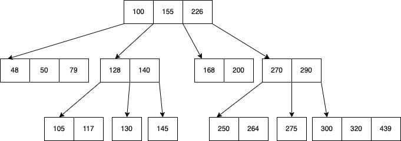
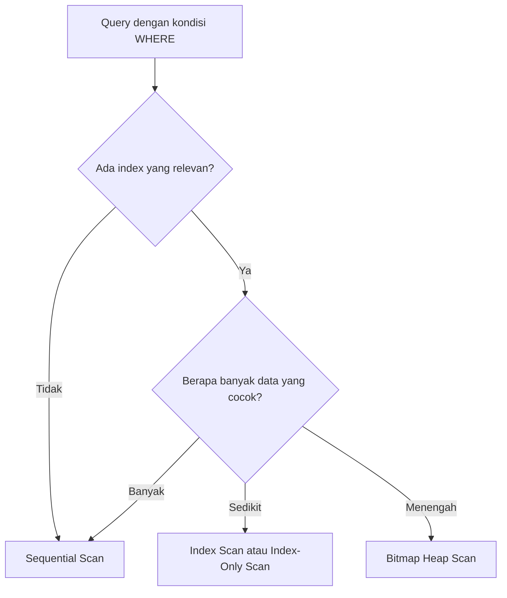
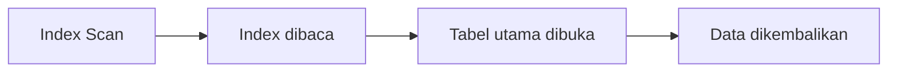
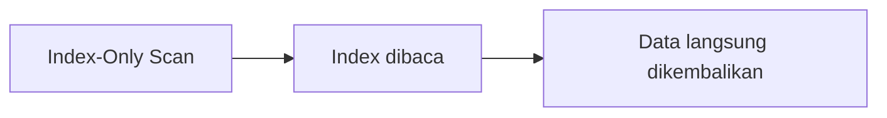

# Modul Pertemuan 3

## Administrasi Basis Data

### Struktur Index, Index-Only Scan, dan Algoritma Akses Data

---

## A. Identitas Materi

**Nama Modul:** Struktur Index, Index-Only Scan, dan Algoritma Akses Data  
**Pertemuan:** 3  
**Prasyarat:** SQL Dasar, pemrosesan query, execution plan dasar  
**DBMS:** PostgreSQL  
**Fokus Materi:** memahami struktur index dan cara database membaca data secara efisien

---

## B. Tujuan Pembelajaran

Setelah mengikuti pertemuan ini, mahasiswa diharapkan mampu:

1. Menjelaskan apa itu index dan mengapa index penting dalam database.
2. Menjelaskan perbedaan `B-Tree`, `Hash`, dan `Bitmap` sebagai struktur index.
3. Menjelaskan perbedaan `Sequential Scan`, `Index Scan`, `Bitmap Heap Scan`, dan `Index-Only Scan`.
4. Menjelaskan konsep selectivity dalam pemilihan algoritma akses data.
5. Membaca hasil `EXPLAIN` sederhana yang menampilkan algoritma akses data.

---

## C. Keterkaitan dengan Pertemuan Sebelumnya

Pada pertemuan sebelumnya, kita membahas bagaimana query diproses mulai dari parsing, validasi, optimasi, sampai eksekusi. Pada pertemuan ini, fokusnya dipersempit pada pertanyaan berikut:

1. bagaimana database menemukan data,
2. bagaimana index membantu pencarian,
3. bagaimana database memilih cara membaca data yang paling efisien.

Materi ini menjadi dasar sebelum masuk ke pembahasan algoritma join pada pertemuan berikutnya.

---

## D. Peta Materi

Urutan pembahasan pada modul ini adalah:

1. konsep index,
2. jenis struktur index,
3. algoritma akses data,
4. `Index-Only Scan`,
5. selectivity,
6. pembacaan `EXPLAIN` untuk scan.

---

## E. Pengantar

Perhatikan query berikut:

```sql
SELECT nama
FROM mahasiswa
WHERE angkatan = 2023;
```

Walaupun query ini terlihat sederhana, database tetap harus memilih cara terbaik untuk mencari data.

Apakah database harus:

* membaca seluruh tabel,
* memakai index,
* membaca block tertentu saja,
* atau mengambil data langsung dari index?

Pilihan tersebut sangat memengaruhi performa query.

---

# BAGIAN 1 - STRUKTUR INDEX

## F. Apa Itu Index?

Index adalah struktur tambahan pada database yang digunakan untuk mempercepat pencarian data.

Secara sederhana, index mirip seperti daftar isi pada buku. Dengan daftar isi, kita tidak perlu membaca seluruh isi buku untuk menemukan topik tertentu.

### Ciri-Ciri Index

1. Index adalah data tambahan, bukan data utama.
2. Index tidak mengubah hasil query, tetapi bisa mengubah kecepatan query.
3. Index membantu database menemukan lokasi data lebih cepat.

### Kekurangan Index

Index juga memiliki biaya:

* membutuhkan ruang penyimpanan tambahan,
* harus diperbarui saat data berubah,
* terlalu banyak index dapat memperlambat proses `INSERT`, `UPDATE`, dan `DELETE`.

---

## G. Cara Kerja Index

Secara umum, index menyimpan:

* nilai key,
* lokasi atau referensi ke data asli.

### Ilustrasi Sederhana

```text
Index:
2021 -> lokasi data A
2022 -> lokasi data B
2023 -> lokasi data C
2024 -> lokasi data D

Saat query mencari angkatan = 2023,
database dapat langsung menuju lokasi data C.
```

---

## H. Jenis Struktur Index

## 1. B-Tree Index

`B-Tree` adalah struktur index yang paling umum digunakan di PostgreSQL.

### Konsep Dasar

Data index disusun seperti pohon bertingkat. Pencarian dimulai dari root, lalu turun ke cabang yang sesuai sampai menemukan lokasi data.

### Ilustrasi

```text
            [20 | 40]
           /    |    \
      <20     20-40    >40
```

### Contoh Struktur B-Tree yang Lebih Detail

Perhatikan struktur B-Tree berikut yang menggambarkan index pada kolom NIM mahasiswa:

```text
Root Level:
                [100 | 155 | 226]
               /    |    |    \
          <100     100-155  155-226  >226
```

Data index dibagi menjadi 4 wilayah berdasarkan nilai pembatas:
1. Nilai < 100 (cabang kiri)
2. Nilai 100-155 (cabang tengah kiri)  
3. Nilai 155-226 (cabang tengah kanan)
4. Nilai > 226 (cabang kanan)



### Cara Membaca B-Tree: Langkah Demi Langkah

#### Contoh 1: Mencari NIM = 130

1. **Mulai dari root**: `[100 | 155 | 226]`
2. **Evaluasi posisi**: 130 > 100 dan 130 < 155
3. **Pilih cabang**: masuk ke cabang kedua (100-155)
4. **Node tingkat kedua**: `[128 | 140]` 
5. **Evaluasi lagi**: 130 > 128 dan 130 < 140
6. **Turun ke leaf**: menemukan data dengan NIM 130

#### Contoh 2: Mencari NIM = 50

1. **Mulai dari root**: `[100 | 155 | 226]`
2. **Evaluasi posisi**: 50 < 100
3. **Pilih cabang**: masuk ke cabang pertama (<100)
4. **Node tingkat kedua**: `[48 | 50 | 79]`
5. **Scan node**: menemukan NIM 50 di node ini

#### Contoh 3: Mencari NIM = 275

1. **Mulai dari root**: `[100 | 155 | 226]`
2. **Evaluasi posisi**: 275 > 226
3. **Pilih cabang**: masuk ke cabang keempat (>226)
4. **Node tingkat kedua**: `[270 | 290]`
5. **Evaluasi**: 275 > 270 dan 275 < 290
6. **Turun ke leaf**: menemukan data dengan NIM 275

### Prinsip Kerja B-Tree

Algoritma pencarian B-Tree mengikuti pola sederhana:

1. **Mulai dari root** (node paling atas)
2. **Bandingkan nilai yang dicari** dengan nilai pembatas di node
3. **Pilih cabang yang sesuai** berdasarkan range nilai
4. **Turun ke level berikutnya** dan ulangi proses
5. **Terus turun** sampai mencapai leaf node dan menemukan data

### Apa itu Leaf Node?

**Leaf node** adalah node atau simpul paling bawah dalam struktur pohon B-Tree yang berisi data aktual yang dicari.

Karakteristik leaf node:

* **Posisi**: Berada di tingkat paling bawah dari struktur B-Tree
* **Isi**: Menyimpan data sebenarnya atau pointer ke data pada tabel utama
* **Tidak memiliki cabang**: Tidak memiliki node anak di bawahnya
* **Tujuan pencarian**: Lokasi akhir di mana data yang dicari ditemukan

#### Ilustrasi Sederhana

```text
Root Node:    [100 | 155 | 226]         ← Node paling atas
                    |
Internal Node: [128 | 140]              ← Node perantara
                    |
Leaf Node:     [130]                    ← Node paling bawah (berisi data aktual)
```

Dalam contoh di atas:
- **Root node**: `[100 | 155 | 226]` adalah titik awal pencarian
- **Internal node**: `[128 | 140]` adalah node perantara yang membantu mengarahkan pencarian
- **Leaf node**: `[130]` adalah tempat data NIM 130 benar-benar tersimpan

#### Mengapa Disebut "Leaf"?

Istilah "leaf" berasal dari analogi pohon di mana:
- **Root** = akar pohon (paling atas dalam B-Tree)
- **Branch** = cabang pohon (internal nodes)  
- **Leaf** = daun pohon (ujung cabang yang tidak memiliki cabang lagi)

### Keuntungan Struktur Bercabang

Struktur pohon bertingkat ini memberikan keuntungan:

* **Mengurangi langkah pencarian**: tidak perlu memeriksa semua data satu per satu
* **Pembagian data yang efisien**: setiap node membagi range data menjadi bagian-bagian lebih kecil
* **Konsistensi performa**: jumlah langkah pencarian relatif sama untuk data apapun

### Analogi Sederhana

B-Tree bekerja seperti direktori mall yang tersusun bertingkat:

```text
Direktori Utama: [Lantai 1-3 | Lantai 4-6 | Lantai 7-9]
                     |           |           |
                 Toko A-M    Toko N-S    Toko T-Z
```

Alih-alih mencari toko satu per satu di seluruh mall, kita langsung menuju area yang tepat berdasarkan pembagian yang sudah ada.

### Kelebihan

* cepat untuk pencarian nilai tertentu,
* mendukung pencarian range,
* stabil untuk data besar.

### Cocok untuk

* pencarian `=`,
* pencarian `BETWEEN`, `<`, `>`,
* kolom yang sering dipakai pada `WHERE` dan `ORDER BY`.

---

## 2. Hash Index

Hash Index adalah metode indexing yang menggunakan hash function untuk menentukan lokasi data secara langsung. Data tidak dicari satu per satu, tetapi langsung dilompat ke tempatnya (bucket).


### Cara Kerja Hash Index

Hash Index bekerja dalam tiga langkah utama:

1. **Data masuk (key)**
   ```
   ID = 123
   ```

2. **Diproses oleh hash function**
   ```
   hash = 123 % 10 = 3
   ```

3. **Disimpan di bucket**
   ```
   Bucket 3 → 123
   ```

### Proses Pencarian Data

Ketika mencari data:
```sql
SELECT * FROM mahasiswa WHERE id = 123;
```

Langkah yang dilakukan:
1. Hitung hash → 123 % 10 = 3
2. Langsung ke bucket 3  
3. Data ditemukan

### Mengapa Menggunakan Modulo (%)

Fungsi modulo digunakan karena:
- Jumlah bucket terbatas (misal 0-9)
- Data bisa sangat besar
- Membatasi hasil agar selalu dalam range bucket

Contoh:
```
999 % 10 = 9
```

Semua data pasti memiliki alamat bucket.

### Struktur Penyimpanan

```
Bucket:
0 → -
1 → 21
2 → 32  
3 → 43
```

Setiap bucket merupakan tempat penyimpanan data.


### Collision (Tabrakan)

Collision terjadi ketika dua data memiliki hash yang sama:

```
21 % 10 = 1
31 % 10 = 1
```

Hasil collision:
```
Bucket 1 → 21, 31
```

**Cara mengatasi collision:**
- Disimpan dalam list (chaining)
- Mencari slot lain (open addressing)

### Contoh-Contoh Hash Index

#### 1. Data Angka (ID)
```
21 % 10 = 1
32 % 10 = 2
43 % 10 = 3
```

#### 2. Data String (Nama)
```
ANI = A(1) + N(14) + I(9) = 24
24 % 10 = 4 → bucket 4
```

#### 3. Kode Produk
```
P010 → 10
10 % 5 = 0 → bucket 0
```

### Kelebihan Hash Index

- Sangat cepat (O(1)) untuk pencarian exact match
- Langsung menuju lokasi data
- Efisien untuk equality comparison

Contoh query yang efisien:
```sql
WHERE id = 10
WHERE status = 'Aktif'
WHERE kode_produk = 'P001'
```

### Kekurangan Hash Index

- Tidak mendukung range query
- Tidak dapat digunakan untuk sorting
- Kemungkinan terjadinya collision
- Tidak efisien untuk operasi perbandingan (`<`, `>`, `BETWEEN`)

Contoh query yang tidak efisien:
```sql
WHERE id > 10
WHERE tanggal BETWEEN '2023-01-01' AND '2023-12-31'
ORDER BY nama
```

### Perbandingan dengan B-Tree Index

| Aspek | Hash Index | B-Tree Index |
|-------|------------|--------------|
| Cara kerja | Langsung lompat ke bucket | Traversal pohon |
| Kecepatan equality | Sangat cepat (O(1)) | Cepat (O(log n)) |
| Range query | Tidak mendukung | Mendukung |
| Sorting | Tidak mendukung | Mendukung |
| Collision | Bisa terjadi | Tidak ada |
| Memory overhead | Rendah | Sedang |

---

## 3. Bitmap Index

`Bitmap Index` menggunakan representasi bit untuk menunjukkan keberadaan nilai pada posisi tertentu.

### Ilustrasi Sederhana

```text
L -> 1 0 1 1 0
P -> 0 1 0 0 1
```

### Kelebihan

* efisien untuk data dengan jumlah nilai unik yang sedikit,
* mudah dikombinasikan dengan operasi logika seperti `AND` dan `OR`.

### Kekurangan

* kurang cocok untuk kolom dengan banyak nilai unik,
* tidak selalu menjadi pilihan utama pada PostgreSQL umum.

---

## I. Kenapa B-Tree Paling Populer?

`B-Tree` paling populer karena seimbang antara kecepatan dan fleksibilitas.

Alasannya:

1. mendukung pencarian exact match,
2. mendukung pencarian range,
3. cocok untuk banyak kasus umum,
4. umum dipakai oleh optimizer PostgreSQL.

---

# BAGIAN 2 - ALGORITMA AKSES DATA

## J. Mengapa Database Membutuhkan Algoritma Akses Data?

Setelah query dianalisis, database harus memilih cara membaca data yang paling efisien. Keputusan ini penting karena:

* membaca seluruh tabel tidak selalu tepat,
* memakai index tidak selalu lebih murah,
* jumlah data yang lolos filter memengaruhi performa.

---

## K. Gambaran Umum Pemilihan Algoritma Akses



---

## L. Sequential Scan

`Sequential Scan` atau `Seq Scan` adalah pembacaan tabel dari awal sampai akhir.

### Cara kerja

1. database membaca block tabel satu per satu,
2. setiap baris diperiksa,
3. baris yang cocok diambil.

### Kelebihan

* selalu bisa digunakan,
* tidak memerlukan index,
* sering efektif untuk tabel kecil atau hasil query besar.

### Kekurangan

* kurang efisien jika tabel besar dan data yang dibutuhkan sedikit.

---

## M. Index Scan

`Index Scan` digunakan ketika database mencari lokasi data melalui index, lalu membuka tabel utama untuk mengambil datanya.

### Cara kerja

1. cari nilai pada index,
2. dapatkan lokasi data,
3. buka tabel utama,
4. ambil data.

### Kelebihan

* cocok untuk data sedikit,
* mengurangi pembacaan seluruh tabel.

### Kekurangan

* tetap perlu membuka tabel utama,
* bisa kurang efisien jika hasil query sangat banyak.

---

## N. Bitmap Heap Scan

`Bitmap Heap Scan` dipakai saat jumlah data yang cocok berada di tingkat menengah.

### Cara kerja

1. database membaca index,
2. database mengumpulkan block yang perlu dibaca,
3. database membaca block tersebut dengan lebih efisien.

### Kelebihan

* mengurangi pembacaan block berulang,
* cocok untuk hasil query menengah.

### Kekurangan

* lebih kompleks dibanding `Seq Scan` dan `Index Scan`.

---

## O. Index-Only Scan

`Index-Only Scan` terjadi ketika database dapat mengambil data langsung dari index tanpa perlu sering membuka tabel utama.

### Kapan bisa terjadi?

Biasanya jika:

1. semua kolom yang dibutuhkan query ada di index,
2. index relevan dengan kondisi query,
3. kondisi visibility data mendukung.

### Contoh

```sql
SELECT nama, angkatan
FROM mahasiswa
WHERE angkatan = 2023;
```

Jika index mencakup `angkatan` dan `nama`, maka query ini berpeluang memakai `Index-Only Scan`.

### Perbandingan sederhana





### Keuntungan

* lebih sedikit I/O,
* dapat lebih cepat,
* efisien untuk query tertentu.

---

## P. Konsep Selectivity

Selectivity menunjukkan seberapa banyak data yang lolos dari filter.

Jika tabel berisi 1.000.000 baris:

* yang cocok 50 baris -> selectivity kecil,
* yang cocok 500.000 baris -> selectivity sedang,
* yang cocok 900.000 baris -> selectivity besar.

### Dampaknya

| Selectivity | Algoritma yang cenderung cocok |
| --- | --- |
| Kecil | `Index Scan` atau `Index-Only Scan` |
| Menengah | `Bitmap Heap Scan` |
| Besar | `Sequential Scan` |

---

## Q. Mengapa Index Tidak Selalu Dipakai?

Walaupun index tersedia, database bisa tetap memilih `Sequential Scan` jika:

* data yang diambil sangat banyak,
* biaya membuka tabel berulang lebih mahal,
* optimizer memperkirakan full scan lebih murah.

Prinsip sederhananya adalah:

> index sangat membantu untuk pencarian selektif, tetapi tidak selalu unggul untuk pengambilan data dalam jumlah besar.

---

## R. Contoh Pembacaan `EXPLAIN`

### 1. Contoh sequential scan

```sql
EXPLAIN
SELECT *
FROM mahasiswa
WHERE angkatan = 2023;
```

Kemungkinan hasil:

```text
Seq Scan on mahasiswa
```

### 2. Contoh index scan

```sql
EXPLAIN
SELECT nama
FROM mahasiswa
WHERE angkatan = 2023;
```

Kemungkinan hasil:

```text
Index Scan using idx_mahasiswa_angkatan on mahasiswa
```

### 3. Contoh index-only scan

```sql
EXPLAIN
SELECT nama, angkatan
FROM mahasiswa
WHERE angkatan = 2023;
```

Kemungkinan hasil:

```text
Index Only Scan using idx_mahasiswa_angkatan_nama on mahasiswa
```

---

## S. Praktikum Sederhana

### 1. Percobaan scan

```sql
EXPLAIN
SELECT nama
FROM mahasiswa
WHERE angkatan = 2023;
```

### 2. Percobaan membuat index

```sql
CREATE INDEX idx_mahasiswa_angkatan ON mahasiswa(angkatan);
```

Lalu jalankan kembali query yang sama dan bandingkan hasil `EXPLAIN`.

### 3. Percobaan index-only scan

```sql
CREATE INDEX idx_mahasiswa_angkatan_nama ON mahasiswa(angkatan, nama);
```

Lalu jalankan:

```sql
EXPLAIN
SELECT nama, angkatan
FROM mahasiswa
WHERE angkatan = 2023;
```

---

## T. Kesalahan Umum Mahasiswa

1. menganggap index selalu membuat query lebih cepat,
2. menganggap semua query dengan `WHERE` pasti memakai index,
3. menganggap `Index Scan` selalu lebih baik daripada `Seq Scan`,
4. menganggap `Index-Only Scan` selalu terjadi setelah index dibuat,
5. tidak memperhatikan jumlah data yang diambil.

---

## U. Ringkasan Materi

1. index adalah struktur tambahan untuk mempercepat pencarian data,
2. `B-Tree` adalah struktur index yang paling umum,
3. `Hash` dan `Bitmap` punya penggunaan yang lebih khusus,
4. database memilih algoritma akses data berdasarkan kondisi query dan jumlah data,
5. `Index-Only Scan` bisa lebih efisien jika kolom yang dibutuhkan tersedia di index,
6. `EXPLAIN` membantu kita melihat cara database membaca data.

---

## V. Latihan Soal

### Soal Pemahaman

1. Jelaskan apa yang dimaksud dengan index dan mengapa index penting.
2. Apa perbedaan `B-Tree`, `Hash`, dan `Bitmap` index?
3. Jelaskan perbedaan `Index Scan` dan `Index-Only Scan`.
4. Apa yang dimaksud dengan selectivity?
5. Mengapa `Sequential Scan` kadang lebih baik daripada `Index Scan`?

### Soal Analisis

6. Jika hanya sedikit data yang cocok, algoritma akses apa yang kemungkinan dipilih? Jelaskan alasannya.
7. Jika hampir seluruh data cocok, mengapa `Sequential Scan` bisa menjadi pilihan yang lebih baik?
8. Dalam kondisi apa query berpeluang menggunakan `Index-Only Scan`?

### Soal Praktik PostgreSQL

9. Jalankan satu query `EXPLAIN`, lalu catat apakah PostgreSQL memilih `Seq Scan`, `Index Scan`, atau `Index Only Scan`.
10. Buat satu kesimpulan tentang hubungan antara index, selectivity, dan performa query.

---

## W. Tugas Mandiri

Gunakan satu tabel dari praktikum Anda sendiri, lalu lakukan langkah berikut:

1. buat satu query dengan kondisi `WHERE`,
2. jalankan `EXPLAIN`,
3. buat index yang relevan,
4. jalankan kembali `EXPLAIN`,
5. analisis apakah algoritma yang dipilih berubah,
6. simpulkan mengapa perubahan itu bisa terjadi.

---

## X. Penutup

Memahami struktur index dan algoritma akses data adalah dasar penting untuk membaca execution plan dan menganalisis performa query. Setelah memahami bagaimana database menemukan dan membaca data, mahasiswa akan lebih siap mempelajari bagaimana database menggabungkan data dari beberapa tabel pada pertemuan berikutnya.