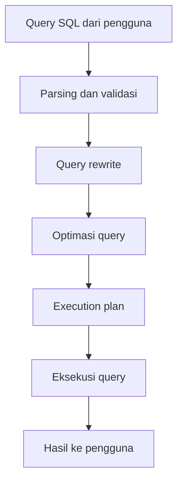

# Modul Pertemuan 3

## Administrasi Basis Data

### Pemrosesan Query pada Database

---

## A. Identitas Materi

**Nama Modul:** Pemrosesan Query pada Database  
**Pertemuan:** 3  
**Prasyarat:** SQL Dasar, tabel dan relasi, pengantar optimasi database  
**DBMS:** PostgreSQL  
**Fokus Materi:** memahami proses yang terjadi ketika query dijalankan oleh sistem database

---

## B. Tujuan Pembelajaran

Setelah mengikuti pertemuan ini, mahasiswa diharapkan mampu:

1. Menjelaskan pengertian pemrosesan query.
2. Menjelaskan mengapa SQL disebut bahasa deklaratif.
3. Menguraikan tahapan utama pemrosesan query dari awal sampai hasil ditampilkan.
4. Menjelaskan peran parser, optimizer, dan executor.
5. Membaca gambaran dasar execution plan pada PostgreSQL.

---

## C. Pengantar

Saat kita menulis query SQL, misalnya:

```sql
SELECT nama, program_studi
FROM mahasiswa
WHERE angkatan = 2023;
```

yang terlihat oleh pengguna biasanya hanya hasil akhirnya. Padahal, sebelum hasil muncul, database melakukan beberapa langkah penting di belakang layar.

Database perlu:

1. membaca query,
2. memeriksa apakah sintaksnya benar,
3. memeriksa apakah tabel dan kolom yang dipakai memang ada,
4. memilih cara yang efisien untuk menjalankan query,
5. mengeksekusi query dan mengirimkan hasilnya.

Rangkaian langkah tersebut disebut **pemrosesan query**.

Memahami pemrosesan query penting karena membantu mahasiswa:

* memahami kenapa query bisa cepat atau lambat,
* menulis SQL yang lebih baik,
* membaca hasil `EXPLAIN` dengan lebih masuk akal.

---

## D. SQL sebagai Bahasa Deklaratif

SQL adalah **bahasa deklaratif**. Artinya, pengguna menuliskan **data apa yang diinginkan**, bukan **langkah demi langkah bagaimana data itu diambil**.

Contoh:

```sql
SELECT *
FROM mata_kuliah
WHERE sks = 3;
```

Pada query tersebut, kita hanya menyatakan kebutuhan: tampilkan semua mata kuliah dengan `sks = 3`.

Kita tidak menuliskan:

* apakah database harus membaca seluruh tabel,
* apakah database harus memakai index,
* tabel mana yang diproses lebih dahulu jika ada join.

Keputusan teknis tersebut ditentukan oleh sistem database.

### Perbandingan Singkat

| Aspek | SQL | Bahasa Imperatif |
| --- | --- | --- |
| Fokus | Apa yang diinginkan | Bagaimana langkahnya |
| Kontrol proses | Diatur database | Diatur programmer |
| Contoh | `SELECT * FROM mahasiswa` | urutan `if`, `for`, dan instruksi |

---

## E. Gambaran Umum Proses Query

Secara sederhana, alur query dapat digambarkan sebagai berikut:



Diagram ini menunjukkan bahwa query tidak langsung dijalankan. Database harus memahami isi query terlebih dahulu, lalu memilih strategi eksekusi yang sesuai.

---

## F. Komponen Penting dalam Pemrosesan Query

### 1. Parser

Parser bertugas membaca query dan memeriksa apakah sintaks SQL sudah benar.

Contoh query yang salah:

```sql
SELECT FROM mahasiswa WHERE angkatan = 2023;
```

Query tersebut salah karena setelah `SELECT` tidak ada kolom yang dipilih.

### 2. Analyzer atau Validator

Setelah sintaks benar, database memeriksa apakah objek yang dipakai memang valid.

Yang diperiksa misalnya:

* nama tabel,
* nama kolom,
* tipe data,
* hak akses pengguna.

Contoh:

```sql
SELECT nim, nama_mahasiswa
FROM mahasiswa;
```

Jika kolom `nama_mahasiswa` tidak ada, query tetap gagal walaupun sintaksnya benar.

### 3. Rewriter

Beberapa DBMS memiliki tahap penulisan ulang query ke bentuk internal yang lebih mudah diproses.

Tujuannya bukan mengubah hasil, tetapi mempersiapkan query agar lebih mudah dioptimalkan.

### 4. Optimizer

Optimizer memilih cara yang diperkirakan paling efisien untuk menjalankan query.

Optimizer mempertimbangkan beberapa hal, seperti:

* ada atau tidaknya index,
* ukuran tabel,
* statistik data,
* urutan join,
* biaya eksekusi.

### 5. Executor

Executor menjalankan query berdasarkan rencana yang sudah dipilih optimizer.

---

## G. Tahapan Pemrosesan Query

### 1. Parsing

Pada tahap ini, database memeriksa bentuk query sesuai aturan SQL.

Jika ada kesalahan sintaks, query berhenti pada tahap ini.

### 2. Validasi

Pada tahap ini, database memeriksa makna query.

Beberapa pertanyaan yang dijawab pada tahap ini:

* Apakah tabelnya ada?
* Apakah kolomnya benar?
* Apakah tipe datanya sesuai?
* Apakah pengguna memiliki hak akses?

### 3. Query Rewrite

Query dapat diubah ke bentuk internal yang lebih cocok untuk proses berikutnya.

### 4. Optimasi

Database membandingkan beberapa kemungkinan cara eksekusi, lalu memilih yang biayanya diperkirakan paling rendah.

Contoh keputusan optimizer:

* memakai `Seq Scan` atau `Index Scan`,
* memakai `Nested Loop`, `Hash Join`, atau `Merge Join`,
* menentukan tabel mana yang dijoin lebih dulu.

### 5. Eksekusi

Setelah rencana dipilih, query dijalankan dan hasil dikirim ke pengguna.

---

## H. Query Plan dan Execution Plan

### 1. Query Plan

Query plan adalah gambaran langkah-langkah yang akan dilakukan database untuk menghasilkan hasil query.

### 2. Execution Plan

Execution plan adalah rencana eksekusi yang akhirnya dipilih oleh optimizer.

Satu query bisa memiliki beberapa kemungkinan rencana. Optimizer memilih rencana yang dianggap paling efisien berdasarkan informasi yang dimiliki database.

### 3. Mengapa Query yang Mirip Bisa Berbeda Performa?

Perhatikan dua query berikut:

```sql
SELECT *
FROM mahasiswa
WHERE angkatan = 2023;
```

```sql
SELECT *
FROM mahasiswa
WHERE CAST(angkatan AS text) = '2023';
```

Hasilnya bisa sama, tetapi performanya dapat berbeda.

Alasannya:

* query pertama lebih mudah memanfaatkan index pada kolom `angkatan`,
* query kedua memaksa database mengubah isi kolom lebih dulu sehingga index bisa menjadi tidak optimal.

---

## I. Contoh Alur Pemrosesan Query

Perhatikan query berikut:

```sql
SELECT m.nim, m.nama, k.kode_mk
FROM mahasiswa m
JOIN krs k ON m.nim = k.nim
WHERE m.angkatan = 2023;
```

Kemungkinan proses yang terjadi adalah:

1. database memeriksa sintaks query,
2. database memastikan tabel `mahasiswa` dan `krs` tersedia,
3. database memeriksa kolom `nim`, `nama`, `kode_mk`, dan `angkatan`,
4. optimizer memilih urutan join yang sesuai,
5. optimizer memilih metode join yang paling cocok,
6. executor menjalankan query dan mengirimkan hasilnya.

### Ilustrasi Sederhana

```text
Pengguna menulis query
        |
        v
Database memahami isi query
        |
        v
Database memilih cara kerja
        |
        v
Database menjalankan query
        |
        v
Hasil ditampilkan
```

---

## J. Faktor yang Memengaruhi Performa Query

### 1. Index

Index membantu database menemukan data lebih cepat, terutama untuk kondisi `WHERE`, `JOIN`, dan `ORDER BY` tertentu.

### 2. Ukuran Tabel

Semakin besar tabel, semakin besar pekerjaan yang harus dilakukan database jika strategi query tidak efisien.

### 3. Statistik Data

Optimizer memakai statistik untuk memperkirakan jumlah baris dan biaya eksekusi.

Jika statistik tidak akurat, optimizer bisa memilih rencana yang kurang tepat.

### 4. Bentuk Penulisan Kondisi

Cara menulis kondisi juga berpengaruh. Misalnya, fungsi pada kolom sering membuat index lebih sulit dipakai.

Contoh:

```sql
WHERE UPPER(nama) = 'BUDI'
```

### 5. Kompleksitas Join

Semakin banyak tabel yang dijoin, semakin kompleks keputusan yang harus dibuat optimizer.

---

## K. Pengenalan `EXPLAIN` dan `EXPLAIN ANALYZE`

Pada PostgreSQL, kita dapat melihat rencana eksekusi query dengan perintah berikut.

### 1. `EXPLAIN`

Perintah ini menampilkan rencana yang dipilih optimizer.

Contoh:

```sql
EXPLAIN
SELECT *
FROM mahasiswa
WHERE angkatan = 2023;
```

Beberapa istilah yang sering muncul:

| Istilah | Arti Sederhana |
| --- | --- |
| `Seq Scan` | membaca tabel secara berurutan |
| `Index Scan` | membaca data dengan bantuan index |
| `Filter` | menyaring baris yang tidak sesuai |
| `Hash Join` | join menggunakan struktur hash |
| `Nested Loop` | join dengan perulangan antarbaris |

### 2. `EXPLAIN ANALYZE`

Perintah ini menjalankan query sekaligus menampilkan hasil pengukuran nyata.

Contoh:

```sql
EXPLAIN ANALYZE
SELECT *
FROM mahasiswa
WHERE angkatan = 2023;
```

Perintah ini bermanfaat untuk membandingkan:

* biaya perkiraan dari optimizer,
* waktu nyata ketika query dijalankan.

---

## L. Kesalahan Umum Mahasiswa saat Menulis Query

Beberapa kesalahan yang sering muncul adalah:

1. menggunakan `SELECT *` tanpa alasan yang jelas,
2. memberi fungsi pada kolom yang sedang difilter,
3. membuat join tanpa kondisi yang tepat,
4. mengambil data terlalu banyak lalu baru disaring di aplikasi,
5. tidak memeriksa execution plan saat query mulai lambat.

---

## M. Ringkasan Materi

Hal-hal penting dari modul ini adalah:

1. SQL adalah bahasa deklaratif.
2. Pemrosesan query terdiri dari parsing, validasi, rewrite, optimasi, dan eksekusi.
3. Optimizer memilih execution plan yang dianggap paling efisien.
4. Performa query dipengaruhi oleh index, ukuran tabel, statistik, dan cara menulis SQL.
5. `EXPLAIN` dan `EXPLAIN ANALYZE` membantu kita memahami cara kerja query di PostgreSQL.

---

## N. Latihan Soal

Kerjakan latihan berikut berdasarkan materi yang telah dipelajari.

### Soal Pemahaman

1. Jelaskan dengan bahasa Anda sendiri apa yang dimaksud dengan pemrosesan query.
2. Mengapa SQL disebut bahasa deklaratif?
3. Sebutkan lima tahap utama pemrosesan query dan jelaskan fungsi masing-masing.
4. Apa perbedaan parser, optimizer, dan executor?
5. Mengapa dua query yang hasilnya sama belum tentu memiliki performa yang sama?

### Soal Analisis

Perhatikan query berikut:

```sql
SELECT *
FROM mahasiswa
WHERE angkatan = 2023;
```

6. Jelaskan alur pemrosesan query tersebut dari awal sampai hasil ditampilkan.
7. Jika kolom `angkatan` memiliki index, apa pengaruhnya terhadap pemrosesan query?

Perhatikan query berikut:

```sql
SELECT m.nama, k.kode_mk
FROM mahasiswa m
JOIN krs k ON m.nim = k.nim
WHERE m.angkatan = 2023;
```

8. Sebutkan minimal tiga keputusan yang perlu dibuat optimizer sebelum query dijalankan.
9. Menurut Anda, kapan database mungkin memakai `Seq Scan` dan kapan lebih cocok memakai `Index Scan`?

### Soal Praktik PostgreSQL

10. Jalankan satu query sederhana menggunakan `EXPLAIN`, lalu catat operasi utama yang muncul.
11. Jalankan query yang sama dengan `EXPLAIN ANALYZE`, lalu bandingkan rencana perkiraan dan hasil nyata.
12. Tuliskan kesimpulan Anda: mengapa administrator basis data perlu memahami execution plan?

---

## O. Tugas Mandiri

Gunakan satu tabel dari praktikum sebelumnya, lalu kerjakan langkah berikut:

1. Buat satu query `SELECT` dengan kondisi `WHERE`.
2. Jalankan `EXPLAIN` pada query tersebut.
3. Jika memungkinkan, buat index pada kolom yang dipakai di kondisi `WHERE`.
4. Jalankan kembali `EXPLAIN`.
5. Bandingkan hasil sebelum dan sesudah penambahan index.

Tuliskan hasil pengamatan Anda dalam bentuk ringkasan singkat.

---

## P. Penutup

Pemrosesan query adalah dasar penting untuk memahami performa database. Mahasiswa yang memahami alur ini akan lebih mudah menganalisis query lambat, membaca execution plan, dan menulis SQL yang lebih efisien.

Pada pertemuan berikutnya, materi dapat dilanjutkan ke pembahasan yang lebih rinci tentang execution plan, index, dan teknik optimasi query pada PostgreSQL.
