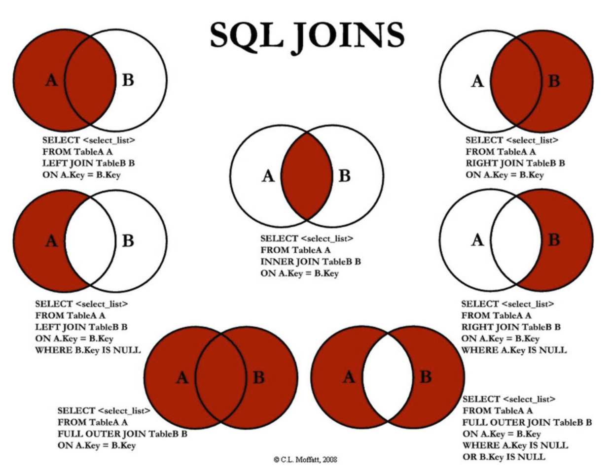
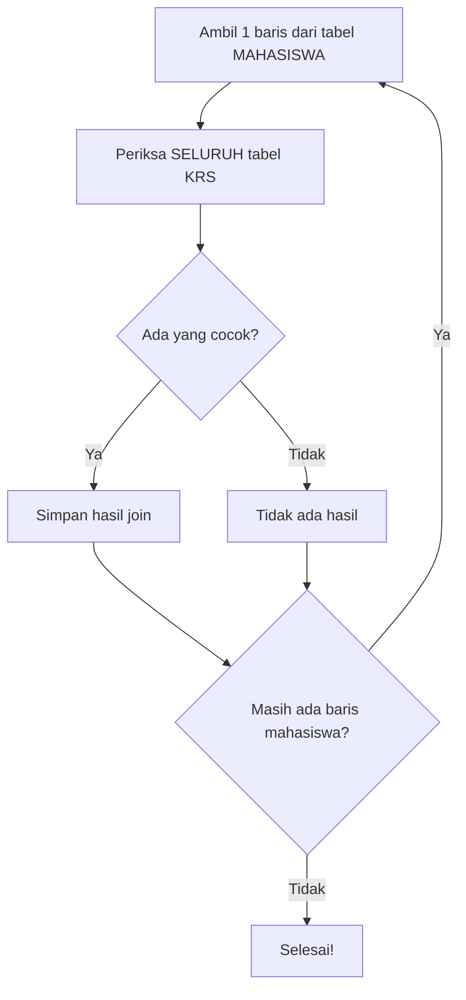
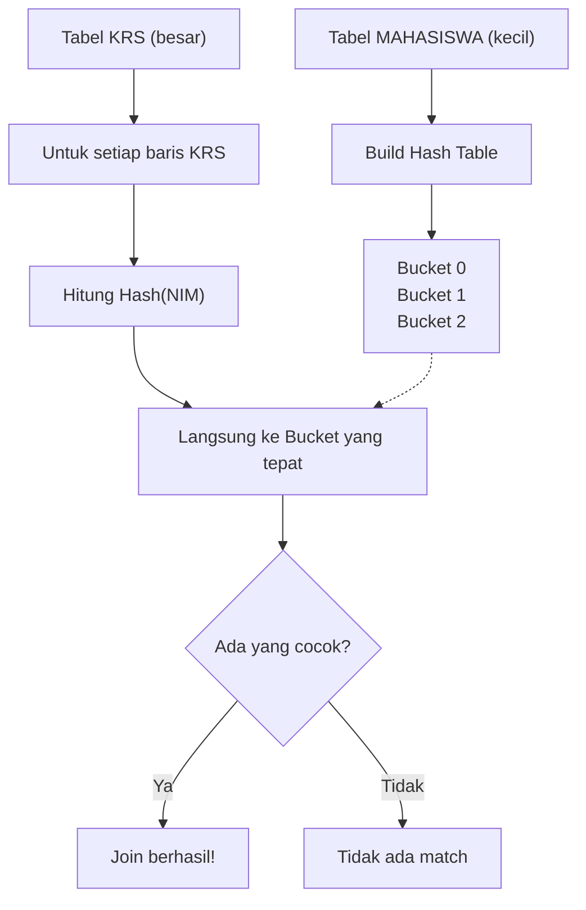
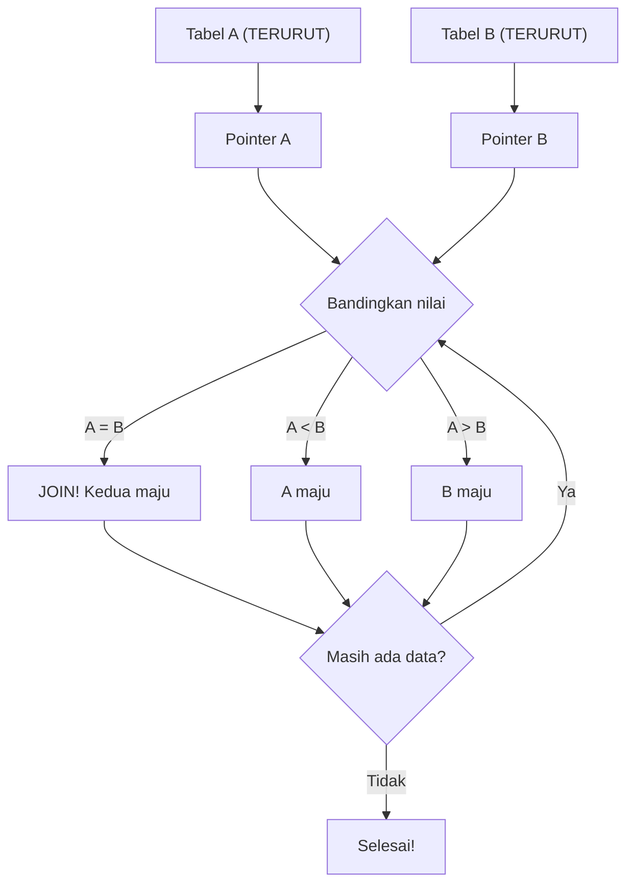
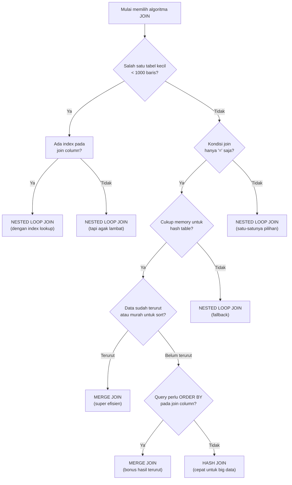

# Modul Pertemuan 4

## Administrasi Basis Data

### Algoritma Join pada Database

---

## A. Identitas Materi

**Nama Modul:** Algoritma Join pada Database  
**Pertemuan:** 4  
**Prasyarat:** SQL Dasar, pemrosesan query, index dan algoritma akses data  
**DBMS:** PostgreSQL  
**Fokus Materi:** memahami cara database menggabungkan tabel dan memilih algoritma join yang efisien

---

## B. Tujuan Pembelajaran

Setelah mengikuti pertemuan ini, mahasiswa diharapkan mampu:

1. Menjelaskan mengapa operasi join penting dalam query database.
2. Menjelaskan cara kerja `Nested Loop Join`, `Hash Join`, dan `Merge Join`.
3. Menjelaskan kelebihan dan kekurangan masing-masing algoritma join.
4. Menjelaskan kondisi data yang memengaruhi pemilihan algoritma join.
5. Membaca hasil `EXPLAIN` sederhana yang menampilkan join algorithm.

---

## C. Keterkaitan dengan Pertemuan Sebelumnya

Pada pertemuan sebelumnya, kita mempelajari bagaimana database menemukan dan membaca data melalui index dan algoritma akses data seperti `Seq Scan`, `Index Scan`, dan `Index-Only Scan`.

Setelah data berhasil ditemukan, database sering masih harus menggabungkan data dari beberapa tabel. Proses penggabungan inilah yang menjadi fokus pembahasan pada pertemuan ini.

---

## D. Peta Materi

Materi pada modul ini dibahas dengan urutan berikut:

1. konsep join,
2. jenis-jenis join (INNER, LEFT, RIGHT),
3. `Nested Loop Join`,
4. `Hash Join`,
5. `Merge Join`,
6. perbandingan algoritma join,
7. pembacaan `EXPLAIN` untuk join.

---

## E. Pengantar

Perhatikan query berikut:

```sql
SELECT m.nama, k.kode_mk
FROM mahasiswa m
JOIN krs k ON m.nim = k.nim;
```

Untuk menjalankan query tersebut, database tidak hanya harus membaca data dari tabel `mahasiswa` dan `krs`, tetapi juga harus menentukan bagaimana kedua tabel itu digabungkan.

Jika tabel kecil, satu algoritma mungkin cukup efisien. Jika tabel besar, algoritma yang sama bisa menjadi lambat. Karena itu, pemilihan algoritma join sangat penting dalam performa query.

---

## F. Apa Itu Join?

Join adalah operasi untuk menggabungkan data dari dua tabel atau lebih berdasarkan kondisi tertentu.

Contoh umum:

```sql
SELECT m.nama, k.kode_mk
FROM mahasiswa m
JOIN krs k ON m.nim = k.nim;
```

Query ini menggabungkan:

* data mahasiswa,
* data KRS,
* berdasarkan kolom `nim`.

Tanpa join, informasi yang tersebar di beberapa tabel tidak bisa ditampilkan secara utuh dalam satu hasil query.

---

## G. Jenis-Jenis Join

Sebelum membahas algoritma join, penting untuk memahami jenis-jenis join berdasarkan cara penggabungan data:

### 1. INNER JOIN

`INNER JOIN` hanya mengembalikan baris yang memiliki pasangan di kedua tabel.

**Contoh:**
```sql
SELECT m.nama, k.kode_mk
FROM mahasiswa m
INNER JOIN krs k ON m.nim = k.nim;
```

**Hasil:** Hanya mahasiswa yang terdaftar di KRS yang akan muncul.

### 2. LEFT JOIN (LEFT OUTER JOIN)

`LEFT JOIN` mengembalikan semua baris dari tabel kiri, meskipun tidak ada pasangan di tabel kanan.

**Contoh:**
```sql
SELECT m.nama, k.kode_mk
FROM mahasiswa m
LEFT JOIN krs k ON m.nim = k.nim;
```

**Hasil:** Semua mahasiswa akan muncul, termasuk yang tidak mengambil mata kuliah (kolom `kode_mk` akan `NULL`).

### 3. RIGHT JOIN (RIGHT OUTER JOIN)

`RIGHT JOIN` mengembalikan semua baris dari tabel kanan, meskipun tidak ada pasangan di tabel kiri.

**Contoh:**
```sql
SELECT m.nama, k.kode_mk
FROM mahasiswa m
RIGHT JOIN krs k ON m.nim = k.nim;
```

**Hasil:** Semua data KRS akan muncul, termasuk yang tidak memiliki data mahasiswa (kolom `nama` akan `NULL`).

### Ilustrasi Visual



*Gambar: Ilustrasi visual jenis-jenis JOIN menggunakan diagram Venn*

**Penjelasan Diagram:**
- **LEFT JOIN**: Mengambil semua data dari tabel A (kiri) dan data yang cocok dari tabel B
- **INNER JOIN**: Mengambil hanya data yang cocok di kedua tabel (irisan)
- **RIGHT JOIN**: Mengambil semua data dari tabel B (kanan) dan data yang cocok dari tabel A
- **FULL OUTER JOIN**: Mengambil semua data dari kedua tabel, termasuk yang tidak cocok

### Perbandingan Hasil

Misalkan tabel `mahasiswa` berisi:
- NIM: 001, Nama: Arif
- NIM: 002, Nama: Budi  
- NIM: 003, Nama: Cici

Tabel `krs` berisi:
- NIM: 001, Kode_MK: DB001
- NIM: 002, Kode_MK: DB002
- NIM: 004, Kode_MK: DB003

| Join Type | Hasil |
|-----------|--------|
| `INNER JOIN` | Arif-DB001, Budi-DB002 |
| `LEFT JOIN` | Arif-DB001, Budi-DB002, Cici-NULL |
| `RIGHT JOIN` | Arif-DB001, Budi-DB002, NULL-DB003 |

---

## I. Mengapa Pemilihan Algoritma Join Penting?

### Dampak Algoritma Join Terhadap Performa

Bayangkan Anda mencari teman untuk kerja kelompok. Ada beberapa cara:

1. **Tanya satu per satu** (seperti Nested Loop): Anda mendekati setiap orang dan bertanya apakah mereka mau bergabung
2. **Buat pengumuman di grup** (seperti Hash Join): Anda posting di grup WhatsApp dan yang berminat akan merespons
3. **Gabung dua daftar terurut** (seperti Merge Join): Anda dan teman punya daftar mahasiswa berdasarkan NIM, lalu menggabungkannya

Setiap cara punya kecepatan berbeda tergantung situasi!

### Mengapa Database Perlu Memilih?

Algoritma join memengaruhi:

* **Kecepatan query** - Apakah query selesai dalam detik atau menit?
* **Penggunaan memory** - Berapa banyak RAM yang dibutuhkan?
* **Jumlah disk I/O** - Berapa kali harus baca data dari disk?
* **Efisiensi CPU** - Seberapa keras processor bekerja?

### Faktor Penentu Pemilihan

Optimizer PostgreSQL seperti "asisten pintar" yang mempertimbangkan:

* **Ukuran tabel** - 100 baris vs 1 juta baris sangat berbeda
* **Ketersediaan index** - Ada "jalan pintas" atau tidak?
* **Jenis kondisi join** - Apakah simple `=` atau kondisi kompleks?
* **Apakah data sudah terurut** - Sudah rapi atau masih acak?
* **Statistik data** - Berapa banyak data unik, duplikat, dll.

**Prinsip Utama:** Tidak ada algoritma yang selalu menang! Seperti memilih transportasi - kadang sepeda motor lebih cepat dari mobil tergantung kondisi jalan dan jarak.

---

## J. Nested Loop Join

`Nested Loop Join` adalah algoritma join yang paling sederhana dan mudah dipahami.

### Analogi Kehidupan Sehari-hari

Bayangkan Anda punya **daftar mahasiswa** dan **daftar nilai**. Untuk mencocokkan nilai dengan mahasiswa:

```text
1. Ambil mahasiswa pertama (misal: NIM 001)
2. Cari di seluruh daftar nilai: "Ada nilai untuk NIM 001?"
3. Kalau ketemu, catat hasilnya
4. Lanjut ke mahasiswa kedua (NIM 002)
5. Cari lagi di seluruh daftar nilai: "Ada nilai untuk NIM 002?"
6. Ulangi sampai selesai
```

Ini seperti **loop bersarang** (nested loop) dalam programming!

### Cara Kerja Detail

**Input:**
- Tabel Mahasiswa: 3 baris
- Tabel KRS: 5 baris

**Proses:**
```text
Untuk baris ke-1 mahasiswa:
  - Periksa baris ke-1 KRS: cocok? 
  - Periksa baris ke-2 KRS: cocok?
  - Periksa baris ke-3 KRS: cocok? (ketemu!)
  - Periksa baris ke-4 KRS: cocok?
  - Periksa baris ke-5 KRS: cocok?
  
Untuk baris ke-2 mahasiswa:
  - Periksa baris ke-1 KRS: cocok?
  - Periksa baris ke-2 KRS: cocok? (ketemu!)
  - ... dan seterusnya
```

**Total pemeriksaan:** 3 × 5 = 15 kali pemeriksaan

### Ilustrasi Visual



### Contoh Konkret

**Tabel Mahasiswa:**
```text
NIM | Nama
001 | Arif
002 | Budi
003 | Cici
```

**Tabel KRS:**
```text
NIM | Mata Kuliah
001 | Database
001 | Algoritma  
002 | Database
004 | Matematika
005 | Fisika
```

**Proses Nested Loop:**
```text
Ambil Arif (001):
  - Cek 001|Database: COCOK!
  - Cek 001|Algoritma: COCOK! 
  - Cek 002|Database: Tidak cocok
  - Cek 004|Matematika: Tidak cocok
  - Cek 005|Fisika: Tidak cocok
  
Ambil Budi (002):
  - Cek 001|Database: Tidak cocok
  - Cek 001|Algoritma: Tidak cocok
  - Cek 002|Database: COCOK!
  - Cek 004|Matematika: Tidak cocok  
  - Cek 005|Fisika: Tidak cocok

Ambil Cici (003):
  - Cek semua KRS: Tidak ada yang cocok
```

### Kelebihan

* **Sederhana:** Mudah dipahami, seperti cara manusia berpikir
* **Fleksibel:** Bisa untuk kondisi join apapun (`=`, `>`, `<`, dll)
* **Efektif untuk tabel kecil:** Kalau datanya sedikit, ini cukup cepat
* **Excellent dengan index:** Kalau ada index di tabel yang dicari, pencarian jadi super cepat!

### Kekurangan

* **Lambat untuk data besar:** Kalau mahasiswa 10.000 dan KRS 50.000 maka butuh 500 juta pemeriksaan!
* **Boros waktu:** Harus memeriksa banyak kombinasi

### Kapan Digunakan?

**Cocok untuk:**
* Salah satu tabel kecil (< 1000 baris)
* Ada index pada kolom join
* Kondisi join yang kompleks
* Data tidak terurut

**Tidak cocok untuk:**
* Kedua tabel besar tanpa index
* Join sederhana dengan data besar

---

## K. Hash Join

`Hash Join` adalah algoritma yang cerdas untuk join dengan kondisi kesamaan (`=`).

### Analogi Kehidupan Sehari-hari

Bayangkan Anda mengorganisir acara dan punya:
- **Daftar undangan** (1000 orang)
- **Daftar yang sudah konfirmasi** (500 orang)

Cara **Hash Join:**
```text
Langkah 1: Buat "kotak-kotak" berdasarkan huruf awal nama
  - Kotak A: Ahmad, Arif, Andi, ...
  - Kotak B: Budi, Bayu, Bony, ...
  - Kotak C: Cici, Candra, ...
  
Langkah 2: Untuk setiap orang yang konfirmasi:
  - Lihat huruf awal namanya
  - Langsung ke kotak yang sesuai
  - Cari di kotak itu saja (bukan semua kotak!)
```

Ini jauh lebih cepat daripada mencari satu per satu di seluruh daftar!

### Cara Kerja Detail

**Hash Join hanya bisa dipakai untuk kondisi `=` (equality join):**

```sql
ON mahasiswa.nim = krs.nim  -- Bisa pakai Hash Join
ON mahasiswa.nim > krs.nim  -- Tidak bisa Hash Join
```

**Proses Step-by-Step:**

**Phase 1: Build Hash Table** (Tahap Persiapan)
```text
1. Pilih tabel yang lebih kecil (misal: tabel Mahasiswa)
2. Baca setiap baris mahasiswa
3. Hitung hash value dari NIM (misal: NIM mod 10)
4. Masukkan ke "bucket" sesuai hash value
```

**Phase 2: Probe** (Tahap Pencarian)
```text
1. Baca tabel KRS baris per baris
2. Hitung hash value dari NIM di KRS
3. Langsung ke bucket yang sesuai
4. Bandingkan hanya dengan data di bucket itu
5. Kalau cocok, gabungkan!
```

### Contoh Konkret dengan Angka

**Tabel Mahasiswa:**
```text
NIM  | Nama | Hash(NIM mod 3)
001  | Arif | Bucket 1
002  | Budi | Bucket 2  
003  | Cici | Bucket 0
004  | Doni | Bucket 1
005  | Erni | Bucket 2
```

**Hash Table Result:**
```text
Bucket 0: [003|Cici]
Bucket 1: [001|Arif, 004|Doni] 
Bucket 2: [002|Budi, 005|Erni]
```

**Tabel KRS:**
```text
NIM  | Mata Kuliah
001  | Database     --> hash = 1, cek Bucket 1 --> ketemu Arif!
003  | Algoritma    --> hash = 0, cek Bucket 0 --> ketemu Cici!
006  | Matematika   --> hash = 0, cek Bucket 0 --> tidak ketemu
```

### Ilustrasi Visual



### Mengapa Hash Join Cepat?

**Tanpa Hash (Nested Loop):**
```text
Untuk 1 baris KRS → periksa 1000 baris Mahasiswa
Total: 500 × 1000 = 500.000 pemeriksaan
```

**Dengan Hash Join:**
```text
Untuk 1 baris KRS → periksa rata-rata 333 baris per bucket  
Total: 500 × 333 = 166.500 pemeriksaan (3x lebih cepat!)
```

### Kelebihan

* **Sangat cepat untuk data besar:** Kompleksitas waktu O(M+N) bukan O(M×N)
* **Efisien untuk equality join:** Optimized khusus untuk kondisi `=`
* **Predictable performance:** Waktu eksekusi lebih stabil

### Kekurangan

* **Butuh memory besar:** Harus muat hash table di RAM
* **Hanya untuk equality join:** Tidak bisa untuk `>`, `<`, `BETWEEN`, dll
* **Overhead setup:** Perlu waktu untuk build hash table

### Kapan Digunakan?

**Cocok untuk:**
* Join dengan kondisi `=` saja
* Kedua tabel besar (> 10.000 baris)
* Punya memory yang cukup
* Tidak perlu hasil yang terurut

**Tidak cocok untuk:**
* Kondisi join selain `=`
* Memory terbatas
* Salah satu tabel sangat kecil

### Tips Memory Management

**Yang dilakukan PostgreSQL:**
- Selalu pilih tabel yang lebih kecil untuk build hash table
- Kalau hash table tidak muat di memory, bagi jadi beberapa batch
- Monitor memory usage dan switch ke algoritma lain jika perlu

---

## L. Merge Join

`Merge Join` adalah algoritma yang elegant untuk join ketika data sudah terurut atau mudah diurutkan.

### Analogi Kehidupan Sehari-hari

Bayangkan Anda punya dua **daftar siswa yang sudah diurutkan berdasarkan NIM:**

**Daftar A (terurut):** 001, 003, 005, 007, 009
**Daftar B (terurut):** 002, 003, 004, 005, 008

Cara **Merge Join** seperti menggabungkan dua antrian yang teratur:

```text
Pointer A --> 001    Pointer B --> 002
Bandingkan: 001 < 002 --> A maju

Pointer A --> 003    Pointer B --> 002  
Bandingkan: 003 > 002 --> B maju

Pointer A --> 003    Pointer B --> 003
Bandingkan: 003 = 003 --> COCOK! Join mereka!

Keduanya maju...
Pointer A --> 005    Pointer B --> 004
Bandingkan: 005 > 004 --> B maju

Pointer A --> 005    Pointer B --> 005  
Bandingkan: 005 = 005 --> COCOK! Join mereka!
```

### Cara Kerja Detail

**Prerequisite:** Kedua tabel harus terurut berdasarkan kolom join!

**Algorithm Steps:**
```text
1. Mulai dari baris pertama kedua tabel
2. Bandingkan nilai join column:
   - Jika sama --> JOIN! lalu maju kedua pointer
   - Jika A < B --> maju pointer A
   - Jika A > B --> maju pointer B
3. Ulangi sampai salah satu tabel habis
```

### Contoh Konkret Step-by-Step

**Tabel Mahasiswa (terurut by NIM):**
```text
NIM | Nama
001 | Arif
003 | Budi  
005 | Cici
007 | Doni
```

**Tabel KRS (terurut by NIM):**
```text
NIM | Mata Kuliah
001 | Database
002 | Algoritma
003 | Matematika
005 | Fisika
006 | Kimia
```

**Proses Merge Join:**

```text
Step 1:
Mahasiswa[0]: 001|Arif    KRS[0]: 001|Database
001 = 001 --> MATCH! Hasil: (Arif, Database)
Maju kedua pointer.

Step 2:  
Mahasiswa[1]: 003|Budi    KRS[1]: 002|Algoritma
003 > 002 --> KRS maju

Step 3:
Mahasiswa[1]: 003|Budi    KRS[2]: 003|Matematika  
003 = 003 --> MATCH! Hasil: (Budi, Matematika)
Maju kedua pointer.

Step 4:
Mahasiswa[2]: 005|Cici    KRS[3]: 005|Fisika
005 = 005 --> MATCH! Hasil: (Cici, Fisika) 
Maju kedua pointer.

Step 5:
Mahasiswa[3]: 007|Doni    KRS[4]: 006|Kimia
007 > 006 --> KRS maju

Step 6:
Mahasiswa[3]: 007|Doni    KRS sudah habis --> STOP
```

**Final Result:**
```text
Arif - Database
Budi - Matematika  
Cici - Fisika
```

### Ilustrasi Visual



### Mengapa Merge Join Efisien?

**Kompleksitas Waktu:** O(M + N) - Linear!

```text
Setiap baris hanya dibaca SEKALI saja!
- Mahasiswa: 1000 baris --> 1000 pembacaan
- KRS: 5000 baris --> 5000 pembacaan  
Total: 6000 pembacaan (bukan 1000 × 5000 = 5 juta!)
```

### Kelebihan

* **Super efisien untuk data terurut:** Kompleksitas linear O(M+N)
* **Memory friendly:** Tidak perlu muat semua data di memory sekaligus
* **Stable performance:** Waktu eksekusi predictable
* **Hasil sudah terurut:** Bonus! Output otomatis tersort

### Kekurangan

* **Harus terurut dulu:** Kalau belum terurut, perlu sorting dulu (expensive!)
* **Hanya untuk equality join:** Tidak bisa untuk `>`, `<`, dll
* **Overhead sorting:** Kalau data acak, sorting bisa mahal

### Kapan Digunakan?

**Cocok untuk:**
* Data sudah terurut (ada index, atau hasil sorting sebelumnya)
* Join pada Primary Key atau Foreign Key
* Query yang juga butuh ORDER BY
* Data besar dengan memori terbatas

**Tidak cocok untuk:**
* Data acak tanpa index
* Sorting lebih mahal dari join itu sendiri
* Kondisi join selain `=`

### Tips Optimasi

**Yang dilakukan PostgreSQL:**
- Cek apakah ada index yang bisa dipakai untuk urutan
- Estimasi cost sorting vs manfaat merge join
- Kalau ada ORDER BY di query, merge join jadi lebih menarik
- Bisa combine dengan index scan untuk dapat data terurut

**Contoh ideal:**
```sql
-- Query ini sangat cocok untuk Merge Join karena:
-- 1. JOIN berdasarkan PK/FK (biasanya ada index)
-- 2. Ada ORDER BY (output perlu terurut juga)
SELECT m.nama, k.kode_mk 
FROM mahasiswa m
JOIN krs k ON m.nim = k.nim
ORDER BY m.nim;
```

---

## M. Perbandingan Algoritma Join

### Tabel Perbandingan Lengkap

| Aspek | Nested Loop Join | Hash Join | Merge Join |
|-------|------------------|-----------|------------|
| **Analogi** | Cari satu-satu di buku telepon | Organisir ke kotak, lalu cari | Gabung dua antrian teratur |
| **Kondisi Join** | Semua (`=`, `>`, `<`, `BETWEEN`) | Hanya kesamaan (`=`) | Hanya kesamaan (`=`) |
| **Cocok untuk Ukuran** | Salah satu tabel kecil | Kedua tabel besar | Kedua tabel besar |
| **Kebutuhan Memory** | Rendah | Tinggi (untuk hash table) | Rendah |
| **Perlu Index?** | Sangat membantu | Tidak perlu | Tidak perlu (tapi perlu sorted) |
| **Perlu Sorting?** | Tidak | Tidak | Ya (jika belum terurut) |
| **Kompleksitas Waktu** | O(M × N) | O(M + N) | O(M + N) |
| **Output Terurut?** | Tidak | Tidak | Ya |

### Contoh Skenario Pemilihan

#### Skenario 1: Tabel Kecil vs Besar
```text
Tabel Mahasiswa: 100 baris
Tabel KRS: 50.000 baris
Pilihan Terbaik: Nested Loop Join
Alasan: Mahasiswa kecil, cukup loop 100×50.000 dengan index
```

#### Skenario 2: Kedua Tabel Besar
```text
Tabel Mahasiswa: 100.000 baris  
Tabel KRS: 500.000 baris
Pilihan Terbaik: Hash Join
Alasan: Equality join pada data besar, efisien O(M+N)
```

#### Skenario 3: Data Sudah Terurut
```text
Mahasiswa terurut by NIM (ada index)
KRS terurut by NIM (ada index)  
Pilihan Terbaik: Merge Join
Alasan: Tidak perlu sorting, langsung merge O(M+N)
```

#### Skenario 4: Query dengan ORDER BY
```text
SELECT * FROM mahasiswa m
JOIN krs k ON m.nim = k.nim
ORDER BY m.nim;

Pilihan Terbaik: Merge Join  
Alasan: Output perlu terurut, merge join memberikan bonus ini
```

---

## N. Faktor yang Memengaruhi Pemilihan Join

### Faktor-Faktor Keputusan PostgreSQL Optimizer

PostgreSQL Optimizer seperti **"konsultan pintar"** yang mempertimbangkan berbagai hal sebelum memutuskan algoritma join mana yang dipakai.

#### 1. Ukuran Masing-Masing Tabel

**Contoh pengambilan keputusan:**
```text
Kasus A: Mahasiswa (100 baris) JOIN KRS (50.000 baris)  
Optimizer: "Nested Loop saja, yang kecil jadi outer loop"

Kasus B: Mahasiswa (100.000 baris) JOIN KRS (500.000 baris)
Optimizer: "Wah besar semua! Hash Join atau Merge Join nih"
```

#### 2. Ketersediaan Index

**Impact pada pemilihan:**
```text
Tanpa Index:
- Nested Loop: LAMBAT (sequential scan berkali-kali)
- Hash Join: OK (scan sekali untuk build hash)
- Merge Join: PERLU SORT dulu (expensive!)

Dengan Index pada join column:  
- Nested Loop: CEPAT! (index lookup)
- Hash Join: Tetap OK 
- Merge Join: SANGAT CEPAT! (data sudah terurut)
```

#### 3. Jenis Kondisi Join

**Compatibility matrix:**
```sql
-- Semua algoritma bisa
ON mahasiswa.nim = krs.nim

-- Hanya Nested Loop yang bisa  
ON mahasiswa.nim > krs.min_nim
ON mahasiswa.angkatan BETWEEN krs.tahun_awal AND krs.tahun_akhir
```

#### 4. Apakah Data Sudah Terurut

**Skenario:**
```text
Data sudah sorted di disk (karena index/clustering):
Merge Join = JACKPOT!

Data acak:  
Merge Join = harus sort dulu = mahal!
```

#### 5. Statistik Data (pg_stats)

**Yang dilihat optimizer:**
```text
- Jumlah baris (n_tups)
- Nilai unik (n_distinct) 
- Distribusi data (histogram)
- Correlation (seberapa terurut)

Contoh:
Jika nim di tabel mahasiswa punya correlation = 0.9
"Data sudah hampir terurut, Merge Join menarik!"
```

### Decision Tree Sederhana



### Prinsip Praktis untuk Mahasiswa

**Rules of Thumb:**

1. **Tabel kecil (< 1000 baris)** --> Nested Loop (apalagi ada index)
2. **Kedua tabel besar + equality join** --> Hash Join 
3. **Data terurut + equality join** --> Merge Join
4. **Non-equality join** --> Hanya Nested Loop yang bisa
5. **Query dengan ORDER BY** --> Merge Join lebih menarik

**Yang Sering Salah Dipahami:**
- "Hash Join selalu tercepat" 
- "Nested Loop selalu lambat"
- "Semakin kompleks algoritmanya, semakin bagus"

**Yang Benar:**
- "Algoritma terbaik = yang paling cocok dengan kondisi data"
- "Simple bisa lebih cepat dari complex kalau kondisinya pas"

---

## O. Contoh Pembacaan `EXPLAIN`

### 1. Contoh Nested Loop

```sql
EXPLAIN
SELECT m.nama, k.kode_mk
FROM mahasiswa m
JOIN krs k ON m.nim = k.nim;
```

Kemungkinan hasil:

```text
Nested Loop
```

### 2. Contoh Hash Join

```sql
EXPLAIN
SELECT m.nama, k.kode_mk
FROM mahasiswa m
JOIN krs k ON m.nim = k.nim;
```

Kemungkinan hasil lain:

```text
Hash Join
```

### 3. Contoh Merge Join

```sql
EXPLAIN
SELECT m.nama, k.kode_mk
FROM mahasiswa m
JOIN krs k ON m.nim = k.nim
ORDER BY m.nim;
```

Kemungkinan hasil:

```text
Merge Join
```

Intinya, bentuk query bisa sama atau mirip, tetapi algoritma join yang dipilih dapat berbeda tergantung kondisi data.

---

## P. Praktikum Sederhana

### 1. Percobaan join dasar

```sql
EXPLAIN
SELECT m.nama, k.kode_mk
FROM mahasiswa m
JOIN krs k ON m.nim = k.nim;
```

Catat algoritma yang dipilih PostgreSQL.

### 2. Amati perubahan kondisi

Jika memungkinkan, tambahkan kondisi berikut:

```sql
WHERE m.angkatan = 2023
```

Lalu jalankan kembali `EXPLAIN` dan amati apakah execution plan berubah.

### 3. Bandingkan hasil

Perhatikan apakah PostgreSQL menampilkan:

* `Nested Loop`,
* `Hash Join`,
* `Merge Join`.

Tulis alasan yang mungkin menyebabkan pemilihan itu.

---

## Q. Kesalahan Umum Mahasiswa

1. menganggap semua query `JOIN` memakai algoritma yang sama,
2. menganggap `Hash Join` selalu paling cepat,
3. menganggap `Nested Loop Join` selalu buruk,
4. tidak memperhatikan ukuran tabel,
5. tidak membaca hasil `EXPLAIN` saat query join lambat.

---

## R. Ringkasan Materi

1. join digunakan untuk menggabungkan data dari beberapa tabel,
2. terdapat tiga jenis join utama: INNER JOIN (hanya data yang cocok), LEFT JOIN (semua data tabel kiri), dan RIGHT JOIN (semua data tabel kanan),
3. `Nested Loop Join` sederhana dan cocok untuk data kecil atau ketika ada index,
4. `Hash Join` cocok untuk equality join pada data besar,
5. `Merge Join` cocok untuk data besar yang sudah terurut,
6. optimizer memilih algoritma join berdasarkan kondisi data dan biaya eksekusi.

---

## S. Latihan Soal

### Soal Pemahaman

1. Jelaskan apa yang dimaksud dengan join.
2. Apa perbedaan antara INNER JOIN, LEFT JOIN, dan RIGHT JOIN?
3. Kapan hasil LEFT JOIN dan INNER JOIN akan menghasilkan data yang sama?
4. Apa perbedaan `Nested Loop Join`, `Hash Join`, dan `Merge Join`?
5. Mengapa `Hash Join` cocok untuk join berbasis kesamaan?
6. Mengapa `Merge Join` bisa efisien jika data sudah terurut?
7. Mengapa tidak ada satu algoritma join yang selalu terbaik?

### Soal Analisis

8. Dalam kondisi apa `Nested Loop Join` lebih masuk akal untuk dipilih?
9. Dalam kondisi apa `Hash Join` biasanya lebih unggul?
10. Mengapa proses sorting dapat membuat `Merge Join` menjadi mahal?
11. Berikan contoh kasus di mana LEFT JOIN menghasilkan baris dengan nilai NULL.

### Soal Praktik PostgreSQL

12. Jalankan satu query `EXPLAIN` yang melibatkan join, lalu catat algoritma join yang dipilih PostgreSQL.
13. Buat query dengan INNER JOIN, LEFT JOIN, dan RIGHT JOIN pada tabel yang sama, lalu bandingkan hasilnya.
14. Tuliskan kesimpulan Anda tentang hubungan antara ukuran tabel, kondisi join, dan algoritma yang dipilih.

---

## T. Tugas Mandiri

Gunakan dua tabel dari praktikum Anda, lalu kerjakan langkah berikut:

1. buat satu query `JOIN`,
2. jalankan `EXPLAIN`,
3. catat algoritma join yang dipilih,
4. tambahkan kondisi filter atau ubah query,
5. jalankan kembali `EXPLAIN`,
6. analisis apakah join algorithm berubah,
7. simpulkan mengapa perubahan itu bisa terjadi.

---

## U. Penutup

Setelah memahami bagaimana database membaca data pada Week 4, mahasiswa perlu memahami bagaimana database menggabungkan data dari beberapa tabel pada Week 5. Pemahaman tentang algoritma join sangat penting untuk membaca execution plan secara lebih lengkap dan menganalisis query yang melibatkan banyak tabel.