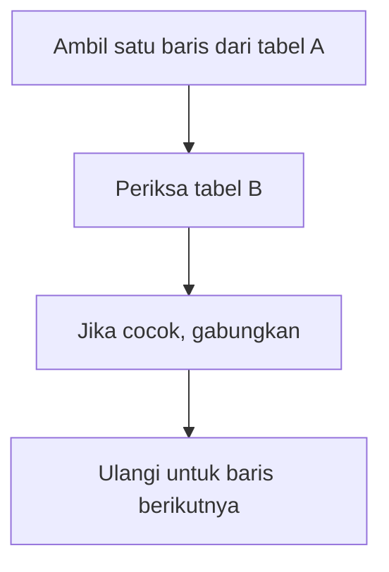
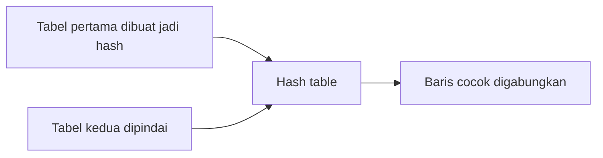
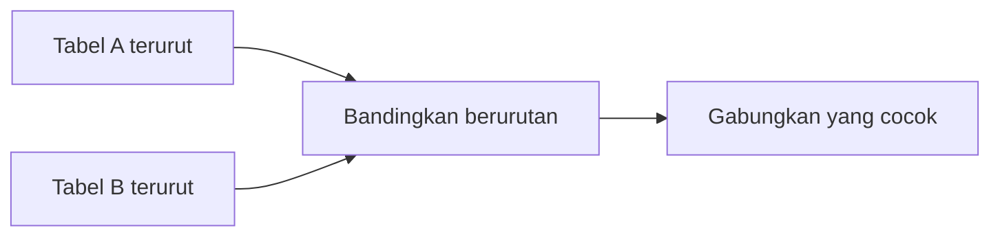

# Modul Pertemuan 5

## Administrasi Basis Data

### Algoritma Join pada Database

---

## A. Identitas Materi

**Nama Modul:** Algoritma Join pada Database  
**Pertemuan:** 5  
**Prasyarat:** SQL Dasar, pemrosesan query, index dan algoritma akses data  
**DBMS:** PostgreSQL  
**Fokus Materi:** memahami cara database menggabungkan tabel dan memilih algoritma join yang efisien

---

## B. Tujuan Pembelajaran

Setelah mengikuti pertemuan ini, mahasiswa diharapkan mampu:

1. Menjelaskan mengapa operasi join penting dalam query database.
2. Menjelaskan cara kerja `Nested Loop Join`, `Hash Join`, dan `Merge Join`.
3. Menjelaskan kelebihan dan kekurangan masing-masing algoritma join.
4. Menjelaskan kondisi data yang memengaruhi pemilihan algoritma join.
5. Membaca hasil `EXPLAIN` sederhana yang menampilkan join algorithm.

---

## C. Keterkaitan dengan Pertemuan Sebelumnya

Pada Week 4, kita mempelajari bagaimana database menemukan dan membaca data melalui index dan algoritma akses data seperti `Seq Scan`, `Index Scan`, dan `Index-Only Scan`.

Setelah data berhasil ditemukan, database sering masih harus menggabungkan data dari beberapa tabel. Proses penggabungan inilah yang menjadi fokus pembahasan pada pertemuan ini.

---

## D. Peta Materi

Materi pada modul ini dibahas dengan urutan berikut:

1. konsep join,
2. `Nested Loop Join`,
3. `Hash Join`,
4. `Merge Join`,
5. perbandingan algoritma join,
6. pembacaan `EXPLAIN` untuk join.

---

## E. Pengantar

Perhatikan query berikut:

```sql
SELECT m.nama, k.kode_mk
FROM mahasiswa m
JOIN krs k ON m.nim = k.nim;
```

Untuk menjalankan query tersebut, database tidak hanya harus membaca data dari tabel `mahasiswa` dan `krs`, tetapi juga harus menentukan bagaimana kedua tabel itu digabungkan.

Jika tabel kecil, satu algoritma mungkin cukup efisien. Jika tabel besar, algoritma yang sama bisa menjadi lambat. Karena itu, pemilihan algoritma join sangat penting dalam performa query.

---

## F. Apa Itu Join?

Join adalah operasi untuk menggabungkan data dari dua tabel atau lebih berdasarkan kondisi tertentu.

Contoh umum:

```sql
SELECT m.nama, k.kode_mk
FROM mahasiswa m
JOIN krs k ON m.nim = k.nim;
```

Query ini menggabungkan:

* data mahasiswa,
* data KRS,
* berdasarkan kolom `nim`.

Tanpa join, informasi yang tersebar di beberapa tabel tidak bisa ditampilkan secara utuh dalam satu hasil query.

---

## G. Mengapa Pemilihan Algoritma Join Penting?

Algoritma join memengaruhi:

* kecepatan query,
* penggunaan memory,
* jumlah block yang dibaca,
* efisiensi keseluruhan execution plan.

Tidak ada satu algoritma yang selalu terbaik untuk semua kondisi. Optimizer memilih berdasarkan:

* ukuran tabel,
* ketersediaan index,
* jenis kondisi join,
* kebutuhan sorting,
* statistik data.

---

## H. Nested Loop Join

`Nested Loop Join` adalah algoritma join yang paling sederhana.

### Cara kerja

```text
Untuk setiap baris di tabel A,
cari pasangan yang cocok di tabel B.
```

### Ilustrasi



### Kelebihan

* sederhana,
* fleksibel,
* efektif jika salah satu tabel kecil,
* bisa sangat baik jika ada index pada tabel yang dicari.

### Kekurangan

* bisa lambat untuk data besar jika harus memeriksa terlalu banyak pasangan.

### Cocok digunakan untuk

* tabel kecil,
* join dengan bantuan index,
* kondisi join yang tidak terlalu kompleks.

---

## I. Hash Join

`Hash Join` biasanya dipakai untuk join dengan kondisi kesamaan, misalnya:

```sql
ON A.id = B.id
```

### Cara kerja

1. database membangun struktur hash dari salah satu tabel,
2. tabel lainnya dibandingkan ke struktur hash tersebut,
3. baris yang cocok digabungkan.

### Ilustrasi



### Kelebihan

* efisien untuk data besar,
* sangat cocok untuk equality join.

### Kekurangan

* membutuhkan memory,
* tidak cocok untuk semua jenis kondisi join.

### Cocok digunakan untuk

* join `=`,
* data besar,
* kondisi tanpa kebutuhan urutan data tertentu.

---

## J. Merge Join

`Merge Join` digunakan ketika kedua sisi join sudah terurut atau dapat diurutkan terlebih dahulu.

### Cara kerja

1. kedua input diurutkan berdasarkan kolom join,
2. database membandingkan kedua sisi secara berurutan,
3. baris yang cocok digabungkan.

### Ilustrasi



### Kelebihan

* efisien untuk data besar yang sudah terurut,
* baik untuk kondisi ketika sorting tidak mahal.

### Kekurangan

* jika data belum terurut, proses sorting menambah biaya.

### Cocok digunakan untuk

* data besar,
* join pada data yang sudah sorted,
* kondisi ketika urutan data dapat dimanfaatkan.

---

## K. Perbandingan Algoritma Join

| Algoritma | Cocok untuk | Kelebihan | Kekurangan |
| --- | --- | --- | --- |
| `Nested Loop Join` | data kecil atau ada index | sederhana dan fleksibel | lambat untuk data besar |
| `Hash Join` | equality join pada data besar | cepat dan efisien | butuh memory |
| `Merge Join` | data besar yang sudah terurut | efisien pada data terurut | bisa mahal jika perlu sorting |

---

## L. Faktor yang Memengaruhi Pemilihan Join

Optimizer biasanya mempertimbangkan beberapa hal berikut:

1. ukuran masing-masing tabel,
2. ada atau tidaknya index,
3. jenis kondisi join,
4. apakah data sudah terurut,
5. biaya memory dan I/O.

Prinsip sederhananya adalah:

* `Nested Loop Join` lebih masuk akal jika salah satu sisi kecil,
* `Hash Join` cocok untuk join kesamaan pada data besar,
* `Merge Join` cocok jika kedua sisi sudah terurut atau murah untuk diurutkan.

---

## M. Contoh Pembacaan `EXPLAIN`

### 1. Contoh Nested Loop

```sql
EXPLAIN
SELECT m.nama, k.kode_mk
FROM mahasiswa m
JOIN krs k ON m.nim = k.nim;
```

Kemungkinan hasil:

```text
Nested Loop
```

### 2. Contoh Hash Join

```sql
EXPLAIN
SELECT m.nama, k.kode_mk
FROM mahasiswa m
JOIN krs k ON m.nim = k.nim;
```

Kemungkinan hasil lain:

```text
Hash Join
```

### 3. Contoh Merge Join

```sql
EXPLAIN
SELECT m.nama, k.kode_mk
FROM mahasiswa m
JOIN krs k ON m.nim = k.nim
ORDER BY m.nim;
```

Kemungkinan hasil:

```text
Merge Join
```

Intinya, bentuk query bisa sama atau mirip, tetapi algoritma join yang dipilih dapat berbeda tergantung kondisi data.

---

## N. Praktikum Sederhana

### 1. Percobaan join dasar

```sql
EXPLAIN
SELECT m.nama, k.kode_mk
FROM mahasiswa m
JOIN krs k ON m.nim = k.nim;
```

Catat algoritma yang dipilih PostgreSQL.

### 2. Amati perubahan kondisi

Jika memungkinkan, tambahkan kondisi berikut:

```sql
WHERE m.angkatan = 2023
```

Lalu jalankan kembali `EXPLAIN` dan amati apakah execution plan berubah.

### 3. Bandingkan hasil

Perhatikan apakah PostgreSQL menampilkan:

* `Nested Loop`,
* `Hash Join`,
* `Merge Join`.

Tulis alasan yang mungkin menyebabkan pemilihan itu.

---

## O. Kesalahan Umum Mahasiswa

1. menganggap semua query `JOIN` memakai algoritma yang sama,
2. menganggap `Hash Join` selalu paling cepat,
3. menganggap `Nested Loop Join` selalu buruk,
4. tidak memperhatikan ukuran tabel,
5. tidak membaca hasil `EXPLAIN` saat query join lambat.

---

## P. Ringkasan Materi

1. join digunakan untuk menggabungkan data dari beberapa tabel,
2. `Nested Loop Join` sederhana dan cocok untuk data kecil atau ketika ada index,
3. `Hash Join` cocok untuk equality join pada data besar,
4. `Merge Join` cocok untuk data besar yang sudah terurut,
5. optimizer memilih algoritma join berdasarkan kondisi data dan biaya eksekusi.

---

## Q. Latihan Soal

### Soal Pemahaman

1. Jelaskan apa yang dimaksud dengan join.
2. Apa perbedaan `Nested Loop Join`, `Hash Join`, dan `Merge Join`?
3. Mengapa `Hash Join` cocok untuk join berbasis kesamaan?
4. Mengapa `Merge Join` bisa efisien jika data sudah terurut?
5. Mengapa tidak ada satu algoritma join yang selalu terbaik?

### Soal Analisis

6. Dalam kondisi apa `Nested Loop Join` lebih masuk akal untuk dipilih?
7. Dalam kondisi apa `Hash Join` biasanya lebih unggul?
8. Mengapa proses sorting dapat membuat `Merge Join` menjadi mahal?

### Soal Praktik PostgreSQL

9. Jalankan satu query `EXPLAIN` yang melibatkan join, lalu catat algoritma join yang dipilih PostgreSQL.
10. Tuliskan kesimpulan Anda tentang hubungan antara ukuran tabel, kondisi join, dan algoritma yang dipilih.

---

## R. Tugas Mandiri

Gunakan dua tabel dari praktikum Anda, lalu kerjakan langkah berikut:

1. buat satu query `JOIN`,
2. jalankan `EXPLAIN`,
3. catat algoritma join yang dipilih,
4. tambahkan kondisi filter atau ubah query,
5. jalankan kembali `EXPLAIN`,
6. analisis apakah join algorithm berubah,
7. simpulkan mengapa perubahan itu bisa terjadi.

---

## S. Penutup

Setelah memahami bagaimana database membaca data pada Week 4, mahasiswa perlu memahami bagaimana database menggabungkan data dari beberapa tabel pada Week 5. Pemahaman tentang algoritma join sangat penting untuk membaca execution plan secara lebih lengkap dan menganalisis query yang melibatkan banyak tabel.