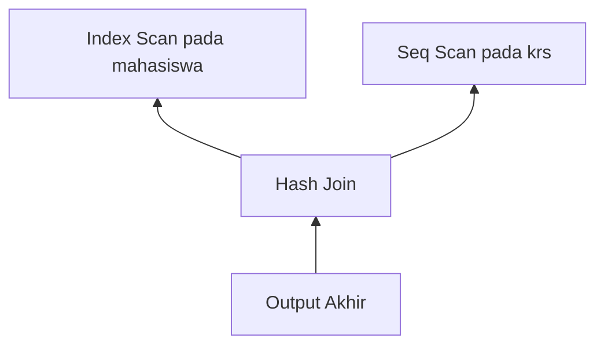
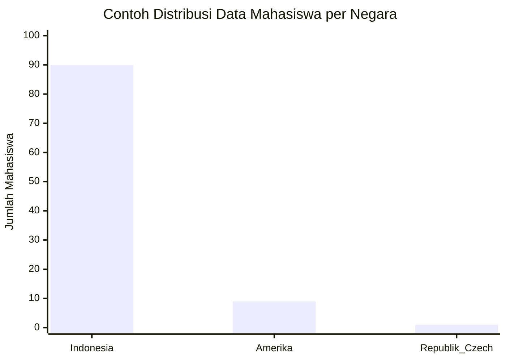

# Modul Pertemuan 5

## Administrasi Basis Data

### Analisis EXPLAIN dan EXPLAIN ANALYZE

---

## A. Identitas Materi

**Nama Modul:** Analisis EXPLAIN dan EXPLAIN ANALYZE  
**Pertemuan:** 5  
**Prasyarat:** SQL Dasar, pemrosesan query, index, algoritma akses data, algoritma join  
**DBMS:** PostgreSQL  
**Fokus Materi:** memahami cara membaca execution plan sebagai dasar analisis performa query

---

## B. Tujuan Pembelajaran

Setelah mengikuti pertemuan ini, mahasiswa diharapkan mampu:

1. Menjelaskan apa yang dimaksud dengan execution plan.
2. Menjelaskan hubungan antara query SQL, optimizer, dan execution plan.
3. Membaca struktur dasar execution plan pada PostgreSQL.
4. Menjelaskan arti informasi penting seperti operation, cost, rows, dan width.
5. Mengidentifikasi bagian execution plan yang perlu diperhatikan saat query berjalan lambat.
6. Menggunakan `EXPLAIN` dan `EXPLAIN ANALYZE` untuk analisis sederhana.

---

## C. Keterkaitan dengan Pertemuan Sebelumnya

Pada pertemuan-pertemuan sebelumnya, kita sudah membahas:

1. bagaimana query diproses,
2. bagaimana optimizer memilih strategi,
3. bagaimana database membaca data melalui scan,
4. bagaimana database menggabungkan tabel melalui join.

Pada pertemuan ini, semua konsep tersebut dipertemukan dalam satu topik utama, yaitu **execution plan**.

Execution plan penting karena di sinilah kita bisa melihat keputusan nyata yang diambil oleh database saat menjalankan query.

---

## D. Peta Materi

Materi pada modul ini dibahas dengan urutan berikut:

1. pengertian execution plan,
2. peran optimizer,
3. struktur tree pada execution plan,
4. cara membaca execution plan,
5. arti cost, rows, dan width,
6. perbedaan `EXPLAIN` dan `EXPLAIN ANALYZE`,
7. kesalahan umum saat membaca execution plan,
8. latihan dan praktikum sederhana.

---

## E. Pengantar

Perhatikan query berikut:

```sql
SELECT m.nama, k.kode_mk
FROM mahasiswa m
JOIN krs k ON m.nim = k.nim
WHERE m.angkatan = 2023;
```

Saat query tersebut dijalankan, PostgreSQL harus menentukan banyak keputusan, misalnya:

* apakah memakai `Seq Scan` atau `Index Scan`,
* tabel mana yang diproses lebih dulu,
* apakah join menggunakan `Nested Loop`, `Hash Join`, atau `Merge Join`,
* apakah hasil harus disortir atau tidak.

Semua keputusan itu tidak langsung terlihat dari query SQL. Untuk melihatnya, kita membutuhkan **execution plan**.

---

## F. Apa Itu Execution Plan?

Execution plan adalah rencana langkah-langkah yang digunakan database untuk menjalankan query.

Secara sederhana:

* query SQL menjelaskan **apa** yang ingin diambil,
* execution plan menjelaskan **bagaimana** database mengambilnya.

### Perbandingan Singkat

| Bagian | Peran |
| --- | --- |
| Query SQL | menyatakan data yang diinginkan |
| Optimizer | memilih cara yang dianggap paling efisien |
| Execution Plan | hasil keputusan optimizer |

### Contoh sederhana

Query:

```sql
SELECT *
FROM mahasiswa
WHERE angkatan = 2023;
```

Execution plan yang mungkin muncul:

```text
Index Scan using idx_mahasiswa_angkatan on mahasiswa
```

Artinya, PostgreSQL memilih membaca data menggunakan index pada kolom `angkatan`.

---

## G. Apa Itu Optimizer?

Optimizer adalah "otak" dalam database yang bertugas menentukan cara terbaik untuk menjalankan query.

### Cara kerja optimizer

Bayangkan Anda ingin pergi dari rumah ke kampus. Ada beberapa rute yang bisa dipilih:
- Jalan tol (cepat tapi bayar)
- Jalan biasa (lambat tapi gratis)  
- Jalan pintas (cepat tapi macet)

Optimizer bekerja seperti aplikasi GPS yang memilih rute terbaik. Bedanya, optimizer memilih cara terbaik untuk mengambil data.

### Hal yang dipertimbangkan optimizer

1. **Ukuran tabel** - tabel kecil vs tabel besar
2. **Ketersediaan index** - ada index atau tidak
3. **Jumlah data yang difilter** - sedikit atau banyak
4. **Statistik tabel** - data yang sering muncul vs jarang

### Penting untuk diingat

Optimizer tidak selalu sempurna! Kadang-kadang pilihannya kurang tepat karena:
- Statistik data sudah lama tidak diupdate
- Kondisi data berubah drastis
- Query yang sangat rumit sulit diprediksi

---

## H. Bentuk Execution Plan: Struktur Tree

Execution plan biasanya berbentuk **tree** atau pohon operasi.

Setiap node mewakili satu operasi, misalnya:

* `Seq Scan`,
* `Index Scan`,
* `Hash Join`,
* `Sort`,
* `Aggregate`.

### Cara memahami struktur tree

Execution plan berbentuk seperti pohon terbalik. Mari kita lihat contoh sederhana:



Dari diagram di atas, kita bisa memahami:

1. **Node paling bawah** = operasi dasar (membaca data)
   - Index Scan pada tabel mahasiswa
   - Seq Scan pada tabel krs

2. **Node tengah** = operasi penggabungan
   - Hash Join menggabungkan hasil dari kedua scan

3. **Node paling atas** = hasil akhir yang dikirim ke user

### Prinsip membaca tree

Penting untuk diingat:
- Data mengalir dari bawah ke atas
- Operasi paling dasar ada di bagian bawah
- Hasil akhir ada di bagian atas
- Setiap kotak mewakili satu jenis operasi database

### Langkah-langkah membaca execution plan

Untuk memudahkan pemahaman, ikuti urutan berikut:

1. **Mulai dari bawah** - cari operasi scan (Seq Scan, Index Scan)
2. **Lihat operasi tengah** - apakah ada join, sort, atau aggregate
3. **Perhatikan aliran data** - dari bawah naik ke atas
4. **Pahami hasil akhir** - node paling atas adalah output query

---

## I. Cara Mudah Membaca Execution Plan

### Aturan paling penting:

> **Baca dari bawah ke atas!**

Mengapa? Karena database bekerja seperti pabrik:
1. **Bahan mentah** (data dari tabel) diproses dulu
2. **Proses pengolahan** (join, filter, sort) di tengah
3. **Hasil jadi** (output final) di atas

### Contoh sederhana

```text
Seq Scan on mahasiswa
```

**Artinya:** PostgreSQL membaca tabel mahasiswa dari awal sampai akhir

### Contoh yang lebih kompleks

```text
Hash Join
  -> Seq Scan on krs
  -> Seq Scan on mahasiswa
```

**Langkah-langkahnya:**
1. Baca tabel `krs` (baris kedua dari bawah)
2. Baca tabel `mahasiswa` (baris paling bawah) 
3. Gabungkan keduanya dengan Hash Join (baris paling atas)

### Tips praktis

- **Mulai dari paling bawah** = operasi pertama yang dikerjakan
- **Naik ke atas** = operasi selanjutnya
- **Paling atas** = hasil yang dikirim ke user

---

## J. Informasi Penting dalam Execution Plan

Saat melihat output `EXPLAIN`, ada beberapa informasi utama yang perlu diperhatikan.

## 1. Operation

Operation menunjukkan jenis langkah yang dilakukan database.

Contoh:

* `Seq Scan`,
* `Index Scan`,
* `Bitmap Heap Scan`,
* `Nested Loop`,
* `Hash Join`,
* `Merge Join`,
* `Sort`,
* `Aggregate`.

## 2. Cost (Biaya Perkiraan)

Contoh tampilan:

```text
cost=0.00..125.50
```

### Apa itu cost?

Cost adalah "harga" yang harus dibayar database untuk menjalankan suatu operasi. Tapi ingat:
- **Bukan waktu dalam detik!** → Cost adalah angka perbandingan internal
- **Angka pertama** (0.00) = biaya untuk mulai operasi
- **Angka kedua** (125.50) = total biaya sampai operasi selesai

### Cara memahami cost

- **Cost kecil** (misal: 1.5) = operasi ringan, cepat
- **Cost besar** (misal: 5000) = operasi berat, lambat
- **Yang penting**: perbandingan antar operasi, bukan angka mutlaknya

### Contoh praktis

```text
Seq Scan: cost=0.00..100.50
Index Scan: cost=0.43..25.20
```

Dari sini kita tahu Index Scan lebih "murah" daripada Seq Scan untuk query ini.

## 3. Rows

`rows` menunjukkan perkiraan jumlah baris yang akan dihasilkan oleh suatu node.

Contoh:

```text
rows=500
```

Artinya optimizer memperkirakan ada sekitar 500 baris yang dihasilkan dari langkah tersebut.

## 4. Width

`width` menunjukkan perkiraan ukuran rata-rata baris dalam satuan byte.

Informasi ini membantu optimizer memperkirakan beban memory dan pemindahan data antar node.

---

## K. Perbedaan `EXPLAIN` dan `EXPLAIN ANALYZE`

### 1. `EXPLAIN` = Rencana Saja

`EXPLAIN` seperti melihat rencana perjalanan sebelum berangkat.

Contoh:

```sql
EXPLAIN
SELECT nama
FROM mahasiswa
WHERE angkatan = 2023;
```

**Yang ditampilkan:**
- Rencana yang akan dijalankan
- Perkiraan cost dan rows
- **TIDAK menjalankan query sama sekali**
- Cepat dan aman untuk query besar

### 2. `EXPLAIN ANALYZE` = Rencana + Pelaksanaan

`EXPLAIN ANALYZE` seperti melihat rencana perjalanan DAN benar-benar melakukan perjalanan.

Contoh:

```sql
EXPLAIN ANALYZE
SELECT nama
FROM mahasiswa
WHERE angkatan = 2023;
```

**Yang ditampilkan:**
- Rencana yang dijalankan
- Hasil nyata (waktu, jumlah baris)
- Perbandingan perkiraan vs kenyataan
- **Query benar-benar dijalankan**

### Kapan pakai yang mana?

| Situasi | Gunakan |
|---------|----------|
| Query besar/lama | `EXPLAIN` (aman, cepat) |
| Analisis mendalam | `EXPLAIN ANALYZE` (detail) |
| Query INSERT/UPDATE/DELETE | Hati-hati dengan `ANALYZE`! |

---

## L. Contoh Analisis Sederhana

Perhatikan query berikut:

```sql
SELECT m.nama, k.kode_mk
FROM mahasiswa m
JOIN krs k ON m.nim = k.nim
WHERE m.angkatan = 2023;
```

Kemungkinan bentuk execution plan:

```text
Hash Join
  -> Seq Scan on krs
  -> Index Scan using idx_mahasiswa_angkatan on mahasiswa
```

Dari plan tersebut, kita bisa menyimpulkan:

1. PostgreSQL membaca tabel `krs` dengan `Seq Scan`,
2. PostgreSQL membaca tabel `mahasiswa` dengan `Index Scan`,
3. kedua hasil digabungkan menggunakan `Hash Join`.

Artinya, konsep-konsep dari Week 4 dan Week 5 langsung muncul di execution plan nyata.

---

## M. Kenapa Execution Plan Bisa Berbeda?

Execution plan untuk query yang mirip belum tentu sama. Beberapa penyebabnya adalah:

1. ukuran data berubah,
2. statistik data berubah,
3. index yang tersedia berbeda,
4. nilai filter berbeda,
5. konfigurasi database berbeda.

Contohnya:

* kondisi dengan data yang sangat sedikit bisa mendorong `Index Scan`,
* kondisi dengan data yang sangat banyak bisa membuat `Seq Scan` lebih masuk akal.

---

## N. Peran Statistik dalam Pembacaan Plan

Optimizer sangat bergantung pada statistik data. Jika statistik kurang akurat, maka perkiraan `rows` dan `cost` juga bisa meleset.

Karena itu, pemahaman tentang distribusi data juga penting saat membaca execution plan.

### Memahami distribusi data

Data dalam tabel tidak selalu tersebar merata. Mari lihat contoh sederhana:



Dari diagram ini kita bisa melihat:
- 90% mahasiswa dari Indonesia
- 9% mahasiswa dari Amerika  
- 1% mahasiswa dari Republik Czech

### Mengapa distribusi data penting?

Distribusi data yang tidak merata mempengaruhi cara optimizer memilih execution plan:

- **Nilai yang sering muncul** → optimizer cenderung pilih Seq Scan
- **Nilai yang jarang muncul** → optimizer cenderung pilih Index Scan
- **Distribusi tidak merata** → estimasi optimizer bisa kurang akurat

### Implikasi praktis

Jika satu nilai muncul sangat sering, optimizer bisa memilih plan berbeda dibanding saat nilai tersebut sangat jarang muncul.

Contoh sederhana:

* nilai yang sangat sering muncul cenderung membuat `Seq Scan` lebih masuk akal,
* nilai yang jarang muncul cenderung membuat `Index Scan` lebih menarik.

---

## O. Cara Cepat Mendeteksi Query Lambat

Ketika melihat execution plan yang panjang dan rumit, jangan panik! Ikuti langkah-langkah ini:

### Langkah 1: Cari "Biang Kerok" Utama

Fokus pada hal-hal ini dulu:

1. **Seq Scan pada tabel besar** 
   - Contoh: `Seq Scan on orders (rows=1000000)`
   - **Solusi:** Mungkin butuh index

2. **Cost yang sangat tinggi**
   - Contoh: `cost=0.00..50000.50` 
   - **Artinya:** Operasi ini paling mahal

3. **Estimasi rows yang meleset jauh**
   - Perkiraan: `rows=100`
   - Kenyataan: `actual rows=50000`
   - **Artinya:** Optimizer salah prediksi

### Langkah 2: Periksa Join

Join yang bermasalah biasanya terlihat seperti ini:

```text
Nested Loop (cost=0.00..999999.99 rows=1000000)
```

**Tanda-tanda join bermasalah:**
- Cost sangat tinggi
- Rows terlalu banyak  
- Waktu eksekusi lama (jika pakai ANALYZE)

### Langkah 3: Prioritas Perbaikan

**Urutan prioritas:**
1. **Seq Scan → Index** (paling mudah diperbaiki)
2. **Join algorithm** (butuh analisis lebih dalam)  
3. **Statistics update** (untuk estimasi yang meleset)
4. **Query restructure** (untuk kasus kompleks)

### Contoh Praktis

**Plan yang bermasalah:**
```text
Nested Loop (cost=0.00..50000.99 rows=100000)
  -> Seq Scan on mahasiswa (cost=0.00..25000.50 rows=50000)
  -> Seq Scan on krs (cost=0.00..25000.49 rows=100000)
```

**Plan yang lebih baik:**
```text
Hash Join (cost=156.25..789.50 rows=500)
  -> Index Scan on mahasiswa (cost=0.29..25.50 rows=500)  
  -> Index Scan on krs (cost=0.29..156.25 rows=500)
```

---

## P. Kesalahan Umum Mahasiswa Saat Membaca Execution Plan

Beberapa kesalahan yang sering terjadi adalah:

1. menganggap `cost` adalah waktu nyata,
2. membaca plan dari atas ke bawah tanpa memahami alur data,
3. langsung fokus ke semua baris sekaligus,
4. tidak membedakan hasil `EXPLAIN` dan `EXPLAIN ANALYZE`,
5. menganggap satu jenis operasi selalu buruk dalam semua situasi.

---

## Q. Ringkasan Materi

Hal-hal penting dari modul ini adalah:

1. execution plan adalah rencana langkah-langkah eksekusi query,
2. execution plan dibentuk oleh optimizer,
3. bentuknya berupa tree yang biasanya dibaca dari bawah ke atas,
4. informasi penting pada plan meliputi operation, cost, rows, dan width,
5. `EXPLAIN` menunjukkan rencana, sedangkan `EXPLAIN ANALYZE` menunjukkan pelaksanaan nyata,
6. execution plan bisa berubah sesuai data, statistik, index, dan kondisi query.

---

## R. Praktikum Sederhana

Lakukan langkah berikut pada PostgreSQL.

### 1. Melihat execution plan sederhana

```sql
EXPLAIN
SELECT *
FROM mahasiswa;
```

### 2. Menambahkan filter

```sql
EXPLAIN
SELECT *
FROM mahasiswa
WHERE angkatan = 2023;
```

### 3. Menambahkan join

```sql
EXPLAIN
SELECT m.nama, k.kode_mk
FROM mahasiswa m
JOIN krs k ON m.nim = k.nim;
```

### 4. Menggunakan `EXPLAIN ANALYZE`

```sql
EXPLAIN ANALYZE
SELECT m.nama, k.kode_mk
FROM mahasiswa m
JOIN krs k ON m.nim = k.nim;
```

Amati:

* jenis scan,
* jenis join,
* cost,
* rows,
* perbedaan antara perkiraan dan hasil nyata.

---

## S. Latihan Soal

Kerjakan latihan berikut berdasarkan materi yang telah dipelajari.

### Soal Pemahaman

1. Jelaskan apa yang dimaksud dengan execution plan.
2. Apa perbedaan antara query SQL dan execution plan?
3. Mengapa execution plan berbentuk tree?
4. Mengapa execution plan biasanya dibaca dari bawah ke atas?
5. Apa arti informasi `cost`, `rows`, dan `width` pada output `EXPLAIN`?

### Soal Analisis

Perhatikan plan berikut:

```text
Hash Join
  -> Seq Scan on krs
  -> Index Scan using idx_mahasiswa_angkatan on mahasiswa
```

6. Jelaskan langkah-langkah yang kemungkinan terjadi pada plan tersebut.
7. Mengapa PostgreSQL mungkin memilih `Seq Scan` pada satu tabel dan `Index Scan` pada tabel lain?
8. Mengapa query yang sama bisa menghasilkan execution plan yang berbeda pada kondisi yang berbeda?

### Soal Praktik PostgreSQL

9. Jalankan satu query menggunakan `EXPLAIN`, lalu catat operasi utama yang muncul.
10. Jalankan query yang sama menggunakan `EXPLAIN ANALYZE`, lalu bandingkan perkiraan optimizer dengan pelaksanaan nyata.
11. Tuliskan bagian mana dari execution plan yang pertama kali Anda periksa saat query terasa lambat, dan jelaskan alasannya.

---

## T. Tugas Mandiri

Gunakan satu query dari praktikum Anda sendiri, lalu lakukan langkah berikut:

1. jalankan `EXPLAIN`,
2. identifikasi scan dan join yang digunakan,
3. catat nilai `cost`, `rows`, dan `width`,
4. jalankan `EXPLAIN ANALYZE`,
5. bandingkan hasil perkiraan dan hasil nyata,
6. tuliskan kesimpulan Anda tentang perilaku query tersebut.

---

## U. Penutup

Execution plan adalah alat penting untuk memahami performa query. Dengan memahami execution plan, mahasiswa tidak hanya tahu hasil query, tetapi juga memahami bagaimana database bekerja di belakang layar. Pemahaman ini menjadi dasar penting untuk analisis performa, query tuning, dan optimasi database pada tahap selanjutnya.