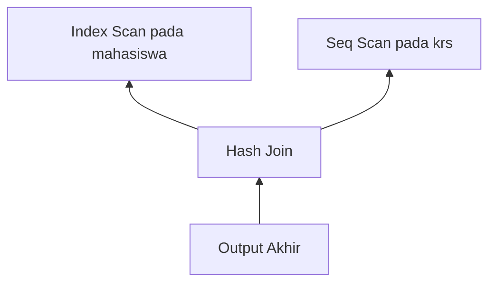
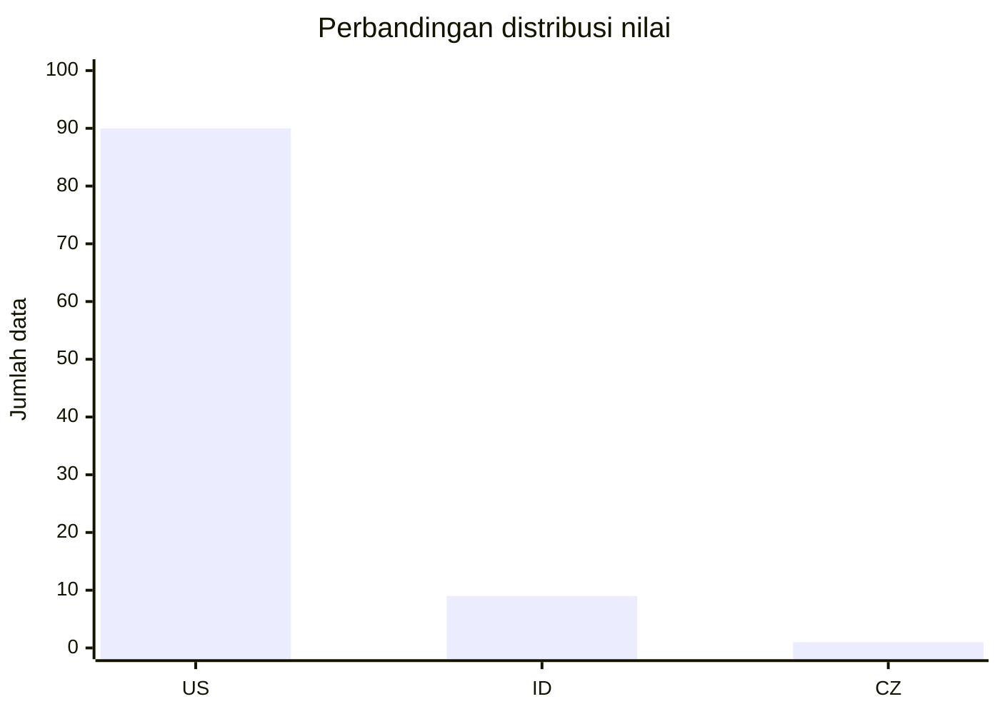

# Modul Pertemuan 6

## Administrasi Basis Data

### Memahami Execution Plan pada Database (PostgreSQL)

---

## A. Identitas Materi

**Nama Modul:** Memahami Execution Plan pada Database (PostgreSQL)  
**Pertemuan:** 6  
**Prasyarat:** SQL Dasar, pemrosesan query, index, algoritma akses data, algoritma join  
**DBMS:** PostgreSQL  
**Fokus Materi:** memahami cara membaca execution plan sebagai dasar analisis performa query

---

## B. Tujuan Pembelajaran

Setelah mengikuti pertemuan ini, mahasiswa diharapkan mampu:

1. Menjelaskan apa yang dimaksud dengan execution plan.
2. Menjelaskan hubungan antara query SQL, optimizer, dan execution plan.
3. Membaca struktur dasar execution plan pada PostgreSQL.
4. Menjelaskan arti informasi penting seperti operation, cost, rows, dan width.
5. Mengidentifikasi bagian execution plan yang perlu diperhatikan saat query berjalan lambat.
6. Menggunakan `EXPLAIN` dan `EXPLAIN ANALYZE` untuk analisis sederhana.

---

## C. Keterkaitan dengan Pertemuan Sebelumnya

Pada pertemuan-pertemuan sebelumnya, kita sudah membahas:

1. bagaimana query diproses,
2. bagaimana optimizer memilih strategi,
3. bagaimana database membaca data melalui scan,
4. bagaimana database menggabungkan tabel melalui join.

Pada pertemuan ini, semua konsep tersebut dipertemukan dalam satu topik utama, yaitu **execution plan**.

Execution plan penting karena di sinilah kita bisa melihat keputusan nyata yang diambil oleh database saat menjalankan query.

---

## D. Peta Materi

Materi pada modul ini dibahas dengan urutan berikut:

1. pengertian execution plan,
2. peran optimizer,
3. struktur tree pada execution plan,
4. cara membaca execution plan,
5. arti cost, rows, dan width,
6. perbedaan `EXPLAIN` dan `EXPLAIN ANALYZE`,
7. kesalahan umum saat membaca execution plan,
8. latihan dan praktikum sederhana.

---

## E. Pengantar

Perhatikan query berikut:

```sql
SELECT m.nama, k.kode_mk
FROM mahasiswa m
JOIN krs k ON m.nim = k.nim
WHERE m.angkatan = 2023;
```

Saat query tersebut dijalankan, PostgreSQL harus menentukan banyak keputusan, misalnya:

* apakah memakai `Seq Scan` atau `Index Scan`,
* tabel mana yang diproses lebih dulu,
* apakah join menggunakan `Nested Loop`, `Hash Join`, atau `Merge Join`,
* apakah hasil harus disortir atau tidak.

Semua keputusan itu tidak langsung terlihat dari query SQL. Untuk melihatnya, kita membutuhkan **execution plan**.

---

## F. Apa Itu Execution Plan?

Execution plan adalah rencana langkah-langkah yang digunakan database untuk menjalankan query.

Secara sederhana:

* query SQL menjelaskan **apa** yang ingin diambil,
* execution plan menjelaskan **bagaimana** database mengambilnya.

### Perbandingan Singkat

| Bagian | Peran |
| --- | --- |
| Query SQL | menyatakan data yang diinginkan |
| Optimizer | memilih cara yang dianggap paling efisien |
| Execution Plan | hasil keputusan optimizer |

### Contoh sederhana

Query:

```sql
SELECT *
FROM mahasiswa
WHERE angkatan = 2023;
```

Execution plan yang mungkin muncul:

```text
Index Scan using idx_mahasiswa_angkatan on mahasiswa
```

Artinya, PostgreSQL memilih membaca data menggunakan index pada kolom `angkatan`.

---

## G. Peran Optimizer dalam Execution Plan

Optimizer adalah bagian dari database yang bertugas memilih strategi eksekusi terbaik.

Sebelum execution plan ditentukan, optimizer akan mempertimbangkan beberapa kemungkinan, misalnya:

1. metode scan yang tersedia,
2. urutan join,
3. algoritma join yang mungkin dipakai,
4. perkiraan biaya masing-masing pilihan.

### Hal penting yang perlu dipahami

Optimizer tidak mencoba semua kemungkinan secara penuh, karena jumlahnya bisa sangat banyak. Oleh karena itu, optimizer menggunakan:

* statistik data,
* aturan optimasi,
* heuristik,
* perhitungan cost.

Karena itu, execution plan adalah **hasil perkiraan terbaik** menurut optimizer, bukan jaminan bahwa plan tersebut selalu paling benar dalam semua kondisi.

---

## H. Bentuk Execution Plan: Struktur Tree

Execution plan biasanya berbentuk **tree** atau pohon operasi.

Setiap node mewakili satu operasi, misalnya:

* `Seq Scan`,
* `Index Scan`,
* `Hash Join`,
* `Sort`,
* `Aggregate`.

### Ilustrasi sederhana struktur tree

Sebelum melihat gambar eksternal, perhatikan bentuk tree yang lebih sederhana berikut.



Diagram ini menunjukkan bahwa:

1. node paling bawah adalah operasi dasar,
2. hasil dari node bawah dikirim ke node di atas,
3. node paling atas adalah hasil akhir query.

### Gambar referensi execution plan

Gambar berikut tetap dipertahankan karena membantu mahasiswa melihat bagaimana plan tampil pada alat analisis yang sebenarnya.


Keterangan singkat untuk gambar di atas:

* bagian paling bawah menunjukkan operasi awal,
* bagian tengah menunjukkan proses gabungan seperti join atau sort,
* bagian paling atas menunjukkan hasil akhir dari keseluruhan query.


Keterangan singkat untuk gambar di atas:

* kotak atau node mewakili jenis operasi,
* garis penghubung menunjukkan aliran data,
* urutan proses tetap dipahami dari bawah menuju ke atas.

### Cara cepat membaca gambar tree

Saat mahasiswa melihat gambar execution plan berbentuk tree, gunakan urutan berikut:

1. cari node paling bawah,
2. identifikasi scan yang digunakan,
3. lihat apakah ada join, sort, atau aggregate,
4. baru lihat node paling atas sebagai hasil akhir.

---

## I. Cara Membaca Execution Plan

Aturan dasar yang paling penting adalah:

> execution plan umumnya dibaca dari bawah ke atas.

Mengapa demikian?

Karena database memulai pekerjaan dari operasi dasar, misalnya membaca tabel atau index, lalu hasil dari operasi itu diteruskan ke node berikutnya sampai menghasilkan output akhir.

### Contoh sederhana

```text
Seq Scan on mahasiswa
```

Artinya PostgreSQL membaca tabel `mahasiswa` secara berurutan.

### Contoh yang lebih lengkap

```text
Hash Join
  -> Seq Scan on krs
  -> Seq Scan on mahasiswa
```

Artinya:

1. PostgreSQL membaca tabel `krs`,
2. PostgreSQL membaca tabel `mahasiswa`,
3. kedua hasil tersebut digabungkan dengan `Hash Join`.

---

## J. Informasi Penting dalam Execution Plan

Saat melihat output `EXPLAIN`, ada beberapa informasi utama yang perlu diperhatikan.

## 1. Operation

Operation menunjukkan jenis langkah yang dilakukan database.

Contoh:

* `Seq Scan`,
* `Index Scan`,
* `Bitmap Heap Scan`,
* `Nested Loop`,
* `Hash Join`,
* `Merge Join`,
* `Sort`,
* `Aggregate`.

## 2. Cost

Contoh tampilan:

```text
cost=0.00..125.50
```

Cost adalah perkiraan biaya eksekusi menurut optimizer.

Secara umum:

* angka pertama adalah perkiraan biaya awal,
* angka kedua adalah perkiraan biaya total sampai operasi selesai.

Cost bukan satuan waktu nyata seperti detik atau milidetik. Cost adalah angka internal yang dipakai PostgreSQL untuk membandingkan beberapa kemungkinan plan.

## 3. Rows

`rows` menunjukkan perkiraan jumlah baris yang akan dihasilkan oleh suatu node.

Contoh:

```text
rows=500
```

Artinya optimizer memperkirakan ada sekitar 500 baris yang dihasilkan dari langkah tersebut.

## 4. Width

`width` menunjukkan perkiraan ukuran rata-rata baris dalam satuan byte.

Informasi ini membantu optimizer memperkirakan beban memory dan pemindahan data antar node.

---

## K. `EXPLAIN` dan `EXPLAIN ANALYZE`

## 1. `EXPLAIN`

`EXPLAIN` menampilkan rencana eksekusi yang dipilih oleh optimizer tanpa benar-benar mengukur waktu nyata pelaksanaannya.

Contoh:

```sql
EXPLAIN
SELECT nama
FROM mahasiswa
WHERE angkatan = 2023;
```

## 2. `EXPLAIN ANALYZE`

`EXPLAIN ANALYZE` menjalankan query dan menampilkan hasil pengukuran nyata.

Contoh:

```sql
EXPLAIN ANALYZE
SELECT nama
FROM mahasiswa
WHERE angkatan = 2023;
```

Dengan `EXPLAIN ANALYZE`, kita bisa membandingkan:

* perkiraan rows menurut optimizer,
* jumlah rows nyata,
* waktu eksekusi nyata,
* apakah perkiraan optimizer cukup akurat atau tidak.

---

## L. Contoh Analisis Sederhana

Perhatikan query berikut:

```sql
SELECT m.nama, k.kode_mk
FROM mahasiswa m
JOIN krs k ON m.nim = k.nim
WHERE m.angkatan = 2023;
```

Kemungkinan bentuk execution plan:

```text
Hash Join
  -> Seq Scan on krs
  -> Index Scan using idx_mahasiswa_angkatan on mahasiswa
```

Dari plan tersebut, kita bisa menyimpulkan:

1. PostgreSQL membaca tabel `krs` dengan `Seq Scan`,
2. PostgreSQL membaca tabel `mahasiswa` dengan `Index Scan`,
3. kedua hasil digabungkan menggunakan `Hash Join`.

Artinya, konsep-konsep dari Week 4 dan Week 5 langsung muncul di execution plan nyata.

---

## M. Kenapa Execution Plan Bisa Berbeda?

Execution plan untuk query yang mirip belum tentu sama. Beberapa penyebabnya adalah:

1. ukuran data berubah,
2. statistik data berubah,
3. index yang tersedia berbeda,
4. nilai filter berbeda,
5. konfigurasi database berbeda.

Contohnya:

* kondisi dengan data yang sangat sedikit bisa mendorong `Index Scan`,
* kondisi dengan data yang sangat banyak bisa membuat `Seq Scan` lebih masuk akal.

---

## N. Peran Statistik dalam Pembacaan Plan

Optimizer sangat bergantung pada statistik data. Jika statistik kurang akurat, maka perkiraan `rows` dan `cost` juga bisa meleset.

Karena itu, pemahaman tentang distribusi data juga penting saat membaca execution plan.

### Ilustrasi sederhana distribusi data

Sebelum melihat gambar, perhatikan dua kondisi berikut.



Diagram di atas menunjukkan bahwa data bisa sangat tidak merata. Jika satu nilai muncul jauh lebih sering dibanding nilai lain, optimizer bisa memilih plan yang berbeda.

### Gambar distribusi data

Gambar berikut tetap dipertahankan karena membantu mahasiswa melihat contoh distribusi data yang lebih nyata.


Keterangan singkat untuk gambar di atas:

* puncak yang tinggi berarti ada nilai yang sangat sering muncul,
* sebaran yang tidak merata membuat perkiraan optimizer menjadi lebih menantang,
* kondisi ini bisa memengaruhi pilihan antara `Seq Scan` dan `Index Scan`.

### Implikasi praktis

Jika satu nilai muncul sangat sering, optimizer bisa memilih plan berbeda dibanding saat nilai tersebut sangat jarang muncul.

Contoh sederhana:

* nilai yang sangat sering muncul cenderung membuat `Seq Scan` lebih masuk akal,
* nilai yang jarang muncul cenderung membuat `Index Scan` lebih menarik.

---

## O. Strategi Cepat Membaca Query Lambat

Saat melihat execution plan yang panjang, mahasiswa tidak perlu langsung membaca semua baris sekaligus. Gunakan urutan berikut:

1. lihat operasi scan yang muncul,
2. lihat join yang dipakai,
3. lihat node dengan `cost` besar,
4. bandingkan `rows` perkiraan dan `rows` nyata jika menggunakan `EXPLAIN ANALYZE`,
5. cari bagian plan yang paling banyak memproses data.

### Fokus utama

Dalam banyak kasus, masalah performa sering muncul pada:

* `Seq Scan` pada tabel besar,
* join yang memproses terlalu banyak baris,
* estimasi rows yang jauh meleset,
* sorting atau aggregation yang mahal.

---

## P. Kesalahan Umum Mahasiswa Saat Membaca Execution Plan

Beberapa kesalahan yang sering terjadi adalah:

1. menganggap `cost` adalah waktu nyata,
2. membaca plan dari atas ke bawah tanpa memahami alur data,
3. langsung fokus ke semua baris sekaligus,
4. tidak membedakan hasil `EXPLAIN` dan `EXPLAIN ANALYZE`,
5. menganggap satu jenis operasi selalu buruk dalam semua situasi.

---

## Q. Ringkasan Materi

Hal-hal penting dari modul ini adalah:

1. execution plan adalah rencana langkah-langkah eksekusi query,
2. execution plan dibentuk oleh optimizer,
3. bentuknya berupa tree yang biasanya dibaca dari bawah ke atas,
4. informasi penting pada plan meliputi operation, cost, rows, dan width,
5. `EXPLAIN` menunjukkan rencana, sedangkan `EXPLAIN ANALYZE` menunjukkan pelaksanaan nyata,
6. execution plan bisa berubah sesuai data, statistik, index, dan kondisi query.

---

## R. Praktikum Sederhana

Lakukan langkah berikut pada PostgreSQL.

### 1. Melihat execution plan sederhana

```sql
EXPLAIN
SELECT *
FROM mahasiswa;
```

### 2. Menambahkan filter

```sql
EXPLAIN
SELECT *
FROM mahasiswa
WHERE angkatan = 2023;
```

### 3. Menambahkan join

```sql
EXPLAIN
SELECT m.nama, k.kode_mk
FROM mahasiswa m
JOIN krs k ON m.nim = k.nim;
```

### 4. Menggunakan `EXPLAIN ANALYZE`

```sql
EXPLAIN ANALYZE
SELECT m.nama, k.kode_mk
FROM mahasiswa m
JOIN krs k ON m.nim = k.nim;
```

Amati:

* jenis scan,
* jenis join,
* cost,
* rows,
* perbedaan antara perkiraan dan hasil nyata.

---

## S. Latihan Soal

Kerjakan latihan berikut berdasarkan materi yang telah dipelajari.

### Soal Pemahaman

1. Jelaskan apa yang dimaksud dengan execution plan.
2. Apa perbedaan antara query SQL dan execution plan?
3. Mengapa execution plan berbentuk tree?
4. Mengapa execution plan biasanya dibaca dari bawah ke atas?
5. Apa arti informasi `cost`, `rows`, dan `width` pada output `EXPLAIN`?

### Soal Analisis

Perhatikan plan berikut:

```text
Hash Join
  -> Seq Scan on krs
  -> Index Scan using idx_mahasiswa_angkatan on mahasiswa
```

6. Jelaskan langkah-langkah yang kemungkinan terjadi pada plan tersebut.
7. Mengapa PostgreSQL mungkin memilih `Seq Scan` pada satu tabel dan `Index Scan` pada tabel lain?
8. Mengapa query yang sama bisa menghasilkan execution plan yang berbeda pada kondisi yang berbeda?

### Soal Praktik PostgreSQL

9. Jalankan satu query menggunakan `EXPLAIN`, lalu catat operasi utama yang muncul.
10. Jalankan query yang sama menggunakan `EXPLAIN ANALYZE`, lalu bandingkan perkiraan optimizer dengan pelaksanaan nyata.
11. Tuliskan bagian mana dari execution plan yang pertama kali Anda periksa saat query terasa lambat, dan jelaskan alasannya.

---

## T. Tugas Mandiri

Gunakan satu query dari praktikum Anda sendiri, lalu lakukan langkah berikut:

1. jalankan `EXPLAIN`,
2. identifikasi scan dan join yang digunakan,
3. catat nilai `cost`, `rows`, dan `width`,
4. jalankan `EXPLAIN ANALYZE`,
5. bandingkan hasil perkiraan dan hasil nyata,
6. tuliskan kesimpulan Anda tentang perilaku query tersebut.

---

## U. Penutup

Execution plan adalah alat penting untuk memahami performa query. Dengan memahami execution plan, mahasiswa tidak hanya tahu hasil query, tetapi juga memahami bagaimana database bekerja di belakang layar. Pemahaman ini menjadi dasar penting untuk analisis performa, query tuning, dan optimasi database pada tahap selanjutnya.