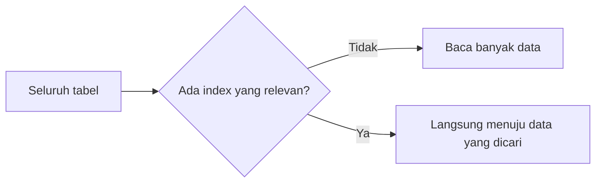
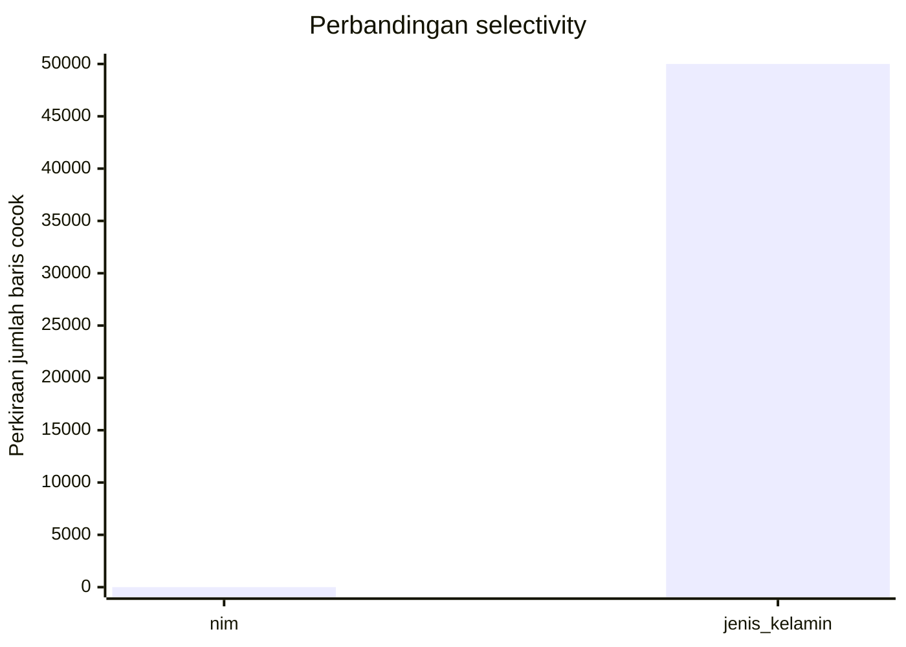

# Modul Pertemuan 6

## Administrasi Basis Data

### Strategi Pembuatan Indeks dan Optimasi Query Pendek

---

## A. Identitas Materi

**Nama Modul:** Strategi Pembuatan Indeks dan Optimasi Query Pendek  
**Pertemuan:** 6  
**Prasyarat:** SQL Dasar, pemrosesan query, execution plan, algoritma akses data, algoritma join  
**DBMS:** PostgreSQL  
**Fokus Materi:** memahami karakteristik query yang hanya mengambil sebagian kecil data dan peran index dalam mempercepat query tersebut

---

## B. Tujuan Pembelajaran

Setelah mengikuti pertemuan ini, mahasiswa diharapkan mampu:

1. Menjelaskan apa yang dimaksud dengan short query dalam konteks optimasi database.
2. Menjelaskan perbedaan short query dan long query berdasarkan jumlah data yang diproses, bukan panjang teks SQL.
3. Menjelaskan mengapa index sangat penting untuk query yang selektif.
4. Menjelaskan konsep selectivity dan hubungannya dengan efektivitas index.
5. Menentukan kapan index kemungkinan membantu dan kapan index kemungkinan kurang efektif.
6. Menggunakan `EXPLAIN` untuk melihat pengaruh index terhadap performa query.

---

## C. Keterkaitan dengan Pertemuan Sebelumnya

Pada pertemuan sebelumnya, kita sudah mempelajari:

1. bagaimana query diproses,
2. bagaimana execution plan dibaca,
3. bagaimana scan dan join dipilih oleh optimizer,
4. bagaimana index memengaruhi cara database membaca data.

Pada pertemuan ini, fokusnya dipersempit ke situasi yang sangat sering muncul pada aplikasi nyata, yaitu query yang hanya ingin mengambil sebagian kecil data dari tabel.

Materi ini penting karena banyak query pada aplikasi transaksi sehari-hari, seperti pencarian pengguna, pencarian pesanan, atau pencarian data mahasiswa, termasuk ke dalam kategori ini.

---

## D. Peta Materi

Materi pada modul ini dibahas dengan urutan berikut:

1. pengertian short query,
2. perbedaan short query dan long query,
3. peran index pada query selektif,
4. konsep selectivity,
5. pemilihan kolom untuk index,
6. kapan index membantu dan kapan tidak,
7. contoh `EXPLAIN`,
8. latihan dan praktikum sederhana.

---

## E. Pengantar

Perhatikan query berikut:

```sql
SELECT nama, program_studi
FROM mahasiswa
WHERE nim = '2310110001';
```

Query ini tampak sederhana. Namun dari sudut pandang optimasi, query seperti ini sangat penting karena biasanya hanya mengambil **satu baris** atau **sejumlah kecil baris** dari tabel yang mungkin berisi sangat banyak data.

Pertanyaan utamanya adalah:

* bagaimana database menemukan data itu dengan cepat,
* apakah database harus membaca seluruh tabel,
* atau apakah database bisa langsung menuju data yang dibutuhkan?

Jawaban atas pertanyaan tersebut sangat berkaitan dengan **index**.

---

## F. Apa Itu Short Query?

Dalam konteks materi ini, **short query** adalah query yang hanya membutuhkan sebagian kecil data dari tabel.

Artinya, query tersebut:

* tidak memproses seluruh isi tabel,
* biasanya memiliki kondisi filter yang cukup selektif,
* sering digunakan untuk mengambil data tertentu secara cepat.

### Contoh

```sql
SELECT *
FROM mahasiswa
WHERE nim = '2310110001';
```

Query di atas termasuk short query karena hanya mencari data untuk satu nilai `nim` tertentu.

### Catatan penting

Istilah short query di sini dipakai sebagai cara mudah untuk menjelaskan query yang **selektif** atau **mengambil sedikit data**. Jadi, istilah ini tidak merujuk pada panjang kalimat SQL, tetapi pada banyaknya data yang diproses oleh database.

---

## G. Apa Itu Long Query?

Sebaliknya, **long query** dalam konteks materi ini adalah query yang memproses data dalam jumlah besar atau bahkan hampir seluruh isi tabel.

Contoh:

```sql
SELECT AVG(ipk)
FROM mahasiswa;
```

Walaupun output akhirnya hanya satu baris, query tersebut tetap dapat dianggap berat karena PostgreSQL harus membaca sangat banyak data untuk menghitung rata-rata.

---

## H. Perbedaan Short Query dan Long Query

Perbedaan utamanya bukan pada panjang teks SQL, melainkan pada jumlah data yang perlu dibaca dan diproses.

| Aspek | Short Query | Long Query |
| --- | --- | --- |
| Data yang diproses | sedikit | banyak |
| Tujuan utama | mengambil subset data | memproses data dalam skala besar |
| Contoh umum | pencarian berdasarkan `id`, `nim`, kode tertentu | agregasi besar, laporan, pemrosesan banyak baris |
| Ketergantungan pada index | sangat penting | tidak selalu dominan |

### Contoh yang sering disalahpahami

Query pendek belum tentu short query:

```sql
SELECT * FROM mahasiswa;
```

Query tersebut pendek, tetapi memproses seluruh tabel.

Sebaliknya, query yang teksnya cukup panjang belum tentu long query:

```sql
SELECT nama, program_studi
FROM mahasiswa
WHERE angkatan = 2023
AND program_studi = 'Informatika'
AND status = 'Aktif';
```

Jika hasilnya hanya sedikit, maka query ini tetap termasuk query yang selektif.

---

## I. Mengapa Short Query Penting?

Pada banyak aplikasi transaksi, query yang paling sering dijalankan justru adalah query seperti ini.

Contohnya:

* mencari satu mahasiswa berdasarkan `nim`,
* mencari satu pesanan berdasarkan `id_pesanan`,
* mencari akun berdasarkan email,
* mencari jadwal berdasarkan kode mata kuliah.

Query seperti itu harus cepat karena biasanya dipanggil berulang kali oleh aplikasi.

Jika query kecil tetapi lambat, maka pengalaman pengguna juga akan terasa lambat.

---

## J. Strategi Dasar Optimasi untuk Short Query

Prinsip utamanya adalah:

> kurangi jumlah data yang harus dibaca secepat mungkin.

Artinya:

1. filter harus bisa diterapkan seawal mungkin,
2. database sebaiknya tidak membaca seluruh tabel jika hanya sedikit data yang dibutuhkan,
3. index sangat membantu agar database bisa langsung menuju data yang dicari.

### Ilustrasi sederhana



---

## K. Peran Index dalam Optimasi Short Query

Index sangat penting karena short query biasanya bergantung pada kemampuan database untuk mencari data dengan cepat.

Tanpa index, PostgreSQL sering harus melakukan:

* `Seq Scan`, yaitu membaca tabel dari awal sampai akhir.

Dengan index, PostgreSQL bisa menggunakan:

* `Index Scan`,
* `Index Only Scan`,
* atau `Bitmap Heap Scan`,

tergantung jumlah data yang cocok dan struktur query.

### Contoh sederhana

```sql
SELECT *
FROM mahasiswa
WHERE nim = '2310110001';
```

Jika kolom `nim` memiliki index yang baik, maka PostgreSQL bisa langsung mencari nilai tersebut tanpa memeriksa semua baris.

---

## L. Apa yang Terjadi Jika Tidak Ada Index?

Jika tidak ada index yang relevan, maka query yang seharusnya ringan bisa menjadi lambat.

Contoh situasi:

* tabel memiliki ratusan ribu baris,
* query hanya mencari satu baris,
* tetapi PostgreSQL harus membaca semua baris karena tidak ada index.

Akibatnya:

* waktu respons menjadi lebih lambat,
* beban I/O meningkat,
* query sederhana terasa tidak efisien.

Karena itu, short query tanpa index yang tepat bisa tetap memiliki performa buruk.

---

## M. Konsep Selectivity

Selectivity menunjukkan seberapa selektif suatu kondisi dalam menyaring data.

Secara sederhana:

* jika kondisi hanya menghasilkan sedikit baris, selectivity tinggi untuk keperluan optimasi,
* jika kondisi menghasilkan sangat banyak baris, selectivity rendah dari sisi manfaat index.

### Contoh sederhana

Misalkan tabel `mahasiswa` berisi 100.000 baris.

1. Kondisi berikut:

```sql
WHERE nim = '2310110001'
```

kemungkinan hanya menghasilkan 1 baris. Ini sangat selektif.

2. Kondisi berikut:

```sql
WHERE jenis_kelamin = 'L'
```

kemungkinan menghasilkan sekitar setengah isi tabel. Ini jauh kurang selektif.

### Ilustrasi sederhana



### Kesimpulan

Kolom dengan nilai yang sangat unik biasanya lebih efektif untuk index dibanding kolom dengan variasi nilai yang sangat sedikit.

---

## N. Memilih Kolom yang Baik untuk Index

Tidak semua kolom cocok dijadikan index utama untuk short query.

Kolom yang umumnya baik untuk index adalah kolom yang:

1. sering dipakai pada `WHERE`,
2. sering dipakai pada `JOIN`,
3. memiliki nilai yang cukup bervariasi,
4. sering dipakai untuk mencari satu atau sedikit data.

### Contoh kolom yang biasanya baik

* `nim`,
* `id_mahasiswa`,
* `email`,
* `kode_mk`.

### Contoh kolom yang perlu dipertimbangkan dengan hati-hati

* `jenis_kelamin`,
* `status_aktif` jika hanya dua nilai,
* kolom dengan nilai yang sangat berulang.

---

## O. Unique Index, Primary Key, dan Foreign Key

### 1. Primary Key

Primary key biasanya otomatis didukung oleh index dan sangat baik untuk short query.

Contoh:

```sql
WHERE id = 10
```

### 2. Unique Index

Unique index membantu pencarian cepat pada kolom yang nilainya harus unik, misalnya email atau username.

### 3. Foreign Key

Foreign key penting untuk relasi antar tabel. Dalam praktik, kolom foreign key sering juga perlu dipertimbangkan untuk index, terutama jika sering dipakai pada join atau filter.

---

## P. Kapan Index Membantu dan Kapan Tidak?

Index biasanya membantu jika:

* query mengambil sedikit data,
* kondisi filter cukup selektif,
* kolom yang dicari memang memiliki index yang relevan.

Index bisa kurang membantu jika:

* query mengambil sebagian besar isi tabel,
* kolom yang difilter memiliki nilai yang sangat berulang,
* biaya memakai index justru lebih besar daripada membaca tabel secara berurutan.

### Prinsip penting

> index tidak selalu dipakai hanya karena index itu ada.

Optimizer tetap akan memilih plan yang dianggap paling murah.

---

## Q. Kesalahan Umum dalam Memahami Index untuk Short Query

Beberapa kesalahan yang sering terjadi adalah:

1. menganggap semua query pendek pasti ringan,
2. menganggap semua kolom layak diberi index,
3. menganggap index selalu mempercepat semua query,
4. menganggap jumlah output kecil berarti query pasti ringan,
5. tidak melihat execution plan saat query terasa lambat.

---

## R. Contoh `EXPLAIN`

### 1. Tanpa index

```sql
EXPLAIN
SELECT *
FROM mahasiswa
WHERE email = 'ani@kampus.ac.id';
```

Kemungkinan hasil:

```text
Seq Scan on mahasiswa
```

### 2. Dengan index yang relevan

```sql
CREATE INDEX idx_mahasiswa_email ON mahasiswa(email);
```

Lalu jalankan kembali:

```sql
EXPLAIN
SELECT *
FROM mahasiswa
WHERE email = 'ani@kampus.ac.id';
```

Kemungkinan hasil:

```text
Index Scan using idx_mahasiswa_email on mahasiswa
```

### Makna praktis

Contoh ini menunjukkan bahwa query yang hanya mengambil sedikit data sangat diuntungkan jika tersedia index yang sesuai.

---

## S. Hubungan Short Query dengan Aplikasi Nyata

Short query sangat sering muncul pada sistem OLTP, yaitu sistem transaksi harian.

Contoh:

* login pengguna,
* pencarian data mahasiswa,
* membuka detail pesanan,
* mencari data dosen,
* memeriksa status pembayaran.

Karena query seperti ini berjalan sangat sering, optimasi kecil pada satu query dapat memberi dampak besar pada performa aplikasi secara keseluruhan.

---

## T. Ringkasan Materi

Hal-hal penting dari modul ini adalah:

1. short query adalah query yang hanya mengambil sebagian kecil data,
2. panjang teks SQL tidak menentukan apakah query termasuk short atau long,
3. index sangat penting untuk query yang selektif,
4. selectivity membantu menjelaskan apakah index kemungkinan efektif,
5. tidak semua kolom cocok untuk index,
6. `EXPLAIN` membantu kita melihat apakah PostgreSQL memanfaatkan index atau tidak.

---

## U. Praktikum Sederhana

Lakukan langkah berikut pada PostgreSQL.

### 1. Jalankan query tanpa index khusus

```sql
EXPLAIN
SELECT *
FROM mahasiswa
WHERE email = 'ani@kampus.ac.id';
```

### 2. Buat index

```sql
CREATE INDEX idx_mahasiswa_email ON mahasiswa(email);
```

### 3. Jalankan kembali query yang sama

```sql
EXPLAIN
SELECT *
FROM mahasiswa
WHERE email = 'ani@kampus.ac.id';
```

### 4. Bandingkan hasil

Amati:

* apakah sebelumnya muncul `Seq Scan`,
* apakah setelah ada index muncul `Index Scan`,
* apa pengaruhnya terhadap cara PostgreSQL membaca data.

---

## V. Latihan Soal

Kerjakan latihan berikut berdasarkan materi yang telah dipelajari.

### Soal Pemahaman

1. Jelaskan apa yang dimaksud dengan short query.
2. Apa perbedaan short query dan long query?
3. Mengapa panjang teks SQL tidak cukup untuk menentukan jenis query?
4. Mengapa index penting untuk short query?
5. Apa yang dimaksud dengan selectivity?

### Soal Analisis

6. Mengapa kolom `nim` biasanya lebih baik untuk index dibanding kolom `jenis_kelamin`?
7. Mengapa query yang outputnya hanya satu baris belum tentu ringan?
8. Dalam kondisi apa index kemungkinan tidak membantu?
9. Mengapa short query tanpa index yang tepat bisa tetap lambat?

### Soal Praktik PostgreSQL

10. Jalankan satu query `EXPLAIN` sebelum dan sesudah membuat index, lalu catat perbedaannya.
11. Tuliskan kesimpulan Anda tentang hubungan antara short query, index, dan performa query.

---

## W. Tugas Mandiri

Gunakan satu tabel dari praktikum Anda sendiri, lalu lakukan langkah berikut:

1. pilih satu query yang hanya mengambil sedikit data,
2. jalankan `EXPLAIN`,
3. identifikasi apakah PostgreSQL memakai `Seq Scan` atau `Index Scan`,
4. jika belum ada, buat index yang relevan,
5. jalankan kembali `EXPLAIN`,
6. simpulkan apakah index membantu query tersebut dan mengapa.

---

## X. Penutup

Short query adalah jenis query yang sangat sering muncul pada aplikasi sehari-hari. Karena itu, memahami hubungan antara short query, selectivity, dan index sangat penting bagi mahasiswa yang ingin memahami optimasi database secara praktis. Dengan dasar ini, mahasiswa akan lebih siap untuk menentukan index yang tepat dan menganalisis mengapa sebuah query bisa cepat atau lambat.