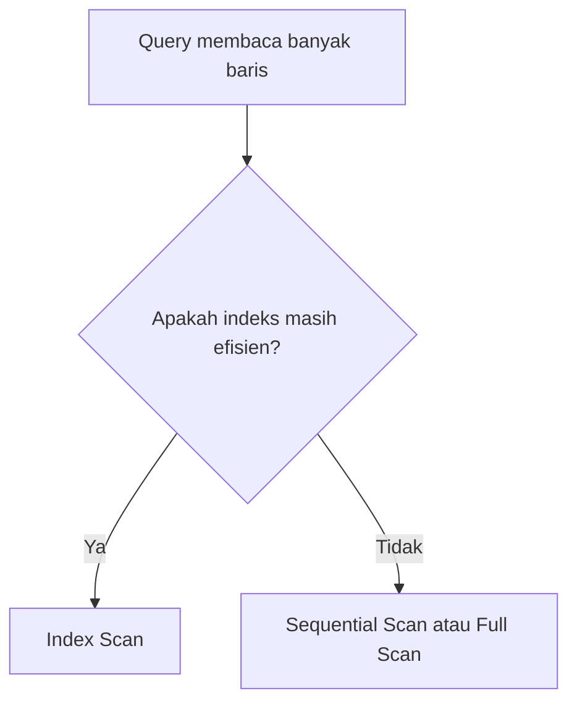
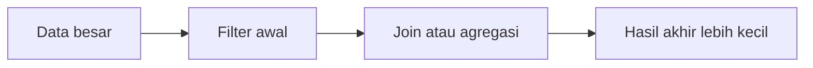

# Modul Pertemuan 7

## Administrasi Basis Data

### Optimasi Query Panjang

---

## A. Identitas Materi

**Nama Modul:** Optimasi Query Panjang  
**Pertemuan:** 7  
**Prasyarat:** pemrosesan query, algoritma akses data, algoritma join, EXPLAIN, strategi indeks, query pendek  
**DBMS:** PostgreSQL  
**Fokus Materi:** memahami karakteristik query besar, kapan full scan justru tepat, serta teknik optimasi long query seperti CTE, temporary table, view, materialized view, partitioning, dan parallelism

---

## B. Tujuan Pembelajaran

Setelah mengikuti pertemuan ini, mahasiswa diharapkan mampu:

1. Menjelaskan apa yang dimaksud dengan query panjang atau long query.
2. Menjelaskan perbedaan strategi optimasi query pendek dan query panjang.
3. Menjelaskan kapan sequential scan atau full scan lebih tepat daripada index scan.
4. Menjelaskan peran hash join, semi-join, dan anti-join pada query besar.
5. Menjelaskan penggunaan CTE, temporary table, view, dan materialized view dalam optimasi long query.
6. Menjelaskan kapan partitioning dan parallelism relevan untuk workload besar.
7. Menganalisis long query secara lebih sistematis menggunakan `EXPLAIN`.

---

## C. Keterkaitan dengan Pertemuan Sebelumnya

Pada pertemuan sebelumnya, kita membahas strategi pembuatan indeks dan optimasi query pendek. Fokus utamanya adalah bagaimana database menemukan sebagian kecil data secepat mungkin.

Pada pertemuan ini, sudut pandangnya berubah. Kita membahas query yang memang harus memproses data besar, sehingga strategi optimasinya tidak lagi selalu berfokus pada indeks.

---

## D. Peta Materi

1. pengertian long query,
2. perbedaan query pendek dan query panjang,
3. full scan dan tipping point penggunaan indeks,
4. hash join, semi-join, dan anti-join,
5. strategi pengurangan data lebih awal,
6. temporary table dan CTE,
7. view dan materialized view,
8. partitioning dan parallelism,
9. praktikum dan latihan.

---

## E. Pengantar

Long query adalah query yang membaca atau mengolah data dalam jumlah besar. Query seperti ini sering muncul pada laporan, analisis, dashboard, dan rekap data historis.

Optimasi query panjang tidak cukup dilakukan dengan menambah indeks. Mahasiswa perlu memahami kapan full scan justru lebih efisien, kapan join tertentu lebih tepat, dan kapan hasil antara perlu disimpan atau tidak.

---

## F. Apa Itu Query Panjang?

Long query biasanya memiliki ciri berikut:

- membaca banyak baris,
- melibatkan banyak join,
- memakai agregasi,
- dipakai untuk laporan atau analitik,
- execution plan lebih kompleks.

### Contoh

```sql
SELECT f.flight_no, COUNT(p.id) AS jumlah_penumpang
FROM flight f
JOIN booking_leg bl ON bl.flight_id = f.flight_id
JOIN passenger p ON p.booking_id = bl.booking_id
WHERE f.departure_airport = 'JFK'
GROUP BY f.flight_no;
```

---

## G. Query Pendek dan Query Panjang

| Aspek | Query Pendek | Query Panjang |
| --- | --- | --- |
| Data yang diproses | sedikit | banyak |
| Fokus optimasi | menemukan data cepat | memproses data besar secara efisien |
| Strategi umum | indeks, filter selektif | full scan, join efisien, pengurangan data bertahap |

---

## H. Full Scan pada Query Besar

Jika query membaca sebagian besar isi tabel, maka sequential scan atau full scan sering lebih efisien daripada index scan.

### Prinsip dasar

- jika data yang diambil sedikit, indeks sering unggul,
- jika data yang diambil banyak, full scan sering lebih masuk akal.



---

## I. Hash Join, Semi-Join, dan Anti-Join

### 1. Hash Join

Hash join sering efektif untuk data besar dengan kondisi kesetaraan.

### 2. Semi-Join

Dipakai ketika query hanya ingin mengetahui apakah pasangan data ada.

```sql
SELECT *
FROM booking b
WHERE EXISTS (
    SELECT 1
    FROM booking_leg bl
    WHERE bl.booking_id = b.booking_id
);
```

### 3. Anti-Join

Dipakai ketika query ingin mencari data yang tidak memiliki pasangan.

```sql
SELECT *
FROM booking b
WHERE NOT EXISTS (
    SELECT 1
    FROM payment p
    WHERE p.booking_id = b.booking_id
);
```

---

## J. Strategi Dasar Optimasi Query Besar

1. kurangi data sedini mungkin,
2. hindari scan berulang,
3. susun join secara masuk akal,
4. evaluasi plan di setiap perubahan.



---

## K. Temporary Table dan CTE

### Temporary Table

```sql
CREATE TEMP TABLE hasil_penerbangan AS
SELECT *
FROM flight
WHERE departure_airport = 'JFK';
```

Kelebihan:

- hasil dapat dipakai berulang,
- mudah untuk analisis bertahap.

Kekurangan:

- menambah I/O,
- membatasi optimizer,
- sering tidak efisien jika hanya dipakai sekali.

### CTE

```sql
WITH hasil_penerbangan AS (
    SELECT *
    FROM flight
    WHERE departure_airport = 'JFK'
)
SELECT *
FROM hasil_penerbangan;
```

CTE membuat query lebih rapi, tetapi tidak selalu lebih cepat.

---

## L. View dan Materialized View

### View

View adalah query tersimpan yang tampil seperti tabel virtual.

### Materialized View

Materialized view menyimpan hasil query secara fisik sehingga cocok untuk query berat yang dibaca berulang.

| Aspek | View | Materialized View |
| --- | --- | --- |
| Menyimpan hasil | tidak | ya |
| Selalu terbaru | ya | tidak selalu |
| Cocok untuk | penyederhanaan query | percepatan query berat |

---

## M. Partitioning dan Parallelism

### Partitioning

Partitioning membagi tabel besar menjadi bagian-bagian lebih kecil berdasarkan aturan tertentu.

### Parallelism

Parallelism membagi pekerjaan query besar ke beberapa worker agar proses lebih cepat.

Keduanya berguna pada konteks yang tepat, tetapi bukan solusi universal.

---

## N. Ringkasan

1. Query panjang membutuhkan strategi optimasi yang berbeda dari query pendek.
2. Full scan dapat menjadi pilihan yang tepat untuk query besar.
3. CTE, temporary table, view, materialized view, partitioning, dan parallelism harus dipilih sesuai konteks.

---

## O. Praktikum

1. Jalankan satu query agregasi besar dan amati `EXPLAIN ANALYZE`-nya.
2. Bandingkan pendekatan CTE dan temporary table.
3. Buat satu materialized view sederhana dan jelaskan manfaatnya.

---

## P. Latihan

### Soal Konsep

1. Apa yang dimaksud dengan query panjang?
2. Mengapa full scan bisa lebih efisien daripada index scan pada query besar?
3. Apa perbedaan temporary table dan CTE?
4. Kapan materialized view lebih tepat dipakai daripada view?

### Soal Analisis

5. Mengapa memecah query menjadi banyak tahap belum tentu membuat performa lebih baik?
6. Kapan partitioning efektif dan kapan tidak terlalu membantu?

### Soal Praktis

7. Buat contoh query `EXISTS` untuk pola semi-join.
8. Buat contoh sederhana materialized view dan jelaskan kapan harus di-refresh.

---

## Q. Penutup

Optimasi query panjang menuntut cara berpikir yang lebih luas daripada sekadar menambah indeks. Mahasiswa perlu memahami trade-off antara full scan, join, hasil antara, dan struktur query secara keseluruhan.
