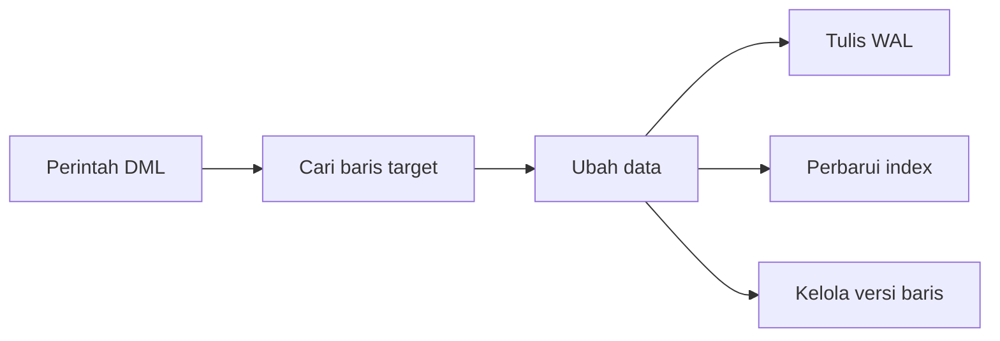
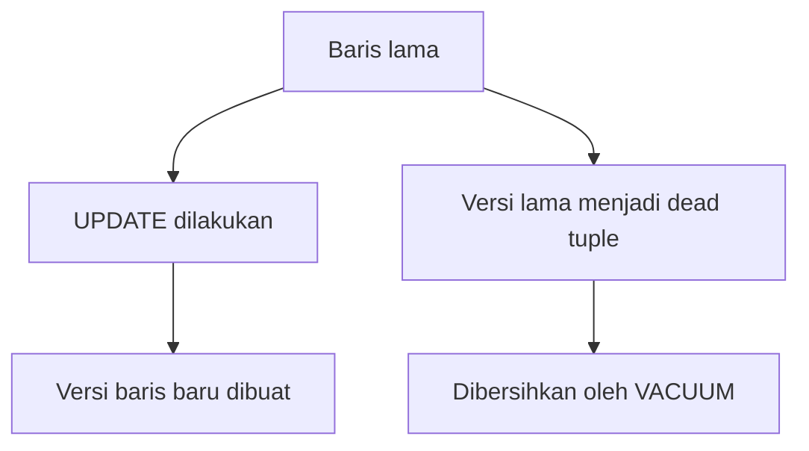

# Modul Pertemuan 9

## Administrasi Basis Data

### Optimasi Data Modification pada PostgreSQL (INSERT, UPDATE, DELETE)

---

## A. Identitas Materi

**Nama Modul:** Optimasi Data Modification pada PostgreSQL (INSERT, UPDATE, DELETE)  
**Pertemuan:** 9  
**Prasyarat:** SQL dasar, transaksi database, indexing, execution plan, optimasi query baca  
**DBMS:** PostgreSQL  
**Fokus Materi:** memahami biaya operasi modifikasi data dan strategi optimasi `INSERT`, `UPDATE`, dan `DELETE` pada PostgreSQL

---

## B. Tujuan Pembelajaran

Setelah mengikuti pertemuan ini, mahasiswa diharapkan mampu:

1. Menjelaskan perbedaan operasi baca data dan operasi modifikasi data.
2. Menjelaskan bagaimana `INSERT`, `UPDATE`, dan `DELETE` bekerja pada PostgreSQL.
3. Menjelaskan pengaruh lock, WAL, index, foreign key, dan trigger terhadap performa DML.
4. Menjelaskan hubungan MVCC, dead tuple, dan `VACUUM`.
5. Menentukan strategi optimasi yang tepat untuk operasi modifikasi data dalam skala kecil maupun besar.
6. Melakukan analisis sederhana terhadap beban DML menggunakan pendekatan yang benar.

---

## C. Keterkaitan dengan Pertemuan Sebelumnya

Pada pertemuan-pertemuan sebelumnya, fokus utama kita adalah optimasi query baca, misalnya bagaimana index membantu pencarian data, kapan full scan lebih baik, dan bagaimana database memilih algoritma join.

Pada pertemuan ini, fokusnya bergeser ke sisi lain yang sama pentingnya, yaitu **menulis dan mengubah data**. Jika query baca berbicara tentang cara menemukan data secara efisien, maka optimasi DML berbicara tentang cara menambah, mengubah, dan menghapus data tanpa membebani sistem secara berlebihan.

---

## D. Peta Materi

Materi pada modul ini dibahas dengan urutan berikut:

1. pengertian DML,
2. mengapa operasi modifikasi data perlu dioptimasi,
3. biaya tersembunyi pada `INSERT`, `UPDATE`, dan `DELETE`,
4. lock dan concurrency,
5. WAL dan pengaruh transaksi,
6. MVCC, dead tuple, dan `VACUUM`,
7. hubungan DML dengan index,
8. mass update, batch processing, HOT update, dan fillfactor,
9. pengaruh foreign key dan trigger,
10. praktikum dan latihan.

---

## E. Pengantar

Dalam sistem database nyata, operasi `SELECT` memang sering paling sering dijalankan. Namun bukan berarti operasi `INSERT`, `UPDATE`, dan `DELETE` bisa diabaikan. Justru pada banyak aplikasi transaksi, performa penulisan data sangat menentukan apakah sistem terasa lancar atau lambat.

Contohnya:

* aplikasi akademik yang menerima banyak input nilai,
* sistem penjualan yang terus menambah transaksi,
* aplikasi absensi yang sering memperbarui status,
* atau sistem logistik yang mengubah status pengiriman berkali-kali.

Jika operasi modifikasi data tidak dikelola dengan baik, masalah yang muncul bukan hanya query lambat, tetapi juga antrean transaksi, lock berkepanjangan, pertumbuhan ukuran tabel, dan meningkatnya beban penyimpanan.

---

## F. Apa Itu DML?

DML adalah singkatan dari **Data Manipulation Language**, yaitu perintah SQL yang digunakan untuk memanipulasi isi data di dalam tabel.

Pada modul ini, fokus DML dibatasi pada operasi yang benar-benar **mengubah data**, yaitu:

* `INSERT` untuk menambah data,
* `UPDATE` untuk mengubah data,
* `DELETE` untuk menghapus data.

### Perbedaan sederhana dengan DDL

| Jenis | Fungsi utama | Contoh |
| --- | --- | --- |
| DDL | mengubah struktur database | `CREATE TABLE`, `ALTER TABLE`, `DROP INDEX` |
| DML | mengubah isi data | `INSERT`, `UPDATE`, `DELETE` |

### Catatan

Pada beberapa pembahasan SQL, `SELECT` kadang dibahas bersama DML secara umum. Namun pada modul ini, fokus kita adalah **data modification**, sehingga perhatian utama ada pada `INSERT`, `UPDATE`, dan `DELETE`.

---

## G. Mengapa DML Perlu Dioptimasi?

Optimasi DML penting karena operasi tulis memiliki efek lanjutan yang tidak selalu terlihat langsung.

Beberapa dampak yang bisa muncul adalah:

1. transaksi lain harus menunggu karena terjadi lock,
2. index ikut berubah sehingga biaya operasi bertambah,
3. log transaksi bertambah besar,
4. tabel menumpuk dead tuple setelah banyak update atau delete,
5. performa query baca ikut menurun jika perawatan tabel tidak dilakukan.

Artinya, operasi DML bukan hanya soal "data berhasil ditulis", tetapi juga soal **berapa besar biaya yang ditimbulkan pada sistem**.

---

## H. Cara Melihat Beban DML dengan Benar

Saat membahas optimasi DML, kita perlu memisahkan dua tahap utama:

1. **menentukan baris yang akan diubah**,
2. **melakukan perubahan pada baris tersebut**.

Pada `UPDATE` dan `DELETE`, tahap pertama sering sangat mirip dengan query baca, karena database tetap harus mencari data yang cocok dengan kondisi `WHERE`.

Contoh:

```sql
UPDATE mahasiswa
SET status = 'Lulus'
WHERE angkatan = 2020;
```

Pada query ini, PostgreSQL harus:

1. mencari semua baris dengan `angkatan = 2020`,
2. lalu memproses perubahan untuk semua baris yang ditemukan.

Jadi, optimasi DML biasanya mencakup:

* optimasi bagian pencarian baris,
* dan optimasi bagian penulisan perubahan.

---

## I. Biaya Tersembunyi pada Operasi DML

Mahasiswa sering melihat `INSERT`, `UPDATE`, atau `DELETE` tampak sederhana. Namun di balik satu perintah singkat, PostgreSQL bisa melakukan banyak pekerjaan tambahan.

Beberapa biaya tersembunyi tersebut adalah:

### 1. Penulisan WAL

Perubahan harus dicatat terlebih dahulu ke **Write Ahead Log** agar sistem tetap aman jika terjadi crash.

### 2. Perubahan index

Jika tabel memiliki banyak index, maka perubahan pada baris dapat menyebabkan banyak struktur index ikut diperbarui.

### 3. Lock dan koordinasi transaksi

Saat dua transaksi mencoba memodifikasi data yang sama, salah satunya dapat menunggu.

### 4. Pertumbuhan dead tuple

Khususnya pada PostgreSQL, `UPDATE` dan `DELETE` dapat meninggalkan versi lama data yang nantinya harus dibersihkan.

### Ilustrasi sederhana



---

## J. Lock dan Concurrency

Salah satu sumber masalah terbesar pada DML adalah **lock**.

Ketika dua transaksi ingin mengubah baris yang sama, PostgreSQL harus menjaga konsistensi data. Karena itu, tidak semua transaksi bisa memodifikasi baris yang sama pada saat yang bersamaan.

### Contoh situasi sederhana

* Transaksi A menjalankan `UPDATE` pada data mahasiswa tertentu.
* Transaksi B mencoba `UPDATE` data mahasiswa yang sama.

Akibatnya, transaksi B biasanya harus menunggu sampai transaksi A selesai atau dibatalkan.

### Dampak lock yang terlalu lama

* antrean transaksi,
* aplikasi terasa lambat,
* potensi timeout,
* dan pada situasi tertentu bisa memicu deadlock.

### Prinsip optimasi

> Semakin lama transaksi dibuka, semakin besar kemungkinan transaksi lain tertahan.

Karena itu, transaksi yang melakukan modifikasi data sebaiknya:

* sesingkat mungkin,
* fokus pada pekerjaan inti,
* dan tidak menyimpan lock lebih lama dari yang dibutuhkan.

---

## K. WAL dan Pentingnya Mengelola Commit

PostgreSQL menggunakan **Write Ahead Log (WAL)** untuk menjaga ketahanan data. Sebelum perubahan dianggap aman, catatan perubahan harus masuk ke log terlebih dahulu.

### Ide dasarnya

1. perubahan dicatat ke WAL,
2. baru transaksi dapat diselesaikan dengan aman.

WAL sangat penting untuk recovery, tetapi juga menambah biaya pada operasi tulis.

### Masalah yang sering terjadi

Commit terlalu sering dapat menambah overhead.

### Contoh kurang efisien

```sql
INSERT INTO log_aktivitas VALUES (...);
COMMIT;

INSERT INTO log_aktivitas VALUES (...);
COMMIT;
```

### Contoh lebih efisien

```sql
BEGIN;

INSERT INTO log_aktivitas VALUES (...);
INSERT INTO log_aktivitas VALUES (...);
INSERT INTO log_aktivitas VALUES (...);

COMMIT;
```

### Prinsip penting

Batch commit sering lebih efisien daripada melakukan commit untuk setiap baris, selama tetap sesuai dengan kebutuhan konsistensi aplikasi.

---

## L. Bagaimana PostgreSQL Melakukan UPDATE?

Berbeda dari gambaran sederhana yang sering dibayangkan, PostgreSQL tidak selalu menimpa baris lama secara langsung pada `UPDATE`.

Dalam model **MVCC (Multi-Version Concurrency Control)**, PostgreSQL membuat versi baru dari baris, lalu versi lama nantinya menjadi tidak aktif untuk transaksi baru.

### Ilustrasi konsep



### Gambar pendukung


### Dampaknya

Keuntungan:

* pembacaan data tidak mudah terganggu oleh update,
* concurrency menjadi lebih baik.

Konsekuensinya:

* muncul dead tuple,
* ukuran tabel bisa bertambah,
* dan performa bisa menurun jika dead tuple tidak dibersihkan.

---

## M. Dead Tuple dan VACUUM

Setelah banyak `UPDATE` atau `DELETE`, PostgreSQL dapat menyimpan banyak versi lama baris yang tidak lagi dipakai. Inilah yang disebut **dead tuple**.

Dead tuple tidak langsung hilang begitu saja. PostgreSQL memerlukan proses pembersihan melalui `VACUUM`.

### Fungsi `VACUUM`

* menandai ruang yang bisa dipakai kembali,
* membantu menjaga performa tabel,
* dan membantu statistik tetap relevan bila dipadukan dengan `ANALYZE`.

### Contoh perintah

```sql
VACUUM ANALYZE;
```

### Gambar pendukung


### Catatan penting

`VACUUM` tidak sama dengan `DELETE`. `DELETE` menghapus data secara logis dari sudut pandang transaksi, sedangkan `VACUUM` membantu merapikan efek sisa versi data tersebut di penyimpanan internal PostgreSQL.

---

## N. Pengaruh Index terhadap DML

Index sangat membantu query baca, tetapi pada operasi tulis index juga membawa biaya tambahan.

### Mengapa demikian?

Saat baris ditambah, diubah, atau dihapus, struktur index yang terkait mungkin juga harus ikut disesuaikan.

### Implikasi praktis

* semakin banyak index, biaya `INSERT` dan `DELETE` cenderung meningkat,
* `UPDATE` bisa menjadi lebih mahal jika kolom yang diubah termasuk kolom yang diindeks.

### Prinsip seimbang

Index tidak boleh dihapus sembarangan hanya demi mempercepat DML, tetapi jumlah index juga tidak boleh berlebihan tanpa alasan yang jelas.

Jadi, desain index harus mempertimbangkan dua sisi:

* kebutuhan query baca,
* dan biaya pemeliharaan saat data berubah.

---

## O. HOT Update dan Fillfactor

PostgreSQL memiliki optimasi yang disebut **HOT (Heap-Only Tuple)**.

Secara sederhana, HOT update dapat terjadi jika:

* kolom yang diubah bukan kolom yang diindeks,
* dan PostgreSQL masih memiliki ruang yang cukup pada halaman yang sama.

Jika kondisi ini terpenuhi, PostgreSQL tidak perlu memperbarui semua index untuk perubahan tersebut. Ini dapat mengurangi biaya update.

### Hubungan dengan fillfactor

`fillfactor` adalah pengaturan yang menentukan seberapa penuh halaman data diisi saat awal penyimpanan.

Contoh:

```sql
CREATE TABLE contoh_transaksi (
  id serial primary key,
  status text,
  catatan text
) WITH (fillfactor = 70);
```

Jika fillfactor dibuat lebih rendah, masih ada ruang kosong pada halaman untuk update berikutnya. Ini dapat membantu peluang terjadinya HOT update.

### Kelebihan

* update tertentu bisa menjadi lebih efisien,
* perpindahan baris dapat berkurang,
* biaya pemeliharaan index bisa turun pada kasus tertentu.

### Kekurangan

* membutuhkan ruang penyimpanan lebih besar,
* tidak selalu cocok untuk semua tabel.

---

## P. Mass Update, Batch Processing, dan Frequent Update

Tidak semua beban update memiliki pola yang sama. Karena itu, strateginya juga perlu dibedakan.

### 1. Mass update

Contoh:

```sql
UPDATE mahasiswa
SET status = 'Aktif';
```

Jika query seperti ini menyentuh sangat banyak baris, dampaknya bisa besar:

* lock berlangsung lebih lama,
* dead tuple bertambah banyak,
* WAL membesar,
* dan beban sistem meningkat.

### Strategi untuk mass update

* lakukan dalam batch jika memungkinkan,
* pilih waktu eksekusi yang tidak terlalu sibuk,
* pantau kebutuhan `VACUUM` setelah operasi besar.

### 2. Frequent update

Frequent update adalah perubahan kecil tetapi sangat sering, misalnya update status transaksi atau update waktu terakhir login.

Pada kasus seperti ini, perhatian utama ada pada:

* desain tabel,
* kolom yang sering berubah,
* peluang HOT update,
* dan pengaturan fillfactor.

---

## Q. Foreign Key dan Trigger

Foreign key dan trigger sangat penting untuk menjaga integritas data dan logika bisnis. Namun keduanya juga dapat menambah biaya pada DML.

### Foreign key

Saat melakukan `INSERT`, `UPDATE`, atau `DELETE`, PostgreSQL mungkin harus memeriksa tabel lain untuk memastikan aturan relasi tetap benar.

### Trigger

Trigger dapat menjalankan logika tambahan secara otomatis ketika data berubah.

### Dampak yang mungkin muncul

* ada query tambahan di belakang layar,
* waktu eksekusi DML bertambah,
* beban transaksi meningkat.

### Prinsip penting

Foreign key dan trigger bukan sesuatu yang harus dihindari, tetapi harus digunakan secara sadar. Jika terlalu banyak logika dimasukkan ke trigger tanpa pengendalian, performa operasi tulis bisa menurun.

---

## R. Strategi Praktis Optimasi DML

Beberapa strategi praktis yang dapat dijadikan pedoman adalah:

1. pastikan kondisi `WHERE` pada `UPDATE` dan `DELETE` cukup efisien,
2. hindari transaksi yang terlalu lama,
3. gunakan batch untuk operasi besar jika memungkinkan,
4. evaluasi jumlah index pada tabel yang sangat sering ditulis,
5. pahami hubungan antara MVCC, dead tuple, dan `VACUUM`,
6. gunakan fillfactor secara selektif pada tabel yang sering di-update,
7. periksa foreign key dan trigger yang berpotensi menambah beban besar.

---

## S. Ringkasan Materi

Ide-ide utama dari pertemuan ini adalah sebagai berikut.

1. DML pada modul ini berfokus pada `INSERT`, `UPDATE`, dan `DELETE`.
2. Optimasi DML tidak hanya soal menulis data, tetapi juga soal mencari baris target secara efisien.
3. Operasi tulis memiliki biaya tambahan seperti WAL, lock, update index, dan manajemen versi baris.
4. PostgreSQL menggunakan MVCC, sehingga `UPDATE` dapat membuat versi baris baru dan meninggalkan dead tuple.
5. `VACUUM` penting untuk menjaga performa setelah banyak perubahan data.
6. Index membantu query baca, tetapi juga menambah biaya pada operasi tulis.
7. HOT update dan fillfactor dapat membantu pada tabel yang sering di-update.
8. Foreign key dan trigger penting, tetapi perlu dikelola dengan hati-hati.

---

## T. Praktikum Sederhana

Gunakan PostgreSQL dan siapkan satu tabel contoh yang berisi data cukup banyak.

### Langkah praktikum

1. Buat satu tabel tanpa index tambahan dan satu tabel dengan beberapa index.
2. Lakukan `INSERT` dalam jumlah besar pada kedua tabel.
3. Bandingkan waktu eksekusi.
4. Lakukan `UPDATE` pada banyak baris.
5. Amati perubahan performa sebelum dan sesudah `VACUUM ANALYZE`.

### Hal yang diamati

1. pengaruh jumlah index terhadap waktu `INSERT`,
2. pengaruh update besar terhadap ukuran tabel dan performa,
3. perubahan performa setelah vacuum,
4. perilaku sistem ketika transaksi dibuat terlalu sering commit.

---

## U. Latihan Soal

### Soal Konsep

1. Apa yang dimaksud dengan DML dalam konteks modul ini?
2. Mengapa operasi `UPDATE` dan `DELETE` bisa menimbulkan lock?
3. Apa fungsi WAL pada PostgreSQL?
4. Jelaskan hubungan antara MVCC, dead tuple, dan `VACUUM`.
5. Mengapa terlalu banyak index dapat memperlambat operasi tulis?

### Soal Analisis

1. Sebuah tabel transaksi memiliki 8 index dan menerima ribuan `INSERT` per menit. Apa risiko performa yang mungkin muncul?
2. Mengapa melakukan commit pada setiap satu baris insert bisa kurang efisien?
3. Sebuah tabel sering di-update pada kolom non-index. Mengapa fillfactor dapat membantu pada kasus ini?

### Soal Praktik SQL

1. Buat contoh query `UPDATE` yang memodifikasi data berdasarkan kondisi `WHERE` tertentu.
2. Buat contoh skenario `DELETE` yang berpotensi menghasilkan banyak dead tuple.
3. Tulis perintah untuk menjalankan `VACUUM ANALYZE` dan jelaskan kapan perintah itu berguna.

---

## V. Tugas Mandiri

Pilih satu tabel pada database PostgreSQL yang menurut Anda cukup sering menerima operasi `INSERT`, `UPDATE`, atau `DELETE`.

Kerjakan hal berikut:

1. jelaskan pola perubahan data pada tabel tersebut,
2. identifikasi faktor yang kemungkinan membebani operasi DML,
3. usulkan minimal dua strategi optimasi,
4. jelaskan apakah tabel tersebut berpotensi membutuhkan pengaturan fillfactor atau perhatian khusus terhadap vacuum.

---

## W. Penutup

Optimasi database tidak berhenti pada query baca. Sistem yang baik juga harus mampu menulis data secara efisien, aman, dan stabil.

Dalam PostgreSQL, operasi `INSERT`, `UPDATE`, dan `DELETE` tidak hanya menulis data, tetapi juga berhubungan dengan WAL, lock, MVCC, dead tuple, index, dan vacuum. Karena itu, mahasiswa perlu memahami bahwa optimasi DML adalah gabungan antara pemahaman teori internal database dan keputusan desain yang tepat.

Jika cara berpikir ini dikuasai, mahasiswa akan lebih siap menganalisis masalah performa pada sistem transaksi yang nyata.