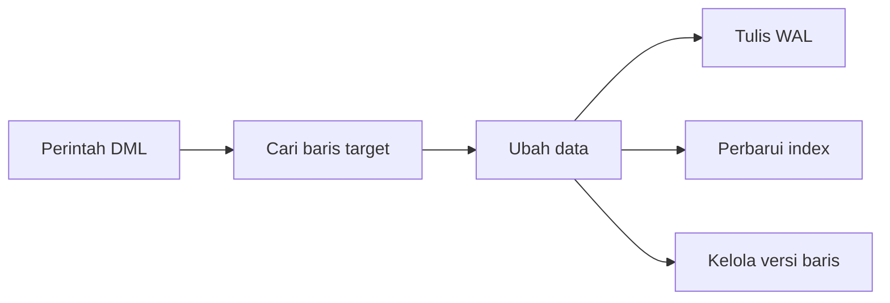

# Modul Pertemuan 9

## Administrasi Basis Data

### Optimasi Data Modification pada PostgreSQL (INSERT, UPDATE, DELETE)

---

## A. Identitas Materi

**Nama Modul:** Optimasi Data Modification pada PostgreSQL (INSERT, UPDATE, DELETE)  
**Pertemuan:** 9  
**Prasyarat:** SQL dasar, transaksi database, indexing, execution plan, optimasi query baca  
**DBMS:** PostgreSQL  
**Fokus Materi:** memahami biaya operasi modifikasi data dan strategi optimasi `INSERT`, `UPDATE`, dan `DELETE` pada PostgreSQL

---

## B. Tujuan Pembelajaran

Setelah mengikuti pertemuan ini, mahasiswa diharapkan mampu:

1. Menjelaskan perbedaan operasi baca data dan operasi modifikasi data.
2. Menjelaskan bagaimana `INSERT`, `UPDATE`, dan `DELETE` bekerja pada PostgreSQL.
3. Menjelaskan pengaruh lock, WAL, index, foreign key, dan trigger terhadap performa DML.
4. Menjelaskan hubungan MVCC, dead tuple, dan `VACUUM`.
5. Menentukan strategi optimasi yang tepat untuk operasi modifikasi data dalam skala kecil maupun besar.
6. Melakukan analisis sederhana terhadap beban DML menggunakan pendekatan yang benar.

---

## C. Keterkaitan dengan Pertemuan Sebelumnya

Pada pertemuan-pertemuan sebelumnya, fokus utama kita adalah optimasi query baca, misalnya bagaimana index membantu pencarian data, kapan full scan lebih baik, dan bagaimana database memilih algoritma join.

Pada pertemuan ini, fokusnya bergeser ke sisi lain yang sama pentingnya, yaitu **menulis dan mengubah data**. Jika query baca berbicara tentang cara menemukan data secara efisien, maka optimasi DML berbicara tentang cara menambah, mengubah, dan menghapus data tanpa membebani sistem secara berlebihan.

---

## D. Peta Materi

Materi pada modul ini dibahas dengan urutan berikut:

1. pengertian DML,
2. mengapa operasi modifikasi data perlu dioptimasi,
3. biaya tersembunyi pada `INSERT`, `UPDATE`, dan `DELETE`,
4. lock dan concurrency,
5. WAL dan pengaruh transaksi,
6. MVCC, dead tuple, dan `VACUUM`,
7. hubungan DML dengan index,
8. mass update, batch processing, HOT update, dan fillfactor,
9. pengaruh foreign key dan trigger,
10. praktikum dan latihan.

---

## E. Pengantar

### Mengapa Optimasi DML Penting?

Bayangkan database seperti perpustakaan yang sangat ramai. Jika kebanyakan orang hanya **membaca buku** (SELECT), perpustakaan masih bisa berfungsi normal. Tapi bagaimana jika banyak orang yang **menambah buku baru** (INSERT), **mengganti isi buku** (UPDATE), atau **membuang buku lama** (DELETE) secara bersamaan?

Tanpa pengelolaan yang baik, perpustakaan akan kacau:
- Orang antre panjang untuk melakukan perubahan
- Rak-rak menjadi berantakan
- Sulit menemukan buku karena katalog tidak update
- Ruang perpustakaan penuh dengan buku rusak yang belum dibersihkan

**Begitu juga dengan database!** Operasi penulisan data (DML) yang tidak dioptimasi akan menyebabkan:

### Contoh Masalah Nyata:
1. **E-commerce saat flash sale**: Ribuan orang checkout bersamaan
2. **Sistem akademik saat pengisian KRS**: Mahasiswa berlomba mendaftar mata kuliah
3. **Aplikasi delivery**: Update status pesanan setiap detik
4. **Media sosial**: Jutaan post, like, dan comment per menit

### Dampak Jika DML Tidak Dioptimasi:
- **Aplikasi jadi lambat** - User menunggu lama
- **Transaksi saling tunggu** - Deadlock dan timeout
- **Database membengkak** - Storage penuh sampah data
- **Performa menurun** - Query baca juga ikut lambat

---

## F. Apa Itu DML?

### Definisi Sederhana
**DML (Data Manipulation Language)** = Bahasa untuk "bermain" dengan isi data

Pikirkan seperti ini:
- **DDL** = Membangun rumah (CREATE TABLE, ALTER TABLE)
- **DML** = Mengisi dan menata isi rumah (INSERT, UPDATE, DELETE)

### Tiga Operasi Utama DML:

#### 1. INSERT - "Menambah Barang Baru"
```sql
INSERT INTO mahasiswa (nama, jurusan) 
VALUES ('Budi', 'Informatika');
```
*Seperti memasukkan buku baru ke rak perpustakaan*

#### 2. UPDATE - "Mengganti/Memperbaiki Barang"
```sql
UPDATE mahasiswa 
SET jurusan = 'Sistem Informasi' 
WHERE nama = 'Budi';
```
*Seperti mengganti cover buku yang rusak*

#### 3. DELETE - "Membuang Barang Lama"
```sql
DELETE FROM mahasiswa 
WHERE status = 'Tidak Aktif';
```
*Seperti membuang buku yang sudah rusak*

### Perbedaan DDL vs DML:

| **DDL (Structure)** | **DML (Content)** |
|---------------------|-------------------|
| Bangun meja | Taruh buku di meja |
| `CREATE TABLE` | `INSERT` data |
| `ALTER TABLE` | `UPDATE` data |
| `DROP TABLE` | `DELETE` data |

> **Catatan**: SELECT tidak dibahas di sini karena tidak mengubah data

### Catatan

Pada beberapa pembahasan SQL, `SELECT` kadang dibahas bersama DML secara umum. Namun pada modul ini, fokus kita adalah **data modification**, sehingga perhatian utama ada pada `INSERT`, `UPDATE`, dan `DELETE`.

---

## G. Mengapa DML Perlu Dioptimasi?

Optimasi DML penting karena operasi tulis memiliki efek lanjutan yang tidak selalu terlihat langsung.

Beberapa dampak yang bisa muncul adalah:

1. transaksi lain harus menunggu karena terjadi lock,
2. index ikut berubah sehingga biaya operasi bertambah,
3. log transaksi bertambah besar,
4. tabel menumpuk dead tuple setelah banyak update atau delete,
5. performa query baca ikut menurun jika perawatan tabel tidak dilakukan.

Artinya, operasi DML bukan hanya soal "data berhasil ditulis", tetapi juga soal **berapa besar biaya yang ditimbulkan pada sistem**.

---

## H. Cara Melihat Beban DML dengan Benar

Saat membahas optimasi DML, kita perlu memisahkan dua tahap utama:

1. **menentukan baris yang akan diubah**,
2. **melakukan perubahan pada baris tersebut**.

Pada `UPDATE` dan `DELETE`, tahap pertama sering sangat mirip dengan query baca, karena database tetap harus mencari data yang cocok dengan kondisi `WHERE`.

Contoh:

```sql
UPDATE mahasiswa
SET status = 'Lulus'
WHERE angkatan = 2020;
```

Pada query ini, PostgreSQL harus:

1. mencari semua baris dengan `angkatan = 2020`,
2. lalu memproses perubahan untuk semua baris yang ditemukan.

Jadi, optimasi DML biasanya mencakup:

* optimasi bagian pencarian baris,
* dan optimasi bagian penulisan perubahan.

---

## I. Biaya Tersembunyi pada Operasi DML

### Mengapa Operasi DML Memiliki Biaya Tersembunyi?

Bayangkan Anda meminta pustakawan untuk "memindahkan buku dari rak A ke rak B". Kedengarannya sederhana, namun pustakawan harus melakukan beberapa langkah:
1. Mencatat perubahan di buku log perpustakaan
2. Memperbarui semua katalog yang mereferensikan buku tersebut
3. Memastikan tidak ada yang sedang meminjam atau membaca buku itu
4. Membersihkan lokasi lama dan menata lokasi baru

**Begitu juga dengan database.** Satu perintah DML sederhana memicu berbagai proses di belakang layar:

### 1. Write Ahead Log (WAL) - Pencatatan Keamanan

**Konsep dasar:** Setiap perubahan data harus dicatat terlebih dahulu sebelum benar-benar diterapkan. Ini memastikan data dapat dipulihkan jika terjadi gangguan sistem.

**Biaya:** Setiap operasi DML harus menulis ke disk dua kali - ke WAL dan ke data file.

### 2. Pembaruan Index - Sinkronisasi Katalog

**Analogi:** Ketika informasi buku berubah, semua katalog (berdasarkan pengarang, subjek, tahun) juga harus diperbarui.

**Contoh dalam database:**
```sql
UPDATE mahasiswa SET nama = 'Budi Santoso' WHERE id = 123;
-- Semua index yang melibatkan kolom 'nama' harus diperbarui
```

**Biaya:** Semakin banyak index pada tabel, semakin banyak struktur yang harus dipelihara.

### 3. Lock dan Concurrency - Pengendalian Akses

**Prinsip:** Sistem database harus memastikan konsistensi data dengan mencegah konflik akses bersamaan.

**Dampak:** Transaksi yang sedang mengubah data akan "mengunci" akses untuk transaksi lain, berpotensi menyebabkan antrian dan penurunan performa.

### 4. Dead Tuple - Akumulasi Data Lama

**Konsep MVCC:** PostgreSQL tidak langsung menghapus data lama setelah UPDATE atau DELETE. Data lama disimpan sebagai "versi cadangan" sampai proses vacuum membersihkannya.

**Masalah:** Akumulasi data lama dapat memperbesar ukuran database dan memperlambat query.

### Formula Biaya Total DML:
```
Biaya Total = Penulisan Data + WAL Logging + (Jumlah Index × Biaya Update) + Lock Overhead + Dead Tuple Management
```

### Ilustrasi sederhana



---

## J. Lock dan Concurrency - Sistem Pengendalian Akses

### Analogi Sederhana: Sistem Reservasi Bioskop

Bayangkan database seperti sistem reservasi bioskop:
- **Setiap kursi** merepresentasikan satu baris data
- **Setiap pengunjung** merepresentasikan satu transaksi
- **Aturan**: Tidak boleh ada konflik dalam penggunaan resource yang sama

#### Operasi Baca (SELECT):
```
Transaksi A: Melihat status kursi B5 → Diizinkan
Transaksi B: Melihat status kursi B5 → Diizinkan
Kesimpulan: Banyak transaksi bisa membaca data yang sama secara bersamaan
```

#### Operasi Tulis (INSERT/UPDATE/DELETE):
```
Transaksi A: Mengubah status kursi B5 → Mendapat exclusive lock
Transaksi B: Mengubah status kursi B5 → Harus menunggu A selesai
Kesimpulan: Hanya satu transaksi yang bisa mengubah data pada satu waktu
```

### Level Lock di PostgreSQL:

| **Jenis Lock** | **Analogi** | **Kapan Terjadi** |
|----------------|-------------|-------------------|
| **Row Lock** | Pegang 1 kursi | UPDATE/DELETE 1 baris |
| **Table Lock** | Tutup seluruh studio | DROP/ALTER TABLE |
| **Page Lock** | Blokir 1 halaman | Jarang, internal PostgreSQL |

### Masalah Lock yang Sering Terjadi:

#### 1. **Lock Wait** - Antrean Panjang
```sql
-- Session 1 (pegang lock lama)
BEGIN;
UPDATE mahasiswa SET status = 'Lulus' WHERE id = 123;
-- Belum COMMIT, jadi lock masih dipegang

-- Session 2 (harus tunggu)
UPDATE mahasiswa SET nilai = 85 WHERE id = 123; -- TUNGGU...
```

#### 2. **Deadlock** - Saling Tunggu
```sql
-- Session A:
BEGIN;
UPDATE tabel1 SET data = 'A' WHERE id = 1; -- Lock tabel1 row 1
UPDATE tabel2 SET data = 'A' WHERE id = 1; -- Mau lock tabel2 row 1

-- Session B (bersamaan):
BEGIN;  
UPDATE tabel2 SET data = 'B' WHERE id = 1; -- Lock tabel2 row 1
UPDATE tabel1 SET data = 'B' WHERE id = 1; -- Mau lock tabel1 row 1

-- DEADLOCK! A tunggu B, B tunggu A
```

### Prinsip Mengurangi Lock Problems:

**DO (Lakukan)**:
```sql
-- Transaksi singkat
BEGIN;
  UPDATE produk SET stok = stok - 1 WHERE id = 123;
  INSERT INTO pesanan VALUES (...);
COMMIT; -- Cepat selesai
```

**DON'T (Jangan)**:
```sql
-- Transaksi lama (buruk!)
BEGIN;
  UPDATE produk SET stok = stok - 1 WHERE id = 123;
  -- Kirim email (lama)
  -- Proses pembayaran (lama)  
  -- Validasi alamat (lama)
COMMIT; -- Lock dipegang terlalu lama!
```

---

## K. WAL dan Pentingnya Mengelola Commit

PostgreSQL menggunakan **Write Ahead Log (WAL)** untuk menjaga ketahanan data. Sebelum perubahan dianggap aman, catatan perubahan harus masuk ke log terlebih dahulu.

### Ide dasarnya

1. perubahan dicatat ke WAL,
2. baru transaksi dapat diselesaikan dengan aman.

WAL sangat penting untuk recovery, tetapi juga menambah biaya pada operasi tulis.

### Masalah yang sering terjadi

Commit terlalu sering dapat menambah overhead.

### Contoh kurang efisien

```sql
INSERT INTO log_aktivitas VALUES (...);
COMMIT;

INSERT INTO log_aktivitas VALUES (...);
COMMIT;
```

### Contoh lebih efisien

```sql
BEGIN;

INSERT INTO log_aktivitas VALUES (...);
INSERT INTO log_aktivitas VALUES (...);
INSERT INTO log_aktivitas VALUES (...);

COMMIT;
```

### Prinsip penting

Batch commit sering lebih efisien daripada melakukan commit untuk setiap baris, selama tetap sesuai dengan kebutuhan konsistensi aplikasi.

---

## L. Mekanisme UPDATE di PostgreSQL - Sistem Multi-Version

### Konsep Multi-Version Concurrency Control (MVCC)

PostgreSQL menggunakan pendekatan unik dalam menangani operasi UPDATE. Alih-alih mengubah data secara langsung, PostgreSQL menerapkan sistem versioning:

1. **Data lama tidak langsung dihapus**
2. **Versi baru dibuat untuk perubahan**
3. **Kedua versi disimpan sementara**
4. **Pembersihan dilakukan secara berkala**

### Proses UPDATE dalam PostgreSQL

#### Kondisi Awal:
```sql
SELECT * FROM mahasiswa WHERE id = 123;
-- Result: id=123, nama='Budi', jurusan='Informatika'
```

#### Operasi UPDATE:
```sql
UPDATE mahasiswa SET jurusan = 'Sistem Informasi' WHERE id = 123;
```

#### Yang Terjadi Secara Internal:
```
Versi Lama (Dead Tuple):
id=123, nama='Budi', jurusan='Informatika' [STATUS: TIDAK AKTIF]

Versi Baru (Live Tuple):
id=123, nama='Budi', jurusan='Sistem Informasi' [STATUS: AKTIF]
```

### Keuntungan MVCC

#### 1. Operasi Baca Tidak Terblokir

MVCC memungkinkan operasi SELECT tetap berjalan meskipun ada UPDATE yang sedang berlangsung:

```sql
-- Session A: UPDATE yang belum di-commit
BEGIN;
UPDATE mahasiswa SET nilai = 85 WHERE id = 123;
-- Transaksi belum selesai

-- Session B: SELECT tetap dapat berjalan
SELECT * FROM mahasiswa WHERE id = 123;
-- Mendapatkan data versi lama tanpa menunggu
```

#### 2. Rollback yang Efisien

```sql
BEGIN;
UPDATE mahasiswa SET jurusan = 'Data Salah' WHERE id = 123;
-- Jika terjadi kesalahan
ROLLBACK; -- Kembali ke versi sebelumnya dengan mudah
```

### Konsekuensi: Akumulasi Dead Tuple

#### Proses Akumulasi:
```
Update ke-1: [Versi 0] → [Versi 1] (1 dead tuple)
Update ke-2: [Versi 0, Versi 1] → [Versi 2] (2 dead tuple)
Update ke-3: [Versi 0, Versi 1, Versi 2] → [Versi 3] (3 dead tuple)

Akibat: Ukuran database terus bertambah
```

#### Dampak Negatif:
- **Pembengkakan ukuran tabel**
- **Penurunan performa SELECT** (harus melewati dead tuple)
- **Konsumsi storage yang tidak efisien**

### Solusi: Proses VACUUM

```sql
-- Vacuum manual pada tabel tertentu
VACUUM mahasiswa;

-- Vacuum dengan update statistik
VACUUM ANALYZE mahasiswa;

-- Vacuum dengan informasi detail
VACUUM VERBOSE mahasiswa;

-- Vacuum untuk seluruh database
VACUUM ANALYZE;
```

---

## M. Dead Tuple dan VACUUM

Setelah banyak `UPDATE` atau `DELETE`, PostgreSQL dapat menyimpan banyak versi lama baris yang tidak lagi dipakai. Inilah yang disebut **dead tuple**.

Dead tuple tidak langsung hilang begitu saja. PostgreSQL memerlukan proses pembersihan melalui `VACUUM`.

### Fungsi `VACUUM`

* menandai ruang yang bisa dipakai kembali,
* membantu menjaga performa tabel,
* dan membantu statistik tetap relevan bila dipadukan dengan `ANALYZE`.

### Contoh perintah

```sql
VACUUM ANALYZE;
```

### Gambar pendukung


### Catatan penting

`VACUUM` tidak sama dengan `DELETE`. `DELETE` menghapus data secara logis dari sudut pandang transaksi, sedangkan `VACUUM` membantu merapikan efek sisa versi data tersebut di penyimpanan internal PostgreSQL.

---

## N. Pengaruh Index terhadap DML

Index sangat membantu query baca, tetapi pada operasi tulis index juga membawa biaya tambahan.

### Mengapa demikian?

Saat baris ditambah, diubah, atau dihapus, struktur index yang terkait mungkin juga harus ikut disesuaikan.

### Implikasi praktis

* semakin banyak index, biaya `INSERT` dan `DELETE` cenderung meningkat,
* `UPDATE` bisa menjadi lebih mahal jika kolom yang diubah termasuk kolom yang diindeks.

### Prinsip seimbang

Index tidak boleh dihapus sembarangan hanya demi mempercepat DML, tetapi jumlah index juga tidak boleh berlebihan tanpa alasan yang jelas.

Jadi, desain index harus mempertimbangkan dua sisi:

* kebutuhan query baca,
* dan biaya pemeliharaan saat data berubah.

---

## O. Mass Update, Batch Processing, dan Strategi Skalabilitas

### Karakteristik Beban DML yang Berbeda

Tidak semua operasi DML memiliki pola yang sama, sehingga strategi optimasinya juga perlu disesuaikan:

### 1. Mass Update - Operasi Skala Besar

**Definisi:** Operasi UPDATE yang mempengaruhi ribuan atau jutaan baris dalam satu transaksi.

**Contoh kasus:**
```sql
-- Update status semua mahasiswa angkatan 2020
UPDATE mahasiswa 
SET status = 'Alumni'
WHERE angkatan = 2020;
-- Bisa mempengaruhi 5000+ baris
```

**Dampak sistem:**
- Lock berlangsung dalam waktu lama
- Akumulasi dead tuple yang signifikan
- Pertumbuhan WAL yang besar
- Potensi timeout pada aplikasi

**Strategi optimasi:**
1. **Pembagian dalam batch kecil**
2. **Eksekusi pada jam sepi**
3. **Monitoring progress secara real-time**
4. **Perencanaan vacuum setelah operasi**

### 2. Frequent Update - Operasi Intensif

**Karakteristik:** Perubahan kecil tetapi sangat sering terjadi.

**Contoh aplikasi:**
- Update waktu login terakhir user
- Update status transaksi real-time
- Counter views atau likes
- Session tracking

**Strategi khusus:**
- Desain tabel yang mendukung HOT update
- Pengaturan fillfactor yang tepat
- Minimalisasi index pada kolom yang sering berubah
- Pertimbangan untuk menggunakan in-memory caching

### 3. Batch Processing - Pendekatan Profesional

**Prinsip:** Memecah operasi besar menjadi bagian-bagian kecil yang dapat dikelola.

**Keuntungan:**
- Mengurangi lock contention
- Memungkinkan progress monitoring
- Lebih mudah di-rollback jika terjadi error
- Sistem tetap responsif untuk operasi lain

**Contoh implementasi:**
```sql
-- Pseudocode batch processing
DO $$
DECLARE
    batch_size INTEGER := 1000;
    processed INTEGER := 0;
BEGIN
    LOOP
        UPDATE table_besar 
        SET status = 'processed'
        WHERE id IN (
            SELECT id FROM table_besar 
            WHERE status = 'pending'
            LIMIT batch_size
        );
        
        GET DIAGNOSTICS processed = ROW_COUNT;
        EXIT WHEN processed = 0;
        
        -- Progress logging dan pause
        RAISE NOTICE 'Processed % rows', processed;
        PERFORM pg_sleep(0.1);
    END LOOP;
END $$;
```

---

## P. HOT Update dan Fillfactor - Optimasi Tingkat Lanjut

### Konsep HOT (Heap-Only Tuple)

**HOT Update** adalah optimasi PostgreSQL yang memungkinkan update tertentu tidak memerlukan pembaruan semua index.

**Kondisi untuk HOT Update:**
1. Kolom yang diupdate tidak memiliki index
2. Masih ada ruang kosong di halaman yang sama
3. Update tidak mengubah nilai kolom yang diindeks

### Analogi Sederhana

Bayangkan sebuah buku dengan banyak bookmark (index):
- **HOT Update**: Mengubah isi halaman tanpa memindah bookmark
- **Normal Update**: Mengubah isi dan harus memindah semua bookmark

### Pengaturan Fillfactor

**Fillfactor** menentukan seberapa penuh halaman data diisi pada saat pembuatan tabel.

```sql
-- Contoh tabel dengan fillfactor 70%
CREATE TABLE user_activity (
    user_id INTEGER,
    last_login TIMESTAMP,
    page_views INTEGER,
    session_data TEXT
) WITH (fillfactor = 70);
```

**Trade-off:**
- **Fillfactor rendah** = Lebih banyak ruang untuk HOT update, tapi ukuran tabel lebih besar
- **Fillfactor tinggi** = Ruang efisien, tapi kemungkinan HOT update lebih kecil

### Desain Tabel untuk HOT Update

```sql
-- Tabel yang optimal untuk frequent update
CREATE TABLE user_sessions (
    id SERIAL PRIMARY KEY,
    user_id INTEGER,           -- Index: jarang berubah
    session_token VARCHAR(128), -- Index: jarang berubah
    
    -- Kolom yang sering berubah: TIDAK diindex
    last_activity TIMESTAMP,   
    page_count INTEGER,
    data_usage INTEGER
) WITH (fillfactor = 75);

-- Index hanya pada kolom stabil
CREATE INDEX idx_user_sessions_user ON user_sessions(user_id);
CREATE INDEX idx_user_sessions_token ON user_sessions(session_token);
```

---

## Q. Pengaruh Foreign Key dan Trigger

### Foreign Key Constraints dan DML

Foreign key memastikan integritas referensial, namun menambah overhead pada operasi DML.

#### Biaya Tambahan:
1. **INSERT**: Validasi apakah nilai reference key ada
2. **UPDATE**: Validasi nilai baru dan lama
3. **DELETE**: Cek apakah ada child records yang mereferensikan

#### Contoh Dampak:
```sql
-- Setiap INSERT mahasiswa harus validasi jurusan_id
INSERT INTO mahasiswa (nama, jurusan_id) 
VALUES ('Budi', 123); -- Cek: apakah jurusan 123 ada?

-- DELETE jurusan harus cek semua mahasiswa
DELETE FROM jurusan WHERE id = 123; 
-- Error jika masih ada mahasiswa dengan jurusan_id = 123
```

### Trigger dan Logika Bisnis

**Trigger** memungkinkan eksekusi logika tambahan secara otomatis saat operasi DML.

#### Keuntungan:
- Konsistensi logika bisnis
- Audit trail otomatis
- Validasi kompleks

#### Biaya:
- Overhead eksekusi tambahan
- Potensi cascade operations
- Kompleksitas debugging

#### Contoh Trigger:
```sql
-- Trigger untuk audit
CREATE TRIGGER audit_mahasiswa_changes
    AFTER UPDATE ON mahasiswa
    FOR EACH ROW
    EXECUTE FUNCTION log_mahasiswa_changes();

-- Setiap UPDATE mahasiswa akan trigger fungsi logging
```

### Best Practices

1. **Gunakan foreign key secara selektif** - hanya pada relasi kritis
2. **Hindari trigger kompleks** - pertimbangkan logika di aplikasi
3. **Monitor cascade operations** - pastikan tidak menyebabkan domino effect
4. **Testing performa** - ukur dampak sebelum implementasi

---

## R. Strategi Praktis Optimasi DML

### 1. Analisis Profil Aplikasi

**Langkah pertama:** Pahami pola penggunaan database Anda.

#### Pertanyaan kunci:
- Tabel mana yang paling sering di-INSERT?
- Kolom mana yang paling sering di-UPDATE?
- Apakah ada pola waktu tertentu untuk operasi DML?
- Berapa rasio operasi baca vs tulis?

### 2. Index Strategy yang Seimbang

#### Prinsip "Index Goldilocks":
- **Too few** = Query SELECT lambat
- **Too many** = DML lambat
- **Just right** = Balance optimal antara keduanya

#### Guidelines:
```sql
-- Tabel dengan profile INSERT-heavy (90% INSERT, 10% SELECT)
-- Strategy: Minimal indexing
CREATE TABLE transaction_log (
    id SERIAL PRIMARY KEY,  -- Hanya index yang essential
    timestamp TIMESTAMPTZ,
    amount DECIMAL,
    description TEXT
);

-- Tabel dengan profile mixed workload (60% SELECT, 40% DML)
-- Strategy: Strategic indexing
CREATE TABLE customer_orders (
    id SERIAL PRIMARY KEY,
    customer_id INTEGER,     -- Index: sering di-WHERE
    status VARCHAR(20),      -- Index: sering di-WHERE
    created_at TIMESTAMP,    -- Index: untuk reporting
    notes TEXT               -- No index: jarang dicari
);

CREATE INDEX idx_orders_customer ON customer_orders(customer_id);
CREATE INDEX idx_orders_status ON customer_orders(status);
CREATE INDEX idx_orders_created ON customer_orders(created_at);
```

### 3. Transaction Management

#### Prinsip Transaksi Efisien:

**DO:**
```sql
-- Keep transactions short and focused
BEGIN;
    INSERT INTO orders (customer_id, amount) VALUES (123, 500.00);
    UPDATE customer_balance SET balance = balance - 500.00 WHERE id = 123;
COMMIT;
```

**DON'T:**
```sql
-- Avoid long transactions with external calls
BEGIN;
    UPDATE orders SET status = 'processing' WHERE id = 123;
    -- External API call (takes 5+ seconds)
    -- Email sending (takes 2+ seconds)
    INSERT INTO audit_log VALUES (...);
COMMIT; -- Lock held too long!
```

### 4. Maintenance Strategy

#### Automated VACUUM Tuning:
```sql
-- High-frequency update tables need more frequent vacuum
ALTER TABLE user_sessions SET (
    autovacuum_vacuum_scale_factor = 0.1,  -- Default: 0.2
    autovacuum_analyze_scale_factor = 0.05 -- Default: 0.1
);

-- Large tables need higher thresholds
ALTER TABLE transaction_history SET (
    autovacuum_vacuum_threshold = 10000,   -- Default: 50
    autovacuum_analyze_threshold = 5000    -- Default: 50
);
```

#### Regular Health Checks:
```sql
-- Monitor dead tuple ratio
SELECT 
    schemaname,
    relname,
    n_live_tup,
    n_dead_tup,
    ROUND((n_dead_tup::FLOAT / GREATEST(n_live_tup, 1)) * 100, 2) as dead_ratio
FROM pg_stat_user_tables
WHERE n_dead_tup > 0
ORDER BY dead_ratio DESC;
```

---

## S. Ringkasan dan Prinsip Utama

### Konsep Kunci yang Telah Dipelajari

1. **DML bukan hanya "tulis data"** - melibatkan banyak proses internal
2. **Biaya tersembunyi** - WAL, index updates, lock management, dead tuples
3. **MVCC dan dead tuples** - trade-off antara concurrency dan storage
4. **Index strategy** - balance antara performa SELECT dan DML
5. **Batch processing** - cara professional handle operasi skala besar
6. **HOT updates** - optimasi untuk frequent updates
7. **Maintenance** - VACUUM sebagai bagian essential dari lifecycle database

### Prinsip-Prinsip Best Practice

#### 1. Design for Your Workload
- **Analisis pola akses** sebelum mendesain schema
- **Index hanya yang diperlukan** - hindari over-indexing
- **Consider HOT updates** untuk tabel dengan frequent updates

#### 2. Transaction Discipline
- **Keep transactions short** - minimize lock duration
- **Batch large operations** - avoid single massive transactions
- **Avoid external calls** within database transactions

#### 3. Monitoring and Maintenance
- **Regular VACUUM scheduling** untuk kesehatan tabel
- **Monitor dead tuple ratios** sebagai early warning
- **Track slow queries** untuk identifikasi bottlenecks

#### 4. Scalability Considerations
- **Plan for growth** - consider partitioning untuk tabel besar
- **Connection pooling** untuk mengelola concurrency
- **Read replicas** untuk memisahkan beban baca dan tulis

### Formula Sukses DML Optimization

```
Performa DML Optimal = 
    (Strategic Indexing) + 
    (Efficient Transactions) + 
    (Regular Maintenance) + 
    (Workload Understanding)
```

---

## T. Practical Guidelines untuk Developer

### Checklist Pre-Production

**Schema Design:**
- [ ] Index strategy sesuai dengan query patterns
- [ ] Fillfactor setting untuk tabel high-update
- [ ] Foreign key constraints hanya pada relasi kritis
- [ ] Trigger complexity dalam batas wajar

**Application Code:**
- [ ] Transaction scope seminimal mungkin
- [ ] Batch processing untuk operasi mass update
- [ ] Error handling untuk deadlock scenarios
- [ ] Connection pooling configuration

**Monitoring Setup:**
- [ ] Dead tuple monitoring
- [ ] Slow query logging
- [ ] Lock wait monitoring
- [ ] VACUUM scheduling

### Common Pitfalls to Avoid

1. **Index Everything Syndrome** - membuat index di setiap kolom
2. **Long Transaction Disease** - transaksi yang terlalu lama
3. **VACUUM Neglect** - mengabaikan maintenance rutin
4. **One-Size-Fits-All** - menggunakan strategi sama untuk semua tabel

### Performance Troubleshooting Guide

**Gejala: INSERT/UPDATE lambat**
- Cek jumlah index pada tabel
- Monitor lock waits
- Analisis transaction duration

**Gejala: Database size membengkak**
- Cek dead tuple ratio
- Review VACUUM frequency
- Analisis update patterns

**Gejala: Deadlock frequent**
- Review transaction ordering
- Analisis lock acquisition patterns
- Consider application-level queuing

---

## U. Kesimpulan

Optimasi DML adalah aspek krusial dalam administrasi database yang sering terabaikan. Berbeda dengan optimasi query SELECT yang fokus pada pencarian data, optimasi DML memerlukan pemahaman mendalam tentang:

- **Mekanisme internal database** (MVCC, WAL, locking)
- **Trade-offs design decisions** (index vs DML performance)
- **Lifecycle management** (vacuum, maintenance, monitoring)
- **Application patterns** (transaction design, batch processing)

Keberhasilan optimasi DML tidak hanya menghasilkan operasi tulis yang cepat, tetapi juga:
- **Sistem yang scalable** dan dapat menangani pertumbuhan data
- **Concurrency yang tinggi** tanpa blocking issues
- **Resource utilization** yang efisien
- **Maintenance overhead** yang minimal

Dengan menguasai prinsip-prinsip yang telah dibahas, mahasiswa diharapkan dapat merancang dan mengelola sistem database yang tidak hanya cepat dalam membaca data, tetapi juga efisien dalam mengelola perubahan data dalam skala enterprise.

**Ingat**: Database yang baik bukan hanya yang cepat di-query, tetapi juga yang mudah di-maintain dan dapat berkembang seiring kebutuhan bisnis.

---

## V. Latihan dan Tugas Mandiri

### Soal Konsep

1. Jelaskan mengapa operasi UPDATE di PostgreSQL dapat menyebabkan dead tuple, dan bagaimana hal ini berbeda dengan sistem database lain yang menggunakan in-place update.

2. Dalam kondisi apa HOT (Heap-Only Tuple) update dapat terjadi? Berikan contoh desain tabel yang optimal untuk memanfaatkan HOT update.

3. Mengapa terlalu banyak index dapat memperlambat operasi INSERT dan DELETE? Jelaskan dengan contoh konkret.

### Soal Analisis

1. Sebuah aplikasi e-commerce memiliki tabel `orders` dengan 10 juta baris. Tabel ini memiliki 8 index dan menerima sekitar 1000 INSERT per menit serta 500 UPDATE per menit. Identifikasi potensi masalah performa dan usulkan strategi optimasi.

2. Bandingkan strategi optimasi yang berbeda untuk:
   - Tabel log aplikasi (99% INSERT, 1% SELECT)
   - Tabel profil user (30% INSERT, 60% SELECT, 10% UPDATE)
   - Tabel keranjang belanja (40% INSERT, 30% SELECT, 25% UPDATE, 5% DELETE)

### Soal Praktik

1. Buatlah contoh implementasi batch processing untuk melakukan mass update pada tabel dengan 1 juta baris, dengan mempertimbangkan:
   - Ukuran batch yang optimal
   - Progress monitoring
   - Error handling
   - Dampak terhadap concurrent transactions

2. Desain skema database untuk aplikasi media sosial sederhana yang mendukung:
   - Posting content (high INSERT volume)
   - Like/unlike posts (frequent UPDATE)
   - User activity tracking (very frequent UPDATE)
   
   Berikan justifikasi untuk setiap keputusan indexing dan pengaturan tabel.

---

## O. HOT Update dan Fillfactor

PostgreSQL memiliki optimasi yang disebut **HOT (Heap-Only Tuple)**.

Secara sederhana, HOT update dapat terjadi jika:

* kolom yang diubah bukan kolom yang diindeks,
* dan PostgreSQL masih memiliki ruang yang cukup pada halaman yang sama.

Jika kondisi ini terpenuhi, PostgreSQL tidak perlu memperbarui semua index untuk perubahan tersebut. Ini dapat mengurangi biaya update.

### Hubungan dengan fillfactor

`fillfactor` adalah pengaturan yang menentukan seberapa penuh halaman data diisi saat awal penyimpanan.

Contoh:

```sql
CREATE TABLE contoh_transaksi (
  id serial primary key,
  status text,
  catatan text
) WITH (fillfactor = 70);
```

Jika fillfactor dibuat lebih rendah, masih ada ruang kosong pada halaman untuk update berikutnya. Ini dapat membantu peluang terjadinya HOT update.

### Kelebihan

* update tertentu bisa menjadi lebih efisien,
* perpindahan baris dapat berkurang,
* biaya pemeliharaan index bisa turun pada kasus tertentu.

### Kekurangan

* membutuhkan ruang penyimpanan lebih besar,
* tidak selalu cocok untuk semua tabel.

---

## P. Mass Update, Batch Processing, dan Frequent Update

Tidak semua beban update memiliki pola yang sama. Karena itu, strateginya juga perlu dibedakan.

### 1. Mass update

Contoh:

```sql
UPDATE mahasiswa
SET status = 'Aktif';
```

Jika query seperti ini menyentuh sangat banyak baris, dampaknya bisa besar:

* lock berlangsung lebih lama,
* dead tuple bertambah banyak,
* WAL membesar,
* dan beban sistem meningkat.

### Strategi untuk mass update

* lakukan dalam batch jika memungkinkan,
* pilih waktu eksekusi yang tidak terlalu sibuk,
* pantau kebutuhan `VACUUM` setelah operasi besar.

### 2. Frequent update

Frequent update adalah perubahan kecil tetapi sangat sering, misalnya update status transaksi atau update waktu terakhir login.

Pada kasus seperti ini, perhatian utama ada pada:

* desain tabel,
* kolom yang sering berubah,
* peluang HOT update,
* dan pengaturan fillfactor.

---

## Q. Foreign Key dan Trigger

Foreign key dan trigger sangat penting untuk menjaga integritas data dan logika bisnis. Namun keduanya juga dapat menambah biaya pada DML.

### Foreign key

Saat melakukan `INSERT`, `UPDATE`, atau `DELETE`, PostgreSQL mungkin harus memeriksa tabel lain untuk memastikan aturan relasi tetap benar.

### Trigger

Trigger dapat menjalankan logika tambahan secara otomatis ketika data berubah.

### Dampak yang mungkin muncul

* ada query tambahan di belakang layar,
* waktu eksekusi DML bertambah,
* beban transaksi meningkat.

### Prinsip penting

Foreign key dan trigger bukan sesuatu yang harus dihindari, tetapi harus digunakan secara sadar. Jika terlalu banyak logika dimasukkan ke trigger tanpa pengendalian, performa operasi tulis bisa menurun.

---

## R. Strategi Praktis Optimasi DML - "Panduan Lengkap"

### 1. Optimasi Pencarian Baris (WHERE Clause)

#### **Buruk** - Tanpa Index:
```sql
-- Scan seluruh tabel 1 juta baris untuk update 1 baris
UPDATE mahasiswa 
SET status = 'Lulus' 
WHERE nama = 'Budi Santoso';  -- No index on nama
```

#### **Baik** - Dengan Index:
```sql
-- Buat index dulu
CREATE INDEX idx_mahasiswa_nama ON mahasiswa(nama);

-- Sekarang update cepat
UPDATE mahasiswa 
SET status = 'Lulus' 
WHERE nama = 'Budi Santoso';  -- Langsung ke target
```

### 2. Transaksi Efisien

#### **Buruk** - Transaksi Lambat:
```sql
BEGIN;
  UPDATE produk SET stok = stok - 1 WHERE id = 123;
  
  -- Operasi lambat di tengah transaksi
  SELECT pg_sleep(5); -- Simulasi proses lama
  
  INSERT INTO log_pembelian VALUES (...);
COMMIT; -- Lock dipegang 5+ detik!
```

#### **Baik** - Transaksi Cepat:
```sql
-- Siapkan data dulu
SELECT current_timestamp; -- Prep timestamp

-- Transaksi super cepat
BEGIN;
  UPDATE produk SET stok = stok - 1 WHERE id = 123;
  INSERT INTO log_pembelian VALUES (...);
COMMIT; -- Lock < 1ms

-- Proses lama di luar transaksi
SELECT send_email('order_confirmation');
```

### 3. Batch Processing untuk Operasi Besar

#### **Buruk** - Satu-satu:
```sql
-- Update 100,000 baris satu-satu (LAMBAT!)
FOR i IN 1..100000 LOOP
  BEGIN;
    UPDATE log_old SET status = 'archived' WHERE id = i;
  COMMIT;
END LOOP;
```

#### **Baik** - Batch:
```sql
-- Update per batch 1000 baris
DO $$
DECLARE
  batch_size INTEGER := 1000;
  affected INTEGER;
BEGIN
  LOOP
    UPDATE log_old 
    SET status = 'archived' 
    WHERE id IN (
      SELECT id FROM log_old 
      WHERE status != 'archived' 
      LIMIT batch_size
    );
    
    GET DIAGNOSTICS affected = ROW_COUNT;
    EXIT WHEN affected = 0;
    
    -- Beri jeda agar tidak monopoli sistem
    PERFORM pg_sleep(0.1);
  END LOOP;
END $$;
```

### 4. Manajemen Index Cerdas

#### Prinsip "Index Goldilocks":
- **Terlalu sedikit** = Query lambat
- **Terlalu banyak** = DML lambat  
- **Just right** = Balance optimal

#### Tabel dengan Profile Berbeda:

```sql
-- TABEL LOG (90% INSERT, 10% DELETE)
CREATE TABLE app_log (
  id SERIAL PRIMARY KEY,         -- Minimal index
  timestamp TIMESTAMPTZ,
  level VARCHAR(10),
  message TEXT
);
-- Index minimal: hanya untuk DELETE by timestamp
CREATE INDEX idx_log_timestamp ON app_log(timestamp) 
WHERE timestamp < NOW() - INTERVAL '30 days';
```

```sql
-- TABEL USER (60% SELECT, 30% UPDATE, 10% INSERT)
CREATE TABLE users (
  id SERIAL PRIMARY KEY,
  email VARCHAR UNIQUE,          -- Frequent search
  username VARCHAR,              -- Frequent search
  last_login TIMESTAMPTZ,        -- Frequent filter
  profile_data JSONB
);
-- Banyak index karena banyak query
CREATE INDEX idx_users_email ON users(email);
CREATE INDEX idx_users_username ON users(username);
CREATE INDEX idx_users_last_login ON users(last_login);
```

### 5. Maintenance Strategy

#### Auto-VACUUM Tuning:
```sql
-- Tabel high-update butuh vacuum lebih sering
ALTER TABLE shopping_cart SET (
  autovacuum_vacuum_scale_factor = 0.1,  -- Default: 0.2
  autovacuum_analyze_scale_factor = 0.05 -- Default: 0.1
);

-- Tabel besar butuh vacuum threshold lebih tinggi
ALTER TABLE transaction_history SET (
  autovacuum_vacuum_threshold = 10000,   -- Default: 50
  autovacuum_analyze_threshold = 5000    -- Default: 50
);
```

### 6. HOT Update Optimization

#### Contoh Tabel untuk Frequent Update:
```sql
CREATE TABLE user_session (
  id SERIAL PRIMARY KEY,
  user_id INTEGER,              -- Index (jarang berubah)
  session_token VARCHAR,        -- Index (jarang berubah) 
  last_activity TIMESTAMPTZ,    -- No index (sering berubah)
  page_count INTEGER,           -- No index (sering berubah)
  data JSONB                    -- No index (sering berubah)
) WITH (fillfactor = 70);       -- Sisakan ruang untuk HOT update

-- Index hanya untuk kolom yang stabil
CREATE INDEX idx_session_user ON user_session(user_id);
CREATE INDEX idx_session_token ON user_session(session_token);
```

### 7. Monitoring & Alerting

```sql
-- Script monitoring harian
CREATE OR REPLACE FUNCTION daily_dml_health_check()
RETURNS TABLE (
  table_name TEXT,
  issue_type TEXT,
  severity TEXT,
  recommendation TEXT
) AS $$
BEGIN
  RETURN QUERY
  -- Cek dead tuple ratio
  SELECT 
    schemaname||'.'||relname,
    'High Dead Tuple Ratio',
    CASE WHEN n_dead_tup::FLOAT / GREATEST(n_live_tup, 1) > 0.5 
         THEN 'CRITICAL' 
         ELSE 'WARNING' 
    END,
    'Run VACUUM ANALYZE ' || schemaname||'.'||relname
  FROM pg_stat_user_tables
  WHERE n_dead_tup::FLOAT / GREATEST(n_live_tup, 1) > 0.2;
  
  -- Cek tabel tanpa recent vacuum
  RETURN QUERY
  SELECT 
    schemaname||'.'||relname,
    'No Recent Vacuum',
    'WARNING',
    'Check vacuum schedule for ' || schemaname||'.'||relname
  FROM pg_stat_user_tables
  WHERE last_vacuum < NOW() - INTERVAL '7 days'
    AND n_tup_upd + n_tup_del > 1000;
END $$ LANGUAGE plpgsql;

-- Jalankan setiap hari
SELECT * FROM daily_dml_health_check();
```

---

## S. Ringkasan Materi

Ide-ide utama dari pertemuan ini adalah sebagai berikut.

1. DML pada modul ini berfokus pada `INSERT`, `UPDATE`, dan `DELETE`.
2. Optimasi DML tidak hanya soal menulis data, tetapi juga soal mencari baris target secara efisien.
3. Operasi tulis memiliki biaya tambahan seperti WAL, lock, update index, dan manajemen versi baris.
4. PostgreSQL menggunakan MVCC, sehingga `UPDATE` dapat membuat versi baris baru dan meninggalkan dead tuple.
5. `VACUUM` penting untuk menjaga performa setelah banyak perubahan data.
6. Index membantu query baca, tetapi juga menambah biaya pada operasi tulis.
7. HOT update dan fillfactor dapat membantu pada tabel yang sering di-update.
8. Foreign key dan trigger penting, tetapi perlu dikelola dengan hati-hati.

---

## T. Praktikum Sederhana

Gunakan PostgreSQL dan siapkan satu tabel contoh yang berisi data cukup banyak.

### Langkah praktikum

1. Buat satu tabel tanpa index tambahan dan satu tabel dengan beberapa index.
2. Lakukan `INSERT` dalam jumlah besar pada kedua tabel.
3. Bandingkan waktu eksekusi.
4. Lakukan `UPDATE` pada banyak baris.
5. Amati perubahan performa sebelum dan sesudah `VACUUM ANALYZE`.

### Hal yang diamati

1. pengaruh jumlah index terhadap waktu `INSERT`,
2. pengaruh update besar terhadap ukuran tabel dan performa,
3. perubahan performa setelah vacuum,
4. perilaku sistem ketika transaksi dibuat terlalu sering commit.

---

## U. Latihan Soal

### Soal Konsep

1. Apa yang dimaksud dengan DML dalam konteks modul ini?
2. Mengapa operasi `UPDATE` dan `DELETE` bisa menimbulkan lock?
3. Apa fungsi WAL pada PostgreSQL?
4. Jelaskan hubungan antara MVCC, dead tuple, dan `VACUUM`.
5. Mengapa terlalu banyak index dapat memperlambat operasi tulis?

### Soal Analisis

1. Sebuah tabel transaksi memiliki 8 index dan menerima ribuan `INSERT` per menit. Apa risiko performa yang mungkin muncul?
2. Mengapa melakukan commit pada setiap satu baris insert bisa kurang efisien?
3. Sebuah tabel sering di-update pada kolom non-index. Mengapa fillfactor dapat membantu pada kasus ini?

### Soal Praktik SQL

1. Buat contoh query `UPDATE` yang memodifikasi data berdasarkan kondisi `WHERE` tertentu.
2. Buat contoh skenario `DELETE` yang berpotensi menghasilkan banyak dead tuple.
3. Tulis perintah untuk menjalankan `VACUUM ANALYZE` dan jelaskan kapan perintah itu berguna.

---

## V. Tugas Mandiri

Pilih satu tabel pada database PostgreSQL yang menurut Anda cukup sering menerima operasi `INSERT`, `UPDATE`, atau `DELETE`.

Kerjakan hal berikut:

1. jelaskan pola perubahan data pada tabel tersebut,
2. identifikasi faktor yang kemungkinan membebani operasi DML,
3. usulkan minimal dua strategi optimasi,
4. jelaskan apakah tabel tersebut berpotensi membutuhkan pengaturan fillfactor atau perhatian khusus terhadap vacuum.

---

## W. Penutup

Optimasi database tidak berhenti pada query baca. Sistem yang baik juga harus mampu menulis data secara efisien, aman, dan stabil.

Dalam PostgreSQL, operasi `INSERT`, `UPDATE`, dan `DELETE` tidak hanya menulis data, tetapi juga berhubungan dengan WAL, lock, MVCC, dead tuple, index, dan vacuum. Karena itu, mahasiswa perlu memahami bahwa optimasi DML adalah gabungan antara pemahaman teori internal database dan keputusan desain yang tepat.

Jika cara berpikir ini dikuasai, mahasiswa akan lebih siap menganalisis masalah performa pada sistem transaksi yang nyata.